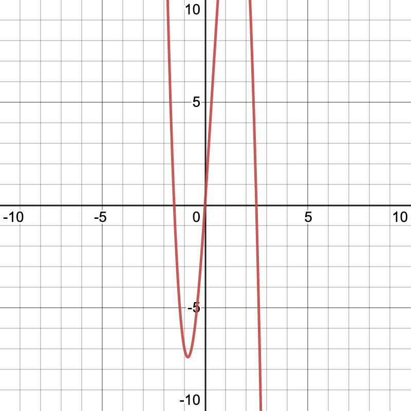

# Precalculus Notes

## Quadrants

* The quadrants start with the top-right hand side and go counterclockwise
* There are four quadants, labelled (often with roman numerals): Quadrant I, Quadrant II, Quadrant III, and Quadrant IV

## Midpoint and Distance

* The midpoint formula:

$$
M = \left(\frac{(x_2 + x_1)}{2}, \frac{(y_2 + y_1)}{2}\right)
$$

* The distance formula:

$$
d = \sqrt{(x_2 - x_1)^2 + (y_2 - y_1)^2}
$$

## Applications of the Distance Formula

* To be able to find whether a triangle is isosceles, scalene, or equilateral:
  * Use the distance formula to find the length of each side
    * If the sides are all equal in length then the triangle is *equilateral*
    * If 2 sides are equal in length then the triangle is *isosceles*
    * If all sides are of different lengths then the triangle is *scalene*
* To quickly sketch a graph from an equation, find the intercepts of the equation, plot the intercepts as points, and then connect the points based on the type of graph the equation matches:
  * $$y_{intercept}$$ - find by substituting $$x = 0$$
  * $$x_{intercept}$$ - find by substituting $$y = 0$$
  * If the graph is an absolute value graph it should look like a "V"
  * If the graph is linear it should be a straight line between the points - like an "l"
  * If the graph is quadratic it should be a curved line between the points - like a "U"

## The forms of symmetry

* X-axis symmetry
  
  * Replace $$y$$ with $$-y$$ and simplify, you should end up with the same equation

* Y-axis symmetry
  
  * Replace $$x$$ with $$-x$$ and simplify, you should end up with the same equation

* Origin symmetry
  
  * Replace $$x$$ with $$-x$$ and $$y$$ with $$-y$$ and simplify, you should end up with the same equation

### Forms of Symmetry Worked Example

* **Q: Given the equation $$x^2 - y = 0$$, can we find which form of symmetry it obeys?**
  * To test x-axis symmetry, we would substitute $$y$$, resulting in the equation $$x^2 - (-y) = 0$$ which simplifies to $$x^2 + y = 0$$
    * This obviously does not work as $$x^2 + y = 0 \neq x^2 -y = 0$$, hence it doesn't have x-axis symmetry
  * To test y-axis symmetry, we would substitute $$x$$, resulting in the equation $$(-x)^2 - y = 0$$ which simplifies to $$x^2 - y = 0$$
    * Because $$x^2 - y = 0 \equiv x^2 - y = 0$$ we know it **does have y-axis symmetry**
  * To test origin symmetry, we would substitute both $$x$$ and $$y$$, resulting in the equation $$(-x)^2 - (-y) = 0$$ which simplifies to $$x^2 + y = 0$$
    * This obviously does not work either as $$x^2 + y = 0 \neq x^2 -y = 0$$, hence it doesn't have origin symmetry

## Even and Odd Functions

* For a function to be **even** it must have *y-axis symmetry*
* For a function to be **odd** it must have *origin symmetry*
* For a function to be **neither even or odd** it would have *x-axis symmetry or no symmetry*

## Functions

* A true ***function*** is a relationship between any two or more variables that maps one input to one exact output
  * That means a function cannot have two coordinates with the same x-coordinate and different y-coordinates
  * To test, use the **vertical line test**: if you draw a vertical line through a function and it passes through through the graph twice, the graph is **not** a function
* **Ordered pairs** are the predominant form of notation used to indicate coordinates on the graph of a function
* A **graph** of a function is the collection of the ordered pairs of the function
* A ***piecewise function*** is a function that is defined differently across different domains - that is, it is made of "pieces"
* For instance, the below is an example of a piecewise function:

$$
t(x)= \begin{cases}4-5 x, & x \leq-4 \\ 2, & -4<x \leq 2 \\ x^{2}+1, & x>2\end{cases}
$$

* The ***domain*** is the set of possible inputs (x-values) for a function
  * We can define it as all values that $$x$$ can be *or* all values that $$x$$ can't be
  * For all polynomial and absolute value functions the domain is all real numbers
    * In interval notation this is $$D(f) = (-\infty, \infty)$$
    * In set notation this is $$D(f) = x \in \mathbb{R}$$
  * For all square root functions $$D(f) \geq 0$$ if $$f(x) = \sqrt{x}$$ 
    * But be careful! *Cube root* functions and all odd-numbered roots are different, their domain is that of all real numbers!
  * In set notation, we use inequality notation to denote domain or range; for instance, a domain from -2 to 5 would be represented with $$D(f) = \{x | -2 \leq x \leq 5\}$$
* The **maximum** and **minimum** are highest points or lowest points in a region of the graph
  * The ***relative maximums*** and ***relative minimums*** are the "peaks" and "valleys" of the graph
  * The technical definitions are as follows:
    * A **relative maximum** is a value $$a$$ of a function $$f$$ contained within an interval $$(x_1, x_2)$$ where $$x_1 < x < x_2$$ implies $$f(a) \geq f(x)$$
    * A **relative minimum** is a value $$a$$ of a function $$f$$ contained within an interval $$(x_1, x_2)$$ where $$x_1 < x < x_2$$ implies $$f(a) \leq f(x)$$
* A function can *increase*, stay *constant*, or *decrease* in an interval
  * The technical definitions for increasing, constant, and decreasing intervals are as follows:
    * An **increasing interval** is an interval of a function $$f$$ in which $$x_1 < x_2$$ would also imply $$f(x_1) < f(x_2)$$
    * A **decreasing interval** is an interval of a function $$f$$ in which $$x_1 < x_2$$ would also imply $$f(x_1) > f(x_2)$$
    * A **constant interval** is an interval of a function $$f$$ in which $$x_1 < x_2$$ would also imply $$f(x_1) = f(x_2)$$

### Analyzing Graphs of Functions

* The slope of a function can be thought of as a *rate of change* - that is, $$m = \frac{\Delta y}{\Delta x}$$
* For a nonlinear (e.g. quadratic) graph, the slope changes at each point on the graph
  * The **average range of change** is the slope of a secant line - a line through two chosen points on a nonlinear graph
  * Technical definition: given two points $$(x_1, f(x_1))$$, $$(x_2, f(x_2))$$ on a function $$f$$, the average range of change $$m$$ would be $$\frac{f(x_2)-f(x_1)}{x_2 - x_1}$$
* **Q: Given the function $$f(x) = x^2 - 2x + 3$$, can we find the average range of change from $$x_1 = 0$$ to $$x_2 = 4$$?**
  * First, we need to make two ordered pairs from the 2 x-values
  * So we substitute $$x = 0$$ and $$x = 4$$ into the equation
    * If we substitute $$x=0$$, then $$f(0) = 0^2 - 2(0) + 3 = 3$$ so our ordered pair $$(x, f(x))$$ would be $$(0, 3)$$
    * If we substitute $$x = 4$$, then $$f(4) = 4^2 - 2(4) + 3 = 11$$ so our ordered pair $$(x, f(x))$$ would be $$(4, 11)$$
  * Using the gradient formula, $$m = \frac{\Delta y}{\Delta x}$$, so $$m = \frac{11 - 3}{4 - 0} =2$$
  * Thus, the average rate of change from $$x_1$$ to $$x_2$$ is 2

### Parent Functions

The following are standard functions used in the study of mathematics:

| Name                     | Equation (general form)           | Domain/Range                                  | End Behavior                                                                                                           | Even/Odd?        |
| ------------------------ | --------------------------------- | --------------------------------------------- | ---------------------------------------------------------------------------------------------------------------------- | ---------------- |
| Constant                 | $$y=C$$ (assuming$$C$$ is a constant) | $$D(f)=x\in \mathbb{R}, R(f)=y=C$$              | $$\begin{cases}x\rightarrow\infty, y\rightarrow C \\ x\rightarrow -\infty, y\rightarrow C\end{cases}$$                   | Even             |
| Identity                 | $$y=x$$                             | $$D(f)=x\in \mathbb{R}, R(f)=y \in \mathbb{R}$$ | $$\begin{cases} x \rightarrow -\infty, y \rightarrow -\infty \\ x \rightarrow \infty, y \rightarrow \infty \end{cases}$$ | Odd              |
| Linear                   | $$y=mx + b$$                        | $$D(f)=x\in \mathbb{R}, R(f)=y \in \mathbb{R}$$ | $$\begin{cases} x \rightarrow -\infty, y \rightarrow -\infty \\ x \rightarrow \infty, y \rightarrow \infty \end{cases}$$ | Odd (not always) |
| Absolute Value           | $$y=\|x\|$$                         | $$D(f)=x\in \mathbb{R}, R(f)=y \geq 0$$         | $$\begin{cases} x \rightarrow -\infty, y \rightarrow \infty \\ x \rightarrow \infty, y \rightarrow \infty \end{cases}$$  | Even             |
| Quadratic                | $$y=x^2$$                           | $$D(f)=x\in \mathbb{R}, R(f)=y \geq 0$$         | $$\begin{cases} x \rightarrow -\infty, y \rightarrow \infty \\ x \rightarrow \infty, y \rightarrow \infty \end{cases}$$  | Even             |
| Cubic                    | $$y = x^3$$                         | $$D(f)=x\in \mathbb{R}, R(f)=y \in \mathbb{R}$$ | $$\begin{cases} x \rightarrow -\infty, y \rightarrow -\infty \\ x \rightarrow \infty, y \rightarrow \infty \end{cases}$$ | Odd              |
| Radical                  | $$y = \sqrt{x}$$                    | $$D(f) = x \geq 0, R(f) = y \geq 0$$            | $$x \rightarrow \infty, y \rightarrow \infty$$                                                                           | Neither          |
| Rational/Inverse         | $$y = \frac{1}{x}$$                 | $$D(f) = x \neq 0, R(f) = y \neq 0$$            | $$\begin{cases} x \rightarrow -\infty, y \rightarrow 0 \\ x \rightarrow \infty, y \rightarrow 0 \end{cases}$$            | Odd              |
| Rational/Inverse Squared | $$y = \frac{1}{x^2}$$               | $$D(f) = x \neq 0, R(f) = y \geq 0$$            | $$\begin{cases} x \rightarrow -\infty, y \rightarrow 0 \\ x \rightarrow \infty, y \rightarrow 0 \end{cases}$$            | Even             |

### Parent function transformations

In a given function $$f$$, the transformed version $$f'(x)= (x-h)^n + k$$ obeys the following rules:

* $$h$$ is the horizontal shift
	* You can tell it is a horizontal shift when you see _just_ $$x$$ substituted with $$x \pm n$$
  * $$f(x+h)$$ is $$f(x)$$ translated $$h$$ units left
  * $$f(x-h)$$ is $$f(x)$$ translated $$h$$ units right
  * For instance, if a function is transformed horizontally by $$-3$$, then $$h=3$$
    * Remember that the sign (+/-) of $$h$$ is always *opposite* to the value of the transform (*"hopposite"*)
* $$k$$ is the vertical shift
  * You can tell it is a vertical shift when you see the _entire function_ $$f(x) = ax$$ substituted with $$f(x) = ax + n$$
  * $$f(x) + k$$ is $$f(x)$$ translated $$k$$ units up
  * $$f(x) -k$$ is $$f(x)$$ translated $$k$$ units down
  * For instance, if a function is transformed vertically by $$+5$$, then $$k=5$$ 
    * Remember that the sign (+/-) of $$k$$ is always the *same* as the value of the transform (*"k" for "keep-the-same"*)

For instance:

* $$y = (x)^2$$ shifted to the right +4 units would be $$y = (x+4)^2$$
* $$y = (x^2 + 8x)$$ shifted up +4 units would be $$y = (x^2 + 8x) + 4$$
* $$y = |x^2|$$ shifted by $$(h, k)$$ becomes $$y = |x-h| + k$$

It might be sometimes hard to tell if the shift is a horizontal or vertical shift. To make it easier, consider the function $$f(x) = 3^x$$.

If we were to shift it horizontally, then we can think of it as just wrapping the $$x$$ term with a bracket:

$$
f(x) = 3^(x)
$$

Then, whatever horizontal shifts we add would _only_ apply **inside** of the bracket. Notice $$a$$ is inside of the bracket here:

$$
f(x) = 3^(x \pm a)
$$

Conversely, if we were to shift it vertically, then we can think of it as wrapping the _entire existing function_ with a bracket:

$$
f(x) = (3^x)
$$

Then, whatever vertical shifts we add would now apply **outside** of the bracket. Notice $$a$$ is ouside of the bracket here:

$$
f(x) = (3^x) + a
$$

This way of visualizing things also works equally well for both vertical and horizontal flips.

In a given function $$f(x) = x$$, then:

* $$-f(x)$$ is the function vertically flipped (reflected about the **x-axis**)
  * This means all outputs (y-values) are multiplied by -1
* $$f(-x)$$ is the function horizontally flipped (reflected about the **y-axis**)
  * This means all inputs (x-values) are multiplied by -1
  * To do this, replace all $$x$$'s in the function with $$-x$$
  * Remember: this is -1 times the $$x$$, not -1 times the entire function!
* $$af(x)$$ results in:
  * A vertical stretch if $$a > 1$$ - think "keep the same"
  * A vertical shrink if $$0 < a <1$$
* $$f(ax)$$ results in:
  * A horizontal shrink if $$a > 1$$ - think *"hopposite"*
  * A horizontal stretch if $$0 < a < 1$$

A helpful way to remember the reflections is that a vertical reflection is **"outside" of a function** and a horizontal reflection is **"inside" a function**. Similarly, a vertical stretch/shrink is **"outside" of a function** and a horizontal stretch/shrink is **"inside" a function**

For instance, if we had the function $$f(x) = x+3$$:

* The same function **vertically flipped** would be $$-f(x) = x+3$$ which simplifies to $$f(x) = -(x+3)$$
* The same function **horizontally flipped** would be $$f(-x) = x+3$$ which simplifies to $$f(x) = (-x) + 3$$

A generalized form of function transform is the following equation:

$$
f(x) = a(bx - c) + d
$$

* $$c$$ is like $$h$$ used previously - it is the horizontal transform (units moved to the left)
* $$d$$ is like $$k$$ used previously - it is the vertical transform (units moved up)
* $$a$$ is the vertical stretch
* $$d$$ is the horizontal stretch value which is always the *reciprocal* of $$d$$

### Reciprocal

* A reciprocal number is the multiplicative inverse of a number
* That means the inverse of a number multiplied by the original number have a product of one

### Function Arithmetic & Composition

* The sum of two functions $$f$$ and $$g$$ is represented with $$(f+g)(x)$$
* The difference of two functions $$f$$ and $$g$$ is represented with $$f-g)(x)$$
* The product of two function $$f$$ and $$g$$ is represented with $$(fg)(x)$$
* The quotient of two functions $$f$$ and $$g$$ is represented with $$\left(\frac{f}{g}\right) (x)$$
* The composition of function $$f$$ with $$g$$ is a substitution of $$g(x)$$ into $$f(x)$$
  * It is often represented with $$(f \circ g)(x)$$ or $$f(g(x))$$
* We can decompose a function by restating it as two functions
  * For instance, we can write the function $$h(x) = |2x - 5| + 1$$ as two functions $$m(x)$$ and $$n(x)$$
  * We know that $$h(x) = (m \circ n)(x)$$
  * We know that the "inside" of $$h(x)$$ is $$2x -5$$ and the "outside" is $$|\dots| + 1$$
  * So we know that $$n(x) = 2x-5$$ and $$m(x) = |x| + 1$$

### Piecewise Functions

A piecewise function is in this general form:

$$
f(x) = \begin{cases}
x^2, x \geq 2 \\
2x + 3, x < 2
\end{cases}
$$

Here, the function has two "pieces" - the first piece is the function $$f(x)=x^2$$ and the second piece is the function $$f(x) = 2x + 3$$.

A piecewise function's pieces are line segments that have circles at their ends. A *closed* circle means that the two functions overlap at an exact value; that is, $$x \geq C$$ or $$x \leq C$$. An *open* circle means that the two functions do not exactly overlap but are infinitesimally close; that is $$x > C$$ or $$x < C$$. Generally, if you see a *greater/less than and equal sign* draw open circles, while if you see a *greater/less than and NOT equal* sign draw closed circles.

## Inverse Functions

* An **inverse operation** is any operation that undoes a previous operation

* Examples - squaring/square root, cubing/cube root, power/logarithm, reciprocal

* Just like we notate functions with $$f(x)$$, we can notate inverse functions with $$f^{-1}(x)$$

* For a function $$f(x)$$ that is defined by a set of ordered pairs, to form the **inverse function** of $$f$$, we interchange the domain and range of each of the ordered pairs

* In practical terms this means replace the x's and the y's and then simplify - for instance, the equation $$y = x+1$$ would be $$x = y+1$$ as an inverse which would simplify to $$y = x-1$$

* Not all functions have an inverse - only functions that map 1 input to exactly 1 output have an inverse
  
  * A horizontal line should cut through the graph of a function $$f$$ only once (called the *horizontal line test*) - otherwise $$f$$ does not have an inverse

* To prove that two functions $$f$$ and $$g$$ are inverse functions of each other, then verify that $$f(f^{-1}(x)) = x$$ and $$f^{-1}(f(x)) = x$$.

## Polynomials

* A polynomial is any expression in the form $$a_nx^n + a_{n-1}x^{n-1}+\dots + a_1x + a_0$$ where $$a_n$$ is the **leading coefficient**, $$a_n > 0$$, $$n$$ is the **degree**, and $$n \geq 0$$

* Polynomials can have 1 term (*monomials* like $$5$$ or $$3x^2$$), 2 terms (*binomals* like $$5x +2$$ or $$x^2 - 4$$), 3 terms (*trinomials* like $$5x^3 + 8x + 9$$) and so on

* A first degree polynomial would be in the form $$ax^1 + \dots$$ (such as $$5x$$), a second degree polynomial would be in the form $$ax^2 + \dots$$ and so on
  
  * If a polynomial is scrambled then the highest degree term is used for the degree
  * If we have a compound degree such as $$3x^3y^2 + 5x$$ the degree would be $$5$$ because we add the degree of the first term's $$x^3$$ (degree 3) and $$y^2$$ (degree 2)

* We always write polynomials with the greatest exponent first
  
  * For instance if we had the expression $$6x^2 + 5 + x^9$$ the **standard form** (when the expression is in order of exponents) would be $$x^9 + 6x^2 + 5$$

* Rational functions and radical functions are not polynomials
  
  * If you have $$ax^{-n}$$ then it is not a polynomial
  
  * Also, if you have $$\sqrt{ax^n}$$ it is not a polynomial

### Special polynomials

* A **perfect square trimonial** is a trinomial in the form $$(u \pm v)^2$$ which simplifies to $$u^2 \pm 2uv + v^2$$
* A **difference of squares** is a trionomial in the form $$(u^2 - v^2)$$ which simplifies to $$(u + v)(u -v)$$

### Sum and Difference of Cubes

* A *sum of cubes* takes the form $$a^3 + b^3$$ and can be factored into the form $$(a + b)(a^2 - ab + b^2)$$
* A *difference of cubes* takes the form $$a^3 - b^3$$ and can be factored into the form $$(a - b)(a^2 + ab + b^2)$$
* We can find $$a$$ and $$b$$ in an expression like $$x^3 + 216$$ by finding the cube root of every term in the expression, so we know that $$a = \sqrt[3]{x^3} = x$$ and $$b = \sqrt[3]{216} = 6$$
  * Before doing so make sure to factor out the entire expression by the greatest common factor, e.g. $$4x^3 + 32$$ should be simplified to $$4(x^3 + 8)$$ before continuing

## Graph of Quadratic Functions

* When graphed, a quadratic function takes the shape of a **parabola**

* To graph a quadratic function we must put the quadratic function in its vertex form of $$f(x) = a(x-h)^2 + k$$
  
  * Note that some old textbooks refer to vertex form as "standard form" so don't get confused!

* The vertex, or turning point, of the parabola is located at $$(h, k)$$

* $$a$$ is the _leading coefficient_ of the function
  
  * If $$a > 0$$ then the graph opens up (smiley face) and the vertex is a **maximum**
  * If $$a < 0$$ then the graph opens down (frowny face) and the vertex is a **minimum**

* The **axis of symmetry** is located at $$x = h$$ (assuming your function is in vertex form) or $$x = \frac{-b}{2a}$$ (assuming your function is in general form)

* Once we know the x-intercepts, vertex, and leading coefficient of a quadratic function, we can graph it!

## Finding the Turning Point/Vertex

- The maximums or minimums of a quadratic function will be at $$\left(\frac{b}{2a}, f\left(\frac{b}{2a}\right)\right)$$
- A vertex is always either a maximum or a minimum

### Completing the Square

* Not all quadratic equations are easily factorable; in that case we can instead solve by **completing the square**, which works for every quadratic equation
* To complete the square, we add the square of the coefficient of $$b$$ to make a perfect square binomial to both sides of the equation
* That means we take a equation $$ax^2 + bx + c = 0$$ and convert it to the form $$a(x-h)^2 + k = 0$$
* To see how this works in practice, let us try to complete the square on the equation $$4x^2 -4x + 21 = 0$$
  * First, we need to divide both sides of our equation by 4, with leaves us with the equation $$4\left[x^2 - x + \frac{21}{4} = 0 \right]$$
  * Now, we need to move our $$c$$ value to the other side of the equation, so $$4\left[x^2 -x = 0 - \frac{21}{4}\right]$$ leaving us a final result of $$4\left[x^2 -x = - \frac{21}{4}\right]$$
  * At this point, we need to add the square to the left-hand side and the right-hand side
    * The square is given by $$\left(\frac{b}{2}\right)^2$$ so in our case because $$b = -1$$, the square would be $$\left(\frac{-1}{2}\right)^2 = \frac{1}{4}$$
    * To make both sides of the equation equal we have to *add* the square to both sides of the equation
    * This gives us $$4\left[x^2 - x + \frac{1}{4} = - \frac{21}{4} + \frac{1}{4}\right]$$ which simplifies to $$4\left[x^2 - x + \frac{1}{4} = -5\right]$$
  * We know that $$x^2 - x + \frac{1}{4}$$ is a *perfect square trinomial* that we can factor as $$4\left[\left(x-\frac{1}{2}\right)^2 = -5\right]$$
  * Finally, we can expand the equation by distributing our 4 on both sides, so we have $$4\left[\left(x-\frac{1}{2}\right)^2\right] = 4(-5)$$
  * This gives us a final equation of $$4 \left(x-\frac{1}{2}\right)^2=-20$$ or $$4 \left(x-\frac{1}{2}\right)^2 +20 = 0$$
    * This is also called the *vertex form* of the equation
    * $$(h, k)$$ is the vertex of the equation, so for our equation it will be $$\left(\frac{1}{2},20\right)$$
  * Hooray! We've now completed the square! With our new equation we can now solve for $$x$$:
    * $$4 \left(x-\frac{1}{2}\right) = \sqrt{-20}$$ so we know that there is no real solution
    * Our solutions become $$x = \frac{1 \pm 2i\sqrt{5}}{2}$$
* Useful tip: To check that we completed the square correctly, recall that an equation in vertex form is in the form $$a(x-h)^2 - k = 0$$ where $$(h, k)$$ is the vertex
  * To check our answer is correct, we'll find the vertex of our equation in the conventional way (via the equation $$V = \frac{-b}{2a}$$) which yields a vertex of $$\left(\frac{1}{2}, 20\right)$$
  * The equation we got from vertex form is $$4 \left(x-\frac{1}{2}\right)^2 +20 = 0$$ where $$(h,k)$$ is also $$\left(\frac{1}{2}, 20\right)$$
  * Because they match, that means our completing the square is correct!

## Finding Quadratic Equations from the vertex and 1 point

* To find a quadratic equation from its vertex $$(h,k)$$ and a point $$(m, n)$$ we need to use the vertex form of $$a(x-h)^2+k=0$$
* For instance, let's find the quadratic equation from the vertex $$(3, 6)$$ passing through the point $$(1, 0)$$
  * Using the vertex form, we can substitute in $$h$$ and $$k$$, so our equation would be $$a(x-3)^2+6 = 0$$
  * Now, let's find $$a$$
  * Using our point $$(1, 0)$$, we can substitute our x and y values into the equation, giving us $$0 = a(1-3)^2+6$$ which simplifies to $$0 = 4a + 6$$
  * This gives us the answer that $$a = -\frac{3}{2}$$
* So putting it all together, our equation would be $$-\frac{3}{2}(x-3)^2+6=0$$

## Finding Quadratic Equations from 2 Points

* If we had the points $$(-1, 0), (3,0)$$ we can deduce that it originated from the equation $$(x+1)(x-3)=0$$ because $$x-1=0$$ and $$x+3=0$$
* The general formula for the polynomial function of 2 zeroes $$a, b$$ would be $$f(x)= (x-a)(x-b)$$
* If you are trying to find a polynomial of degree $$n$$ but you are only provided with $$n-k$$ factors, then $$k$$ factor(s) needs to be raised to the power $$n-(k - 1)$$
  * E.g. If you know $$x$$ and $$-2$$ are two factors of a polynomial of degree 4, then $$(4-2)$$ factors need to be raised to the power of $$4-(2-1) = 3$$
  * This means our factors will need to be $$x$$ and $$(x+2)^3$$ which results in the polynomial $$x(x+2)^3$$ or (expanded) $$x^4 + 6 x^3 + 12 x^{2} + 8 x$$.

### Turns and Degree

* Polynomial functions have graphs with smooth rounded **turns**
* A turn is present at every minimum and maximum
* The degree of a polynomial function must be at least 1 greater than the total number of terms
  * So if there is a function with 3 turns, it would be a polynomial function of *degree 4* (quartic function)

### End behavior

* The end behavior of a function is expressed as follows:

$$
\begin{cases}
x \rightarrow \infty, y \rightarrow n \\
x \rightarrow -\infty, y \rightarrow n
\end{cases}
$$

* We can also express the same idea in limit notation like so:

$$
\lim_{x \rightarrow a} f(x) = b
$$

* We would read this as *"the limit of $$f(x)$$ as $$x$$ approaches $$a$$ is $$b$$"*
* For instance, we can express the end behavior of a cubic function like so:

$$
\begin{cases}
\lim_{x \rightarrow \infty} f(x) = -\infty \\
\lim_{x \rightarrow -\infty} f(x) = \infty
\end{cases}
$$

### Leading Coefficient Test

* Leading coefficient tells you where the graph **ends** (what the right side will be)
  * If it's positive, it ends by rising to the right, if it's negative, it ends by falling to the right
* Degree tells you where the graph **starts** (where the left side will be)
  * If it's even, it starts the same way as you end, if it's odd, it starts the opposite way as the way you end

|                                           | If your degree is odd...      | If your degree is even...      |
| ----------------------------------------- | ----------------------------- | ------------------------------ |
| If the leading coefficient is positive... | Rises to right, falls to left | Rises to right, rises to left  |
| If the leading coefficient is negative... | Falls to right, rises to left | Falls to right, falls to right |

### Graphing any polynomial function manually

* First, find the degree of the function - remember that functions with **even degrees** are symmetric about the y-axis, and functions with **odd degrees** are symmetric about the origin
  
  * Then, remember that y-axis symmetry results in **same end behavior**, and origin symmetry results in **opposite end behavior**
  * For same end behavior, we would expect that $$\lim_{x \rightarrow \infty} f(x)$$ and $$\lim_{x \rightarrow -\infty} f(x)$$  are the same
  * For the opposite end behavior, we would expect that two ends are different, so $$\lim_{x \rightarrow \infty} f(x) = n$$ and $$\lim_{x \rightarrow \infty} f(x) =-n$$

* Then find the coefficient of the leading term - this will decide whether the graph rises or falls to the right
  
  * If the leading coefficient is positive, rises to the right
  * If the leading coefficient is negative, falls to the right

* Using what we know about the degree, if the degree is even, then the end behavior to the left is the same as the right, but if the degree is odd, then the end behavior to the left is _opposite_ to the right

* Find the two intercepts (x and y)
  
  * For x-intercept solve the equation with $$y=0$$
  
  * For y-intercept solve the equation of $$x=0$$

* Find the number of turns

* Apply any transformations (horizontal/vertical shift, stretch, flip)

* Now you should be able to graph the function manually

### Manually plotting a polynomial example

* Let's try to plot the polynomial $$f(x)=-4x^3+4x^2+15x$$
  * First, by solving for $$x=0$$, we get the y-intercepts of $$(0,0)$$, $$(-1.5, 0)$$, and $$(2.5, 0)$$
  * Second, by solving for $$y=0$$, we get the x-intercept $$(0, 0)$$
  * The function is of **degree 3**, which means it has a maximum of **2 turns**
  * Its **leading coefficient** is negative, so we know it **falls to the right**
  * And its degree is an odd number (3), so we know it starts the opposite way as it falls, which means it **rises to the left**
  * Its 3 zeroes all have a **multiplicity of 1**, which means that they all cross the x-axis
    * Plus, its multiplicies add up to its degree, which means we calculated the multiplicities correctly
  * So we can now conclusively plot the function:

  

### Zeroes and Multiplicity

* The maximum number of x-intercepts a polynomial equation can have is equal to its degree
  
  * For example, a trinomial can have 2 x-intercepts at most

* Each x-component of the x-intercept is a **zero**

* A zero can appear more than once:
  
  * If a polynomial equation has a repeated zero, then its factors will be in the form $$(x-a)^k$$ where $$k \geq 1$$ and $$k$$ is the **multiplicy**
  * The repeated zero in such an equation is $$x=a$$
  * If $$k$$ is odd, the graph *crosses* the x-axis at $$x=a$$; if $$k$$ is even, it *touches* the x-axis at $$x=a$$ but does not cross it

* For instance, in the equation $$y=x^2-1$$, which can be factored to $$(x+1)(x-1)$$, the factors of the equation are $$(x+1)$$ and $$(x-1)$$
  
  * We first need to put our two factors into the form $$(x-a)^k$$
    
    * We know that $$(x+1)$$ is equivalent to $$(x+1)^1$$,  so the multiplicty $$k=1$$, and since $$k$$ is odd, the graph crosses the x-axis at $$x=1$$
    
    * We know that $$(x-1)$$ is equivalent to $$(x-1)^1$$, so the multiplicity $$k=1$$, and since $$k$$ is odd, the graph crosses the x-axis at $$x=1$$

* Remember: the sums of your multiplicities will **always** add up to your degree! Use this to check your answers.

## Stuff to add

- [ ] Add notes on using function notation to write a transformed function $$f'$$ in terms of the original function $$f$$
- [ ] Add notes from [here](http://web.math.ucsb.edu/~vtkala/2016/S/4B/FactoringCubicPolynomials.pdf) to Precalculus notes
- [ ] Publish to Notli
