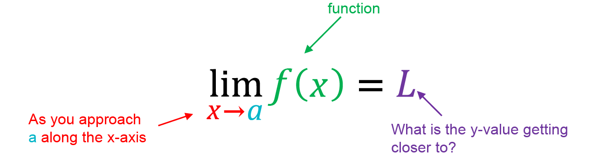
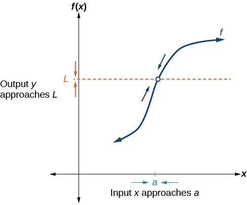
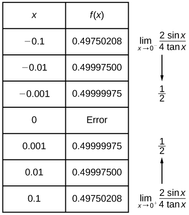
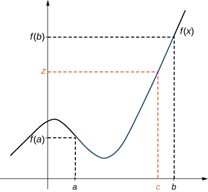
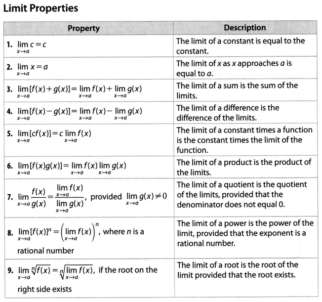

# Function limit
 

- 3.1. Definition of the Cauchy limit of a function
- 3.2. Theorem on the connection of the two sided limit with unilateral
- 3.3. Definition of the limit of a function according to Heine
- 3.4. Equivalence of limit definitions in Heine and Cauchy
- 3.5. Theorem on the uniqueness of the limit of a function
- 3.6. Theorem on local boundedness of a function, having a finite limit
- 3.11. Complex function limit theorem (replacement variable in the limit)
- 3.12. The theorem on the constancy of a convexity of a doubly differentiable function
- 3.13. Passing to the limit in inequality 
- 3.14. Intermediate function limit theorem
- 3.15. Infinitely large functions
- 3.16. Theorem on the connection of infinitely large and infinitesimal functions
- 3.7. Infinitely small functions
- 3.8. Theorem on the connection between a function, its limit and infinitesimal
- 3.9. Properties of infinitesimal functions
- 3.10. Theorem on arithmetic operations on functions that have a limit
- 3.17. First and second wonderful limits and consequences of them
- 3.18. Weierstrass' theorem on the limit of a monotonic and limited function
- 3.19. Comparison of infinitesimals
- 3.20. Order of smallness, equivalent to infinite small, incomparable infinitesimal
- 3.21. Table of equivalent infinitesimals
- 3.22. Properties of equivalent infinitesimals
- 3.23. Rules for working with "about small"
- 3.24. Comparison of infinitely large
- 3.25. Theorems about equivalent infinites big

# Limits

## Learning Targets

## Concepts / Definitions

### Informal definition of a limit
If $f(x)$ becomes arbitratily close to a single number $L$ as $x$ approaches a number $a$ from _either_ side, the limit of $f(x)$ as $x$ approaches $$ is $L$.

### Definition for a Limit using one-sided limits
$$\lim_{x\to a} f(x) = L\quad iff\quad \lim_{x\to a^-} f(x) = L = \lim_{x \to a^+} f(x)$$

Note: Technically, the theorem is based on a real number, $L$, but we include infinity as a possible answer.

### Graphical Example

### Numerical Example

Numerically, we will have a limit _if it is clear we are approaching one output value_ as we look at values from inputs smaller and larger than $\alpha$.

### Analytic / Algebraic Example
$$\lim_{x\to 1}\frac{x^2-1}{x-1}$$
$$= \lim_{x\to 1}\frac{(x+1)(x-1)}{x-1}$$
$$= \lim_{x\to 1}(x+1)$$
$$= 2$$

Many times limits (not all), like the derivative, require us to find the output value of the hole of the difference quotient.

### Continuity at a Point

#### Interior Point
A function $y = f(x)$ is continuous at an interior point c of its domain if
$$\lim_{x\to c} f(x) = f(c)$$

#### Endpoint
A function $y = f(x)$ is continuous at a left endpoint $\alpha$ or is continuous at a right endpoint $b$ of its domain if
$$\lim_{x\to a^+} f(x) = f(a)\quad or\quad \lim_{x\to b^-} f(x) = f(b)\ respectively$$

### Intermediate Value Theorem for Continuous Functions

A function $y = f(x)$ that is continuous on a closed interval $[a, b]$ takes on every value between $f(a)$ and $f(b)$. In other words, if $y_0$ is between $f(a)$ and $f(b)$, then $y_0 = f(c)$ for some $c$ in $[a, b]$.

#### Properties of Limits
Let $b$ and $c$ be real numbers, lef $n$ be a positive integer, and let $f$ and $g$ be functions with the following limits.

Ex: Is any real number exactly 1 less than its cube?
