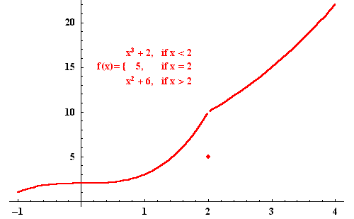
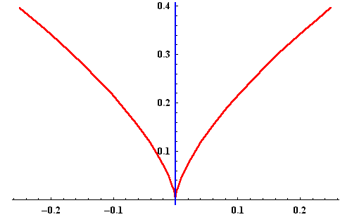
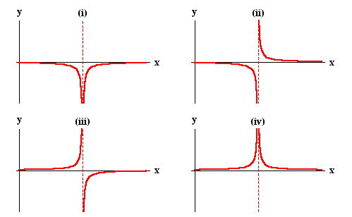
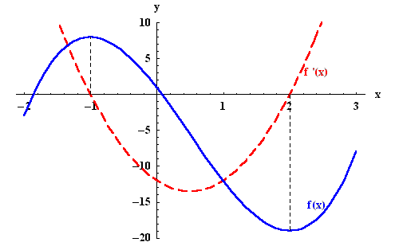
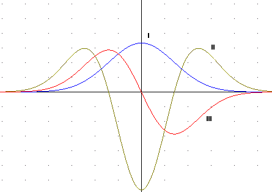

# Definition of the Derivative and Differentiability

## Concepts / Definitions

### Slope of a Curve at a Point

The slope of the curve $$y = f(x)$$ at the point $$P(a,f(a))$$ is the number
$$m = \lim_{h\to 0} \frac{f(a+h)-f(a)}{h}$$
provided the limit exists.

### Derivative at a Point

The derivative of the function $$f$$ at the point $$x = a$$ is
$$f'(a) = \lim_{x\to a} \frac{f(x)-f(a)}{x-a}$$
provided the limit exists.

### The Derivative Function

What if we wanted to find the slope at any point, a functions of slopes, rather than slope at a particular point?

The derivative of the function $$f$$ with respect to the variable $$x$$ is the function $$f'$$ whose value at $$x$$ is 
$$f'(x) = \lim_{h\to 0} \frac{f(x+h)-f(x)}{h}$$
provided the limit exists.

#### Other Notations for derivatives of $$y = f(x)$$
$$\frac{d}{dx}f(x) = \frac{df}{dx} = f'(x) = \frac{d}{dx}y = \frac{dy}{dx} = y'$$

### How $$f'(a)$$ fails to exist

#### Left derivative not equal to right derivative (a corner)

#### A point where the function is discontinuous (discontinuity)

#### Left and right slopes approach opposite $$\infty$$ (a cusp)

### Note: (todo)

Despite limits dealing with _numbers_, and $$\infty$$ not considered as one, mathmatical standard is to write the slope as $$\infty$$ in order to give more detail to the answer.

NOTE: Remember that for a derivative to exist at a point, the derivative (in other words, the limit of difference quotient) must exist as a number, and from the left and from the right must be the same.

The limits for graphs II and III are $$-\infty$$ and $$\infty$$, respectively. It doesn't exist for I and IV.

### Working Definitions

#### Differentiability Implies Continuity
If $$f$$ has a derivative at $$x = a$$, then $$f$$ is continuous at $$x = a$$.

#### Differentiability Implies Local Linearity
A differentiable function resembles its own tangent close (zoomed in) to some input value $$a$$.

#### Numerical Derivative
The numerical derivative of $$f$$ at $$a$$, which we will denote $$nDeriv(f(x),a)$$ is the number
$$\frac{f(a+0.001)-f(a-0.001)}{0.002}$$

Then average the two below. Both must be really close to each other!
$$f'(a) = \lim_{h\to 0} \frac{f(a+h)-f(a)}{h}$$
$$f'(a) = \lim_{h\to 0} \frac{f(a)=f(a-h)}{h}$$

### Graphing $$f'$$ from a graph of $$f$$

### Determine $$f$$, $$f'$$, and $$\frac{d}{dx}f'$$

<<<<<<< HEAD:_episodes/0501-definition-of-the-derivative.md
[==>](../0502-differentiation-rules)
=======
[==>](../052-differentiation-rules)
>>>>>>> c57a79c715d4fefb2e2d43490bf64fdafd31a28b:_episodes/051-definition-of-the-derivative.md
