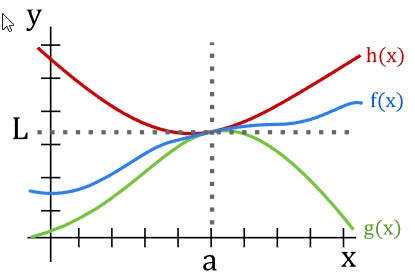

# Squeeze Theorem and Limit of Composite Functions

## Concepts / Definitions

### Limit Properties

Property | Description
---|---
$$\lim_{x\to 0}c = c$$ | The limit of a constant is equal to the constant.
$$\lim_{x\to a}x = a$$ | The limit of $$x$$ as it approaches $$a$$ is equal to $$a$$.
$$\lim_{x\to 0}[f(x) + g(x)] = \lim_{x\to 0} f(x) + \lim_{x\to 0} g(x)$$ | The limit of a sum is the sum of the limits.
$$\lim_{x\to 0}[f(x) - g(x)] = \lim_{x\to 0}f(x) - \lim_{x\to 0}g(x)$$ | The limit of a difference is the difference of limits.
$$\lim_{x\to 0}[cf(x)] = c\lim_{x\to 0}f(x)$$ | The limit of a constant times a function is the constant times the limit of the function.
$$\lim_{x\to 0}[f(x)g(x)] = \lim_{x\to 0}f(x)\lim_{x\to 0}g(x)$$ | The limit of a product is the product of the limits.
$$\lim_{x\to 0}\frac{f(x)}{g(x)} = \frac{\lim_{x\to 0}f(x)}{\lim_{x\to 0}g(x)}$$, provided $$\lim_{x\to 0}g(x) = 0$$ | The limit of a quotient is the quotient of the limits, provided that the denominator does not equal zero.
$$\lim_{x\to 0}[f(x)]^n = (\lim_{x\to 0}f(x))^n$$, where $$a$$ is a rational number | The limit of a power is the power of the limit, provided that the exponent is a rational number.
$$\lim_{x\to 0}\sqrt[n]{f(x)} = \sqrt[n]{\lim_{x\to 0}f(x)}$$, if the root on the right side exists | The limit of a root is the root of the limit, provided that the root exists.

### Limit of a Composite Function Theorem

If $$f$$ and $$g$$ are functions such that $$\lim_{x\to c}g(x) = L$$ and $$\lim_{x\to L}f(x) = f(L)$$, then
$$\lim_{x\to c}(f \circ g)(x) = \lim_{x\to c}f(g(x)) = f(\lim_{x\to c}g(x)) = f(L)$$

The limit of a composition is the composition of the limit, provided the outside function is continuous at the limit of the inside function.

#### Proving the limit of $$\frac{\sin x}{x}$$

We know by comparing rates and / or looking at the graph that $$\lim_{\theta \to 0}\frac{\sin \theta}{\theta} = 1$$. How do we prove it? (L'Hospital not born yet)

### Squeeze Theorem

If $$f(x) \leq h(x) \leq g(x)$$ for all $$x\neq c$$ in some interval about $$c$$, and $$\lim_{x\to c}g(x) = \lim_{x\to c}f(x) = L$$ then
$$\lim_{x\to c}h(x) = L$$

## Examples

### Example 1
Show the following analytically
$$\lim_{x\to 0}(x^2 \sin(1/x)) = 0$$

We know the following, $$-x^2 \leq x^2 \sin(\frac 1x) \leq x^2$$ 

_and_ 
$$
\lim_{x\to 0}-x^2 \leq \lim_{x\to 0}(x^2\sin(\frac 1x)) \leq \lim_{x\to 0}x^
2$$ 

$$
\lim_{x\to 0}-x^2 = 0$$
 _and_ 
$$
\lim_{x\to 0}x^2 = 0
$$, so by Squeeze Theorem 

$$
\lim_{x\to 0}(x^2\sin\frac 1x) = 0
$$

### Example 2
$$
\lim_{\theta\to 0}\frac{1}{\cos\theta}\geq\lim_{\theta\to 0}\frac{\sin\theta}{\theta}\geq\lim_{\theta\to 0}\cos\theta
$$

$$
1 \geq\ ? \geq 1
$$

## Exercises

  1. Evaluate $$\lim_{x\to 1} \arcsin(\frac{1-\sqrt x}{1-x})$$
  2. Show analytically that $$\lim_{x\to 0}x^2\cos(\frac{1}{x^2}) = 0$$
  3. Evaluate $$\lim_{x\to 0}\frac{(x+2)^4}{x}$$
  4. Show analytically that $$\lim_{x\to\infty}\frac{\sin x}{x} = 0$$
  5. For the graphs below, <!--TODO-->
  6. Functions $$f$$, $$g$$, and $$h$$ are twice-differentiable functions with $$g(2) = h(2) = 4$$. 
The line 
$$y = 4 + \frac 23 (x-2)$$ 
is tangent to both the graph of 
$$g$$ at $$x=2$$ and the graph of $$h$$ at $$x=2$$. 

It is known that $$
g(x) \leq h(x)
$$ for 
$$
1 < x < 3$$. 
Let $$k$$ be a function satisfying $$
g(x)\leq k(x)\leq h(x)
$$ for $$1 < x < 3$$. 
Is $$k$$ continuous at $$x=2$$? Justify your answer.

[==>](../055-chain-rule)
