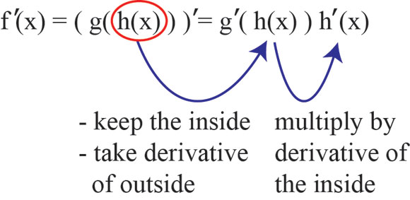

# Chain Rule

## The Chain Rule

If $$f$$ is differentiable at the point $$u=g(x)$$ and $$g$$ is differentiable at $$x$$, then the composite function $$(f\circ g)(x) = f(g(x))$$ is differentiable at $$x$$.

#### Newton Notation
$$(f\circ g)'(x) = f'(g(x)) \bullet g'(x)$$

#### Liebniz
If $$y = f(u)$$ and $$u = g(x)$$, then
$$\frac{dy}{dx}=\frac{dy}{du}\bullet\frac{du}{dx}$$

#### In words
The derivative of the outside function evaluated at the inner function times the derivative of the inside function.

### Parametric Rule for dy/dx
If all three derivatives exist, and $$\frac{dx}{dt} \neq 0$$,
$$\frac{dy}{dx} = \frac{dy/dt}{dx/dt}$$

## Examples

### Example 1

$$y = 5(x^3 + 7)^3$$

$$y = 5(g(x))^3$$

$$y' = 15(g(x))^2 \bullet g'(x)$$

$$y' = 15(x^3 + 7)^2 \bullet (3x^2 + 0)$$

$$y' = 45x^2(x^3 + 7)^2$$

### Example 2
Determine the derivative of $$f(x) = (3x^2 + 1)^2$$

$$f'(x) = 2(3x^2 + 1)\frac{d}{dx}(3x^2 + 1)$$

$$f'(x) = 2(3x^2 + 1)(6x + 0)$$

$$f'(x) = 12x(3x^2 + 1)$$

### Example 3
Determine the derivative of $$g(t) = \tan(5-\sin 2t)$$

$$g'(t) = \sec^2(5-\sin 2t)\frac{d}{dx}(5-\sin 2t)$$

$$g'(t) = \sec^2(5-\sin 2t)(-\cos 2t)\frac{d}{dx} 2t$$

$$g'(t) = \sec^2(5-\sin 2t)(-\cos 2t)(2)$$

$$g'(t) = 2\sec^2(5-\sin 2t)(-\cos 2t)$$

### Example 4
Find the derivative of the following. Note: $$\frac{d}{dx}F(x) = F'(x) = f(x)$$

$$f(\theta) = \cos^2 2\theta$$

$$F(x) = (3x - 1)^4(2x + 1)^{-1}$$

[==>](../057-derivatives-of-inverse-functions)
