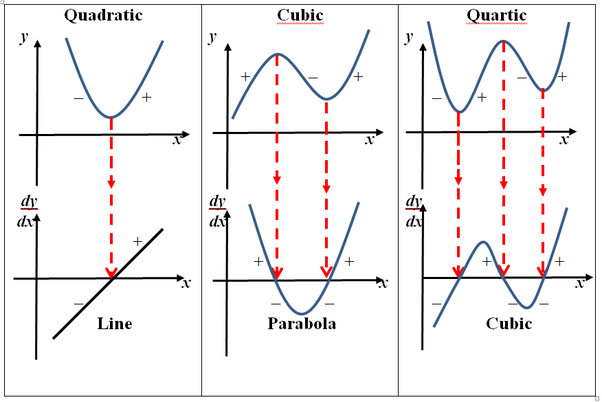

# Differentiation Rules

## Concepts / Definitions

### Derivative of a Constant

If $$f$$ is the function with constant value $$c$$, then
$$\frac{df}{dx} = \frac{d}{dx}(c) = 0$$

### Constant times a Function Rule

#### Solving for the rule

If $$u$$ is a differentiable function of $$x$$ and $$c$$ is a constant, then for $$y = cu$$ $$\frac{d}{dx}cu = ?$$

#### Definition
If $$u$$ is a differentiable function of $$x$$ and $$c$$ is a constant, then
$$\frac{d}{dx}cu = c\frac{du}{dx}$$

### The Sum and Difference Rule

#### Solving for the rule

If $$u$$ and $$v$$ are differentiable functions of $$x$$, then their sum and difference are differentiable at every point where $$u$$ and $$v$$ are differentiable. At such points, $$\frac{d}{dx}(u\pm v) = ?$$

$$y' = \lim_{h\to 0} \frac{u(x+h)+v(x+h)-(ux+vx)}{h}$$
$$y' = \lim_{h\to 0} \frac{u(x+h)-ux+v(x+h)-vx}{h}$$
$$y' = \lim_{h\to 0} \frac{u(x+h)-ux}{h} + \lim_{h\to 0} \frac{v(x+h)-vx}{h}$$
$$y' = u'(x) + v'(x)$$

#### Definition
If $$u$$ and $$v$$ are differentiable functions of $$x$$, then their sum and difference are differentiable at every point where $$u$$ and $$v$$ are differentiable. At such points,
$$\frac{d}{dx} (u \pm v) = \frac{du}{dx} \pm \frac{dv}{dx}$$

### Power Rule for Derivatives

<!-- TODO -->

<!-- At this point, we know how to calculate the derivatives of simple functions like $$x$$, $$x^2$$, and $$x^3$$. 
Many rules that we've derived so far have been the result of an observation of a pattern.  
If we're to find a general rule for derivatives of any power function, it stands to reason that we should start by looking for a pattern amongst them.
-->

$$f(x) = x^2$$

x | -1 | 0 | 1 | 2 | 3
---|---|---|---|---|---
f'(x) | -2 | 0 | 2 | 4 | 6

$$f'(x) = 2x$$

$$g(x) = x^3$$

x | -1 || 0 || 1 || 2 || 3
---|---|---|---|---|---|---|---|---|---
g'(x) | 3 || 0 || 3 || 12 || 27
|||V||V||V||V
|||-3||3||9||15
||||V||V||V
||||6||6||6

$$g'(x) = 3x^2$$

<!-- See a pattern yet? If not, know that the derivative of $$x^4$$ is $$4x^3$$. You should be able to write a general rule for this. However, it's not enough yet - we need to prove these observations _algebraically_.-->

#### Definition
If $$f(x) = x^n$$ is a power function, with non-zero real number $$n$$, then
$$\frac{d}{dx}f(x) = nx^{n-1}$$

### The Product Rule

#### Solving

$$f'(x) = \lim_{h\to 0} \frac{(x+h)^n - x^n}{h}$$
$$f'(x) = \lim_{h\to 0} \frac{(_nC_0x^nh^0 + _nC_1x^{n-1}h^1 + _nC_2x^{n-2}h^2 + ... + _nC_{n-1}x^1h^{n-1} + _nC_nx^0h^n) - x^n}{h}$$
$$f'(x) = \lim_{h\to 0} \frac{(x^n + nx^{n-1}h^1 + _nC_2x^{n-2}h^2 + ... + nx^1h^{n-1} + h^n) - x^n}{h}$$
$$f'(x) = \lim_{h\to 0} \frac{h(nx^{n-1} + _nC_2x^{n-2}h^1 + ... + nx^1h^{n-2} + h^{n-1})}{h}$$
$$f'(x) = \lim_{h\to 0} (nx^{n-1} + _nC_2x^{n-2}h^1 + ... + nx^1h^{n-2} + h^{n-1})$$
$$$$

#### Definition
The product of two differentiable functions $$u$$ and $$v$$ is differentiable, and
$$\frac{d}{dx}(uv) = \frac{du}{dx}v+u\frac{dv}{dx}$$

### The Quotient Rule

#### Definition
At a point where $$v \neq 0$$, the quotient $$y = \frac uv$$ of two differentiable functions is differentiable, and
$$\frac{d}{dx}(\frac uv) = \frac{\frac{du}{dx}v - u\frac{dv}{dx}}{v^2}$$

In words, derivative of the numerator times the denominator minus the numerator times derivative of the denominator, all divided by the denominator squared.

Slightly simplier, derivative of the top times the bottom 
minus the top times derivative of the bottom, 
all divided by the bottom squared.

A common <!--haha no--> catch phrase to remember this is "Low d high minus high d low all divided by bottom squared".

### Higher Order Derivatives

#### Second Derivative
$$y'' = \frac{d}{dx}y' = \frac{d}{dx} (\frac{dy}{dx}) = \frac{d^2y}{dx^2}$$

#### Third Derivative <!-- double check this -->
$$y''' = \frac{d}{dx}y'' = \frac{d}{dx}(\frac{dy'}{dx}) = \frac{d^3y}{dx^3}$$

#### nth Derivative
$$y^{(n)} = \frac{d}{dx}y^{n-1} = \frac{d^ny}{dx^n}$$

### Examples

Find an equation of the line tangent to the curve $$y = \frac{x^2 - 1}{x^2 + 1}$$ at $$x = -2$$

$$\frac{dy}{dx} = \frac{4x}{(x^2+1)^2}$$
$$\frac{dy}{dx}\rvert_{x = -2} = \frac{4(-2)}{((-2)^2 + 1)^2}$$
$$\frac{dy}{dx}\rvert_{x = -2} = -\frac{8}{25}$$
$$y = \frac{(-2)^2-1}{(-2)^2+1}$$
$$y = \frac 35$$
$$z = -\frac{8}{25}(x+2) + \frac 35$$

[==>](053-rates-of-change.md)

