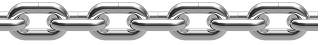
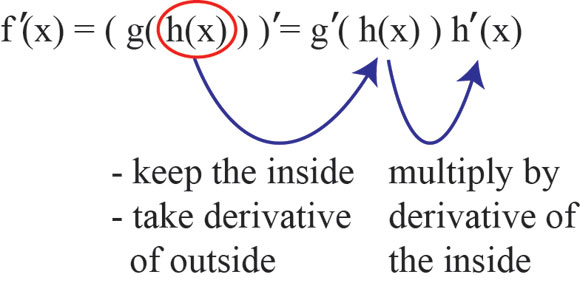

# 3-6 Chain Rule

## Learning Targets

You will be able to
- [ ] Differentiate composite functions using the chain rule
- [ ] ~~Find slopes of parametric functions~~

## The Chain Rule

If $f$ is differentiable at the point $u=g(x)$ and $g$ is differentiable at $x$, then the composite function $(f\circ g)(x) = f(g(x))$ is differentiable at $x$.

#### Newton Notation
$$(f\circ g)'(x) = f'(g(x)) \bullet g'(x)$$

#### Liebniz
If $y = f(u)$ and $u = g(x)$, then
$$\frac{dy}{dx}=\frac{dy}{du}\bullet\frac{du}{dx}$$

#### In words
The derivative of the outside function evaluated at the inner function times the derivative of the inside function.

### Parametric Rule for dy/dx
If all three derivatives exist, and $\frac{dx}{dt} \neq 0$,
$$\frac{dy}{dx} = \frac{dy/dt}{dx/dt}$$

## Examples

### Example 1

$$y = 5(x^3 + 7)^3$$
$$y = 5(g(x))^3$$
$$y' = 15(g(x))^2 \bullet g'(x)$$
$$y' = 15(x^3 + 7)^2 \bullet (3x^2 + 0)$$
$$y' = 45x^2(x^3 + 7)^2$$

### Example 2
Determine the derivative of $f(x) = (3x^2 + 1)^2$
$$f'(x) = 2(3x^2 + 1)\frac{d}{dx}(3x^2 + 1)$$
$$f'(x) = 2(3x^2 + 1)(6x + 0)$$
$$f'(x) = 12x(3x^2 + 1)$$

### Example 3
Determine the derivative of $g(t) = \tan(5-\sin 2t)$
$$g'(t) = \sec^2(5-\sin 2t)\frac{d}{dx}(5-\sin 2t)$$
$$g'(t) = \sec^2(5-\sin 2t)(-\cos 2t)\frac{d}{dx} 2t$$
$$g'(t) = \sec^2(5-\sin 2t)(-\cos 2t)(2)$$
$$g'(t) = 2\sec^2(5-\sin 2t)(-\cos 2t)$$

### Example 4
Find the derivative of the following. Note: $\frac{d}{dx}F(x) = F'(x) = f(x)$
$$f(\theta) = \cos^2 2\theta$$
$$F(x) = (3x - 1)^4(2x + 1)^{-1}$$

[==>](3-8-derivatives-of-inverse-functions.md)
