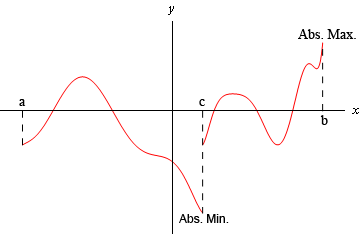
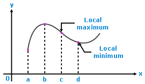
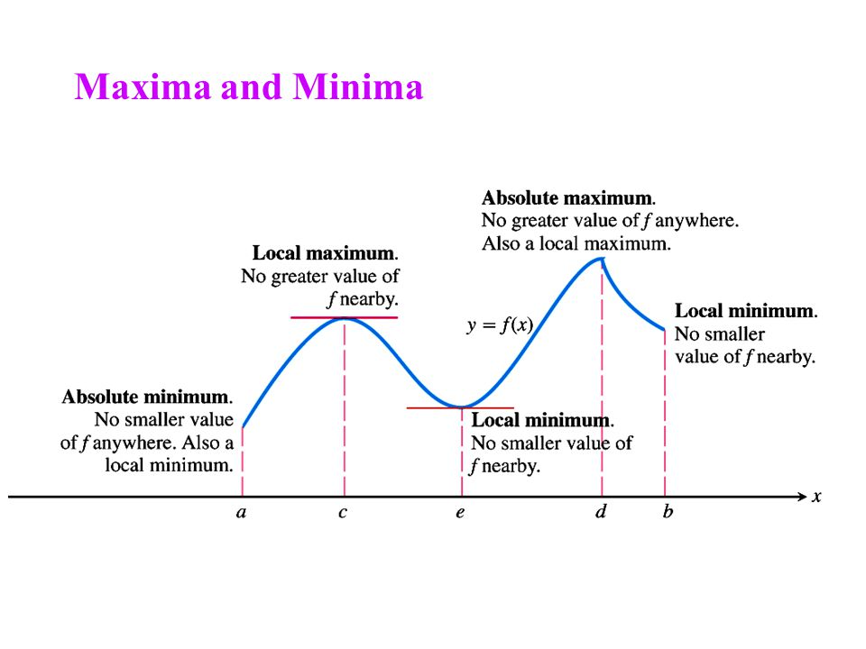

# 4-1 Extreme Values of Functions

## Learning Targets

You will be able to
- [ ] Identify absolute/global and local/relative extreme values
- [ ] Find absolute/global and local/relative extreme values

## Concepts / Definitions

### Intervals
A **closed interval** is an interval including endpoints, equivalent to $[a,b]$. 
An **open interval** is an interval not including endpoints, equivalent to $(a,b)$. 
A **half-open interval** is when one side of the interval includes an endpoint, but the other doesn't. Equivalent to $[a,b)$ or $(a,b]$.

### Definition of Absolute (or global) Extreme Values
Let $f$ be a function with domain $D$. Then $f(c)$ is the
 1. absolute maximum value on $D$ if and only if $f(x) \leq f(c)$ for all $x$ in $D$
 2. absolute minimum value on $D$ if and only if $f(x) \geq f(c)$ for all $x$ in $D$

### The Extreme Value Theorem (existance)
If $f$ is continuous on a closed interval $(a,b)$, then $f$ has both a maximum value and a minimum value on the interval.

### Definition of Local (relative) Extreme Values (how to find)
Let $c$ be an interior point of the domain of the function $f$. Then $f(c)$ is a
 1. local maximum value at $c$ if and only if $f(x) \leq f(t)$ for all $x$ in some open interval containing $c$.
 2. local minimum value at $c$ if and only if $f(x) \geq f(c)$ for all $x$ in some open interval containing $c$.

A function $f$ has a local maximum or local minimum at an endpoint if the appropriate inequality holds for all $x$ in some half-open domain interval containing $c$.

### Maxima and Minima

No relative or absolute max here. 
Absolute min when $x=0$. 
Local min when $x=3$.

### Definition of a Critical Point
A point in the interior of the domain of a function $f$ at which $f'(c) = 0$ or $f'(c)$ does not exist is a critical point of $f$.

### Definition of a Stationary Point
A point in the interior of the domain of a function $f$ at which $f'(c) = 0$ is called a stationary point of $f$.

### Usage

Find extreme values means find all absolute extrema (max and min), and local extrema.

When question says find the extreme values of the function and where they occur.

For where, you give the location point. Another acceptable way of giving the point is 
A min/max value of \_\_\_\_\_ at/when x = \_\_\_\_\_

### Example
Identify the critical numbers and determine the absolute maximum and minimum values of $f(x) = x^{2/3}$ on $[-2,3]$.

$$f'(x) = \frac 23 x^{-1/3}$$
$$f'(x) = \frac{2}{3\sqrt[3]{x}}$$
Critical number is $c=0$ because the derivative is undefined when $x=0$.
$$f(0) = 0$$
$$f(-2) = \sqrt[3]{4}$$
$$f(3) = \sqrt[3]{9}$$
Absolute Min value is 0 
Absolute Max value is $\sqrt[3]{9}$.

[==>](4-2-mean-value-theorem.md)
