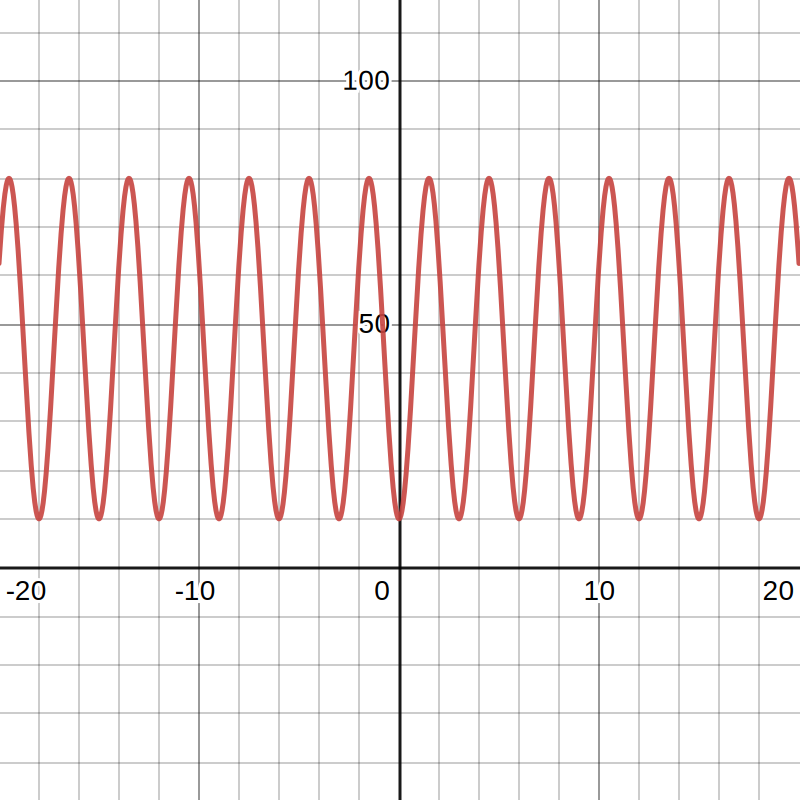
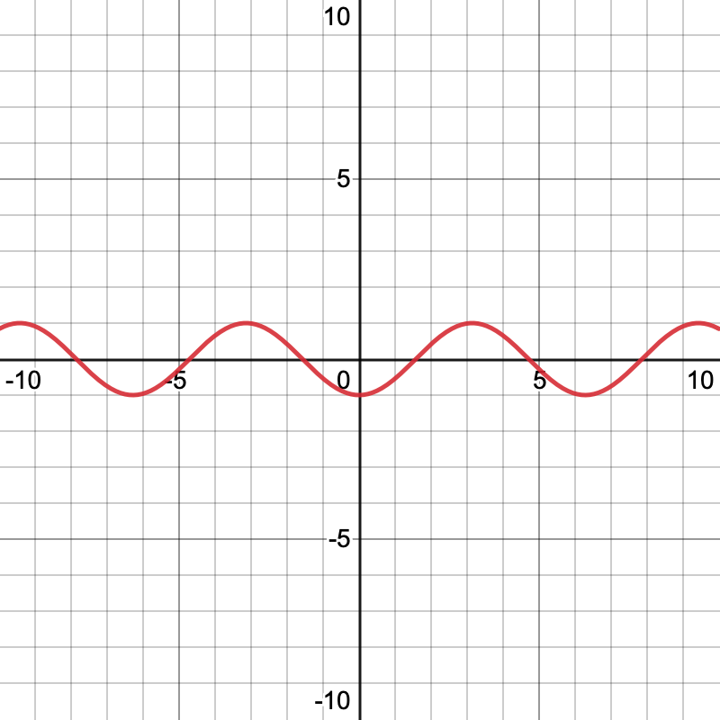
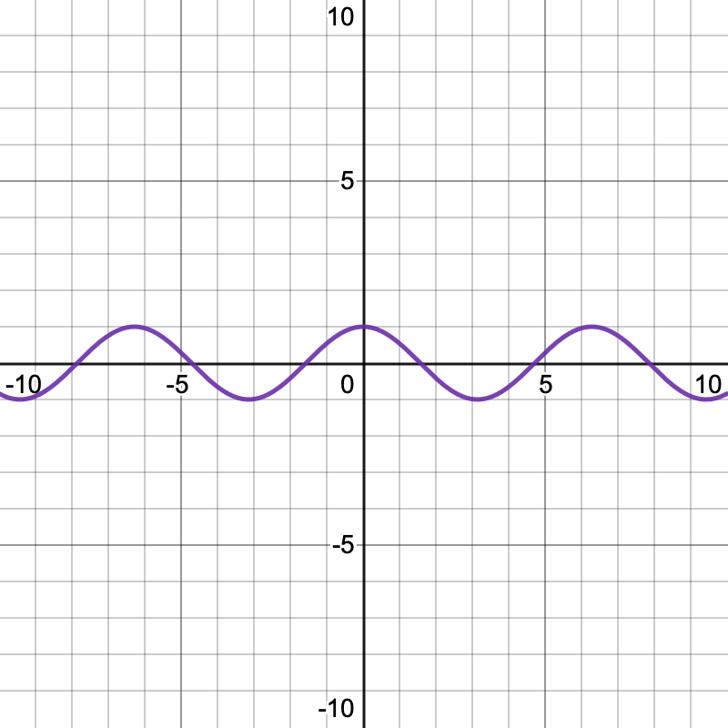
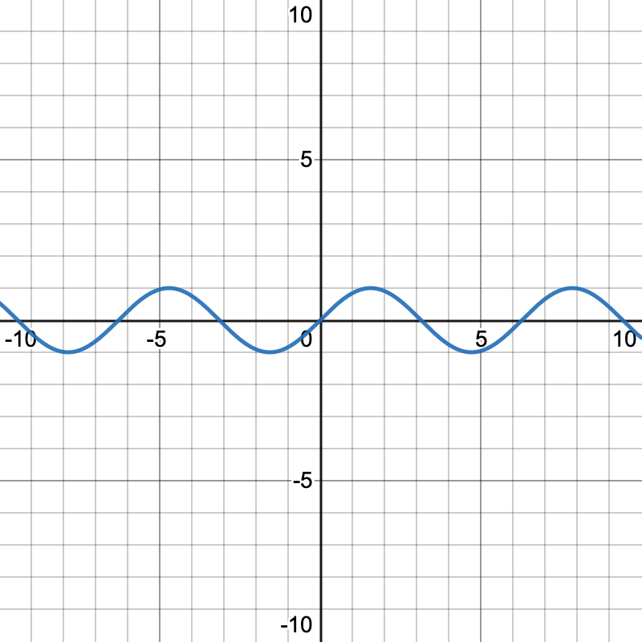
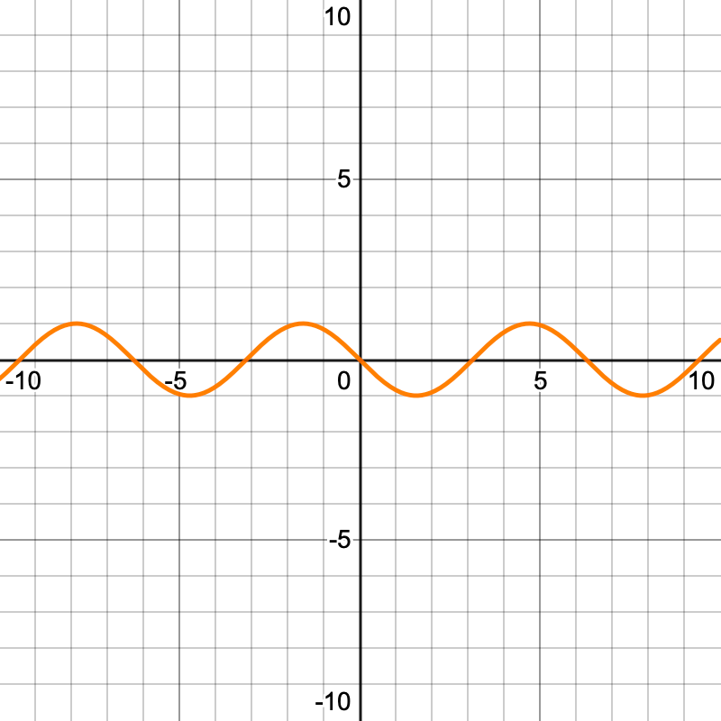
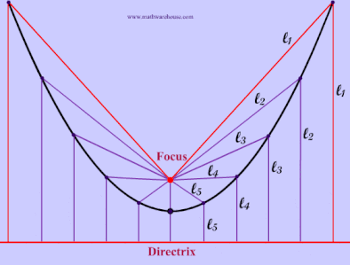

# Honors Algebra Exam Reference Notes

*An unofficial guide from the notes of Jacky Song.*

<!--
## All Symbols, Formulae, and Equations used in Honors Algebra

* General equation of line: $$y = mx + c$$

  * $$m$$ is the slope

  * $$c$$ is the *y-intercept*

*To be completed sometime soon...*
-->

## Solving Quadratic Equations

In essence, every quadratic equation follows the following equation:

$$
ax^2 + bx^2 + c = 0
$$

And the factored form of a quadratic equation (the form we want it to be in) follows the following equation:

$$
a(x-r)(x-s) = 0
$$

What we want to find is two numbers, $$r$$ and $$s$$, which *multiply* to form *c* and *add* to form $$bx^2$$. All methods of solving quadratic equations effectively are ways to be able to derive $$r$$ and $$s$$.

### Factoring By Grouping

Suppose we have an equation that looks like this:

$$
x(x+1) - 5(x+1)
$$

Then, we know that the common factor is $$(x+1)$$. Hence, after factoring, it becomes:

$$
(x-5)(x+1)
$$

### Factoring By AC Method

Suppose we have the equation below:

$$
2x^2 + 5x + 2 = 0
$$

We multiply the first and last terms to form special variable called $$X$$:

$$
\underline{2}x^2 + 5x + \underline{2} = 0
$$

$$
X = 2 \cdot 2 = 4
$$

We also take out the coefficient $$b$$ in $$bx^2$$ to form a special variable called $$Y$$:

$$
2x^2 + \underline{5}x + 2 = 0
$$

$$
Y = 5
$$

We find two numbers that *multiply* to make $$X$$ and *add* to make $$Y$$:

$$
\begin{cases}
1 + 4 = Y \\
1 \cdot 4 = X
\end{cases} \\
(1, 4)
$$

We now replace the $$bx^2$$ term in the original equation with our 2 factors

$$
(1, 4) = 1x + 4x
$$

$$
2x^2 + \underline{4x + 1x} + 2 = 0
$$

We can now factor the equation out:

$$
2x(x+2) + 1(x+2)
$$

$$
(2x + 1)(x+2) = 0
$$

### Completing the Square

Suppose we have the following equation:

$$
x^2 - 6x + 8 = 0
$$

First, let's make sure that the coefficient $$a$$ in $$ax^2$$ is equal to one. In this case it already is, so no need to worry.

Now, we want to space out the equation - in places we want to modify, we leave blank:

$$
(x^2 - 6x \quad\underline{\qquad}\quad) + 8 \quad\underline{\qquad} = 0
$$

For the first blank, we'll need to take the coefficient $$b$$ of $$bx^2$$, then divide it by two and square it:

$$
(x^2 - \underline{6}x \quad\underline{\qquad}\quad) + 8 \quad\underline{\qquad} = 0
$$

$$
\left(x^2 - 6x \left(\frac{-6}{2}\right)^2\right) + 8 \quad\underline{\qquad} = 0
$$

$$
(x^2 - 6x + 9) + 8 \quad\underline{\qquad} = 0
$$

Now that we've added the square (9 in our case), we need to subtract it from the other side to *complete* the square:

$$
(x^2 - 6x + \underline{9}) + 8 -\underline{9} = 0
$$

$$
(x^2 -6x + 9) -1 = 0
$$

As the expression we have on the left is now a perfect square, we can easily factorize it:

$$
(x - 3)(x - 3) - 1 = 0
$$

$$
(x-3)^2 - 1 = 0
$$

With simplification:

$$
(x-3)^2 = 1
$$

## Matching Quadratic Functions to Graphs

You may be given a few equations and told to find the equation that matches a graph. Matching involves finding several things about the quadratic function in question.

Firstly, for a quadratic function $$f(x) = ax^2 + bx + c$$, if $$a > 0$$ the graph opens up (frowny face) and if $$a < 0$$ the graph opens down (smiley face).

Secondly, the vertex of the quadratic function tells you either the highest or lowest point - you can compare it to a graph. The vertex is given by:

$$
\left(- \frac{b}{2a}, f\left(-\frac{b}{2a}\right)\right)
$$

Thirdly, you can compare the x-intercepts by setting $$y=0$$, and y-intercepts by setting $$x = 0$$.

Forthly, you can use the axis of symmetry.

## Trigonometry

### Things you'll need to know!

- Trigonometric Identities
  - SOH CAH TOA
  - Trig song
  - Converting radians and degrees
  - Trig inverse equivalents
  - Trig ratio rules

### SOH CAH TOA!

**S**ine is **O** over **H** (SOH)!

**C**osine is **A** over **H** (CAH)!

**T**angent is **O** over **A** (TOA)!

With that, as long as we know one of leg of the triangle, be it opposite (O), hypotenuse (H), or adjacent (A), we can find any other side!

### The Trig Song

One, two three!

Three, two, one!

Two under the bar!

Square root all that's not one!

Square root of three over three!

One, then square root of three!

Now that you know the song!

You can sing it again, to me!

*And this is how you get to this:*

|         | 30 degrees           | 45 degrees           | 60 degrees           |
| ------- | -------------------- | -------------------- | -------------------- |
| sine    | $$\frac{1}{2}$$        | $$\frac{\sqrt{2}}{2}$$ | $$\frac{\sqrt{3}}{2}$$ |
| cosine  | $$\frac{\sqrt{3}}{2}$$ | $$\frac{\sqrt{2}}{2}$$ | $$\frac{1}{2}$$        |
| tangent | $$\frac{\sqrt{3}}{3}$$ | $$1$$                  | $$\sqrt{3}$$           |

**Explanation:**

"One, Two, Three" is the first row of the table

"Three, Two, One" is the second row

"Two under the bar" means to make 2 the denominator of every number (so 1 will become $$\frac{1}{2}$$, 2 will become $$\frac{2}{2}$$, you get the idea)

"Square root all that's not one" means to add a square root to every number (in rows 1) and 2) that, as you might have guessed, is **not 1**)

"Square root of three over three" is for the first column of the third row ($$\tan 30^\circ$$)

"One, then square root of three" is for the second and third columns of the third row ($$\tan 45^\circ$$ and $$\tan 60^\circ$$)

And you've got that done!

### Converting between radians and degrees

Here's a base rule to memorize: $$2\pi$$ radians is **equal to** $$360^\circ$$

Using that, you can quickly find that:

| Radians         | Degrees |
| --------------- | ------- |
| $$\pi$$           | 180     |
| $$\frac{\pi}{2}$$ | 90      |
| $$\frac{\pi}{3}$$ | 60      |
| $$\frac{\pi}{4}$$ | 45      |
| $$\frac{\pi}{6}$$ | 30      |

### Trig Inverse Equivalents

Aside from the main trigonometric ratios, we also have secants, cosecants, and cotangents. These are inverses of the three we already know and love.

| Secant                                 | Cosecant                               | Cotangent                              |
| -------------------------------------- | -------------------------------------- | -------------------------------------- |
| $$\sec \theta = \dfrac{1}{\cos \theta}$$ | $$\csc \theta = \dfrac{1}{\sin \theta}$$ | $$\cot \theta = \dfrac{1}{\tan \theta}$$ |

* **Secant** is the inverse to cosine (remember that by noticing that if you spell cos backwards, it looks like sec!)
  
  * If you have a fraction like $$\sec \frac{1}{x}$$, just flip the fraction to get the equivalent in cosine ($$\cos \frac{x}{1} = \cos x$$)

* **Cosecant** is the inverse to sine (think of it as the one that has a name the most unlike its inverse counterpart)

* **Cotangent** is the inverse to tangent (remember it because of the obvious name)

<!--
### Trig Ratio Rules

Several trigonometric ratios can be derived via the Pythagorean Theorem. These, unfortunately, you have to memorize (and there's no easy song for it)

To be completed...
-->

### Trig Ratios and Quadrants

In case you've forgotten, here are the four quadrants:

**Trick to remember** The quadrants start from the positive x and positive y, then go left. So start counting from the region of $$(+x,+x)$$ which is the first quadrant, and to the left of that is the second quadrant, next is the third, and next is the forth.

How do trig ratios have anything to do with the quadrants? Because quadrants determine whether these ratios are positive or negative. Like this:

| Sector I                                        | Sector II                                      | Sector III                                        | Sector IV                                        |
| ----------------------------------------------- | ---------------------------------------------- | ------------------------------------------------- | ------------------------------------------------ |
| **A**ll                                         | **S**tudents                                   | **T**ake                                          | **C**alculus                                     |
| **All** ratios positive ($$+\sin, +\cos, +\tan$$) | **Sine** positive only $$(+\sin, -\cos, -\tan)$$ | **Tangent** positive only ($$-\sin, -\cos, +\tan$$) | **Cosine** positive only $$(-\sin, +\cos, -\tan)$$ |

#### Finding Trig values from a point

If you were given the point $$P = (-3, 4)$$, we can solve for the values of $$\sin, \cos, \tan, \csc, \sec$$, and $$\cot$$:

* We know that the point is in the second quadrant

* Using our *all students take calculus* trick, we know that the second quadrant is where only **sine is positive**

* We can draw a triangle to point $$P$$ from the origin of the graph, which has a width of 3 units and a height of 4 units, and using Pythagoras's $$x^2 + y^2 = h^2$$, we know that the hypotenuse is $$\sqrt{3^2 + 4^2}=5$$

* So we know that $$H = 5, O = 4, A = 3$$

* We also know that $$\sin \theta = O/H$$, so $$\sin \theta = 4/5$$

* Then we can work out $$\cos \theta = 3/5$$, and $$\tan \theta = 4/3$$ 

* Lastly, because sine and cosecant are inverses, we know that $$\csc \theta = 5/4, \sec \theta = 5/3,$$ and $$\cot \theta = 3/4$$

#### Finding Trig values from an angle

If you were given the expression $$\tan \frac{5\pi}{2}$$, we can find its exact value:

* We know that $$\tan \frac{5\pi}{2} = \tan \frac{\pi}{2}$$ because $$\frac{4\pi}{2} = 360^\circ$$, which is a full revolution, and we can effectively ignore a full revolution, and $$\frac{5\pi}{2} - \frac{4\pi}{2} = \frac{\pi}{2}$$
* We also know that $$\tan \frac{\pi}{2}$$ is the same as $$\tan 45^\circ$$, which we know to be equal to 1
* Sometimes, you will also be asked to provide the reference angle, such as the reference angle of $$\tan \frac{5\pi}{2}$$
* The **reference angle** is how far an angle is from the x-axis
* $$180^\circ, 360^\circ, 540^\circ,$$ and $$720^\circ$$ are angles that are on the x-axis, and when finding the reference angle, we just need to find the difference to the closest reference angle
* In the case of $$\frac{5\pi}{2}$$, the closest reference angle is $$\frac{4\pi}{2} = 2\pi = 360^\circ$$
* The difference between $$\frac{5\pi}{2}$$ and $$\frac{4\pi}{2}$$ is $$\frac{\pi}{2}$$ which is $$45^\circ$$
* Thus, we know that the reference angle of $$\tan \frac{5\pi}{2}$$ is $$\tan \frac{4\pi}{2}$$ or 360 degrees

## Trigonometric Identities

* The trigonometric identities are a series of ratios between trig functions; unfortunately, you'll need to memorize them!

$$
\sin^2 \theta + \cos^2 \theta = 1
$$

$$
\tan^2 \theta + 1 = \sec^2 \theta
$$

$$
\cot^2 \theta + 1 = \csc^2 \theta
$$

$$
\tan \theta = \frac{\sin \theta}{\cos \theta}
$$

## Transformations of Sine/Cosine Graphs

(The image here is corrupted, will fix this later!)

### Sine/Cosine Graph General Equation

$$
y = A ⋅ sin(k(x + c)) + d
$$

In this equation:

* $$A$$ is the amplitude, or the absolute value of the maximum of the graph
  
  * You can remember it by recalling that $$y= sin x$$ is basically $$y = 1 sin x, A = 1$$ if you forget

* $$k$$ is distance between two maximums of the graph, which you can find from the period $$P$$ using the equation $$k = 2\pi/P$$

* $$c$$ is how far the graph is shifted to the left or right (it is negative if the graph is shifted to the left, positive when shifted to the right)

* $$d$$ is how far the graph is shifted up or down

* The maximum of a sinosoid graph is $$(d+A)$$, and the minimum is $$(d+-A)$$

* The range of a sinosoid graph is $$(d+-A) \leq y \leq (d+A)$$, and the range is always $$[-\infty, \infty]$$

## Solving Problems with Sinusoidal Graphs

* Sinosoidal graphs are often useful (and sometimes required!) in solving word problems

* Example: The Ferris wheel at the Puyallup Fair has a diameter of about 70 feet and takes 3 minutes to complete a full rotation. Passengers board from a platform 10 feet above the ground. Write an equation for a rider’s height above ground over time.

* To solve this problem, we need to find the horizontal stretch (amplitude), horizontal shift, vertical stretch (period), and vertical shift
* Amplitude, or $$A$$, can be found with this formula:

$$
A = \frac{H_{max}-H_{min}}{2}
$$

* To find $$H_{max}$$, we simply need to find how high from the ground we will be when we get to the top of the Ferris wheel. We know that the Ferris wheel is 10 feet above the ground, and is 70 feet high (because its diameter is 70 feet), so $$H_{max} = 70 + 10 = 80\ \mathrm{ft.}$$

* To find $$H_{min}$$, we just need the lowest point of the Ferris wheel. The lowest point on the Ferris wheel is at 0 feet, but the Ferris wheel is also 10 feet above the ground, so its lowest point $$H_{min} = 10+ 0 = 10\ \mathrm{ft.}$$

* Using the amplitude formula with our values of $$H_{max}$$ and $$H_{min}$$, we find that our amplitude is $$\frac{80 - 10}{2}=\frac{70}{2}$$

* The period is the amount of time we need for a complete revolution, so in this case, it would be 3 minutes, or simply 3

* To find out $$k$$, we simply use this formula:

$$
k = \frac{2\pi}{P}; P = \frac{2\pi}{k}
$$

* So we know that $$k = \frac{2\pi}{3}$$

* There is no horizontal shift, but there is a vertical shift $$d$$ because the Ferris wheel is above the ground, and it is determined with this formula:

$$
d = \frac{H_{max} + H_{min}}{2}
$$

* Using this formula, $$d = \frac{80 + 10}{2} = 45$$

* Now, we can plug all of those numbers into our formula of $$y = A \sin (k(x)) + d$$

* Because our graph goes up, but doesn't pass its starting point (see the chart below for details), we won't be writing $$y = A \sin (k(x)) + d$$; instead, we will be using the inverse cosine graph, so our equation changes to $$y = -A \cos (k(x)) + d$$

* Then, just plug in the numbers to get $$y = -\frac{70}{2}\cos \left(\frac{2\pi}{3}x\right) + 45$$

* Graph it out, and you'll get this!

### What equation do I use for a sinusoidal graph?

| If the graph goes like...                                                                                      | And it looks like...          | Then its formula is... | And you're looking at a...                                          |
| -------------------------------------------------------------------------------------------------------------- | ----------------------------- | ---------------------- | ------------------------------------------------------------------- |
| Starts at $$(0,Y_{min})$$, and goes up first, but never goes **lower** than its starting point                   |      | $$y = - \cos x$$         | Inverse cosine graph (most commonly found in ferris wheel problems) |
| Starts at $$(0, Y_{max})$$, and goes down first, but never goes **higher** than its starting point               |  | $$y = \cos x$$           | Cosine graph                                                        |
| Starts at $$(0, Y_{midline})$$, and goes up first, then goes **both higher and lower** than its starting point   |      | $$y = \sin x$$           | Sine graph                                                          |
| Starts at $$(0, Y_{midline})$$, and goes down first, then goes **both higher and lower** than its starting point |  | $$y = -\sin x$$          | Inverse sine graph                                                  |

## Conic Sections

* There are four main types of conic section: parabolas, hyperbolas, ellipses, and circles

* All can be defined in terms of a **directex** (a fixed line) and a **focus** (a fixed point)

| Diagram                                                                                                                | Does it have?                                                      | Then it is a... | And its equation is...                                                      | Its vertex form equation is...                                                                                                                                                                                                                                | It is defined as...                                                                                                                                                                                    | Graph on Coordinate Grid |
| ---------------------------------------------------------------------------------------------------------------------- | ------------------------------------------------------------------ | --------------- | --------------------------------------------------------------------------- | ------------------------------------------------------------------------------------------------------------------------------------------------------------------------------------------------------------------------------------------------------------- | ------------------------------------------------------------------------------------------------------------------------------------------------------------------------------------------------------ | ------------------------ |
|                                                                                                                        | 1 squared variable                                                 | Parabola        | Standard (smiley/frowny face): $$x^2 = \pm 4ay$$ if sideways: $$y^2 = \pm 4ax$$ | Standard (smiley/frowny face): $$(x-h)^2 = 4a(y-k)$$ if sideways: $$(y-k)^2 = 4a(x-h)$$ (remember to use the sideways form whever you encounter an equation where $$y$$ is squared or in the form $$(y-n)^2$$)                                                        | The section of a right circular cone by a plane parallel to a generator of the cone **OR** the locus of points equidistant from a focus and a directrix                                                |                          |
|                                                                                                                        | 2 squared variables with the same signs and different coefficients | Ellipse         | Standard form: $$\frac{x^2}{a^2} + \frac{y^2}{b^2} = 1$$                      | Standard (flat/wide): $$\frac{(x-h)^2}{a^2} + \frac{(y-k)^2}{b^2} = 1$$ if sideways and pointy (swap $$a^2$$ and $$b^2$$): $$\frac{(x-h)^2}{b^2} + \frac{(y-k)^2}{a^2} = 1$$ (remember to use the sideways form whenever you encounter an equation where $$b^2 > a^2$$) | The section of a right circular cone by a plane that is not perpendicular to the axis of symmetry and does not intersect the cone’s base **OR** the locus of points equidistant from two foci (points) |                          |
|  | 2 squared variables with opposite signs                            | Hyperbola       | Standard form: $$\frac{x^2}{a^2} + \frac{y^2}{b^2} = 1$$                      | Standard (flat/wide): $$\frac{(x-h)^2}{a^2} - \frac{(y-k)^2}{b^2} = 1$$ if sideways and pointy (swap $$a^2$$ and $$b^2$$): $$\frac{(x-h)^2}{b^2} - \frac{(y-k)^2}{a^2} = 1$$ (remember to use the sideways form whenever you encounter an equation where $$b^2 > a^2$$) |                                                                                                                                                                                                        |                          |
|                                                                                                                        | 2 squared variables with the same signs and same coefficients      | Circle          | Standard form: $$x^2 + y^2 = r^2$$                                            |                                                                                                                                                                                                                                                               | The locus of points equidistant from one focus                                                                                                                                                         |                          |

### Focus, Vertex, and Directex

If we put a **parabola** in the vertex form $$y=a(x−h)^2+k$$ or $$(x-h)^2 = 4a(y-k)$$ by completing the square, we can find its focus, directex, and vertex like so:

* The focus of any parabola at $$(h, k+a)$$ if the conic section is vertical (facing up), or at $$(h+a, k)$$ if the conic section is horizontal (facing sideways) - you can tell that it's vertical if there is a $$(x-n)^2$$ and it's vertical if there is a $$(y-n)^2$$

* The directex of any parabola has the equation $$y=k-a$$ if the conic section is vertical (facing up), or $$x=h-a$$ if the conic section is horizontal

* The vertex of any parabola can be found at $$(h, k)$$

* The axis of symmetry of any parabola is at $$x = -\frac{b}{2a}$$

* The length of the *latus rectum* of any parabola is equal to $$4a$$, and correspondingly $$a = \frac{1}{4}_{latus\ rectum}$$

If we put an **ellipse** in the vertex form of $$\frac{(x-h)^2}{a^2} + \frac{(y-k)^2}{b^2} = 1$$ or $$\frac{(x-h)^2}{b^2} + \frac{(y-k)^2}{a^2} = 1$$, we can find its center, focus, directex, and vertex like so:

* The center is at $$(h,k)$$

* The two vertices are at $$(h+a, k)$$ and $$(h-a, k)$$, or if the ellipse is oriented sideways, it would be at $$(h, k\pm a)$$

* The foci (there is not one singular focus, but two [plural] foci) is at $$(h + c, k), (h-c, k)$$ where $$c = \sqrt{a^2 - b^2}$$, or if the ellipse is oriented sideways, the foci are at $$(h, k\pm c)$$ where $$c = \sqrt{b^2 - a^2}$$

* $$c$$ is equal to the distance between the focus and $$h$$ (in a normal graph) or the distance between the focus and $$k$$ (in a sideways graph)

* $$a$$ is equal to the distance between the vertex and center, and $$a$$ is always greater than $$b$$

* The major axis $$L$$ is equal to $$a+b$$, and the two vertices are given by $$\left(h + \frac{L}{2}, k\right)$$ and $$\left(h - \frac{L}{2}, k\right)$$

* The minor axis is equal to $$\sqrt{(a+b)^2 - f^2}$$, where $$f$$ is the distance between the two foci

### Expanded form to standard form

* In some cases, you will be asked to graph a conic section from its expanded (full) form rather than its standard form

* The equation would be in the form $$ax^2 + by^2 + cx + dy + e = n$$, but you need to convert it to standard form to be able to locate the focus, center, and vertices

* So, we use ***completing the square*** to convert expanded form to standard form

**Example:** convert the equation $$4x^2 + 9y^2 -48x + 72y + 144 = 0$$ to standard form

| Explanation                                                                                                                                                                                                                                                                                         | Equation                                                         |
| --------------------------------------------------------------------------------------------------------------------------------------------------------------------------------------------------------------------------------------------------------------------------------------------------- | ---------------------------------------------------------------- |
| First, move the constant to the other side                                                                                                                                                                                                                                                          | $$4x^2 + 9y^2 -48x + 72y = -144$$                                  |
| Then, combine the terms with the same variables                                                                                                                                                                                                                                                     | $$(4x^2 -48x) + (9y^2 + 72y) = -144$$                              |
| Then, factor out the terms                                                                                                                                                                                                                                                                          | $$4(x^2 -12x) + 9(y^2 + 8y) = -144$$                               |
| Then, divide by the factor 4                                                                                                                                                                                                                                                                        | $$(x^2 - 12x) - \frac{9}{4}(y^2 + 8y) = -36$$                      |
| Then, divide by the factor 9                                                                                                                                                                                                                                                                        | $$\frac{1}{9}(x^2 - 12x) - \frac{1}{4}(y^2 + 8y) = -4$$            |
| Take half of the coefficients of the first-degree terms (and don't forget their signs!), square them, and add the squares into the appropriate spaces on both sides of the equation $$(\frac{b^2}{2})$$. Carry over the added squares to the other side of the equation, together with their factors. |  |
| Simplify on the right, and convert to squared form on the left.                                                                                                                                                                                                                                     | $$\frac{(x-6)^2}{9} + \frac{(y+4)^2}{4} = -4 + 4 + 4$$             |
| Divide by 4 (or whatever value you have on the right hand side)                                                                                                                                                                                                                                     | $$\frac{(x-6)^2}{36} + \frac{(y+4)^2}{16} = 1$$                    |

## Sequences and Series

* A sequence is a function whose domain is a list of positive integers

* A finite sequence has a limited amount of terms

* An infinite sequence is continuous and so has an unlimited amount of terms

* **Arithmetic sequences** are sequences where the difference between consecutive terms is constant

* **Domain** = the position of the terms e.g. $$n, (n+1), (n+2)\dots$$

* **Range** = the values of the terms e.g. $$a_1, a_2, a_3, a_4 \dots$$

* A **series** is the sum of the terms in a sequence, which can be finite or infinite

* We can write a series using summation notation, where $$k$$ is the first term, $$m$$ is the number of total terms, and $$a_n$$ is equal to the nth term
  
  $$
  \sum_{n=k}^{m} a_n
  $$

* For instance, if we had the sequence $$\{1, 3, 5, 7, 9, \dots n\}$$, we would know that the difference $$d$$ between each of the terms is 2, so $$d = 2$$

* Then, because the nth term is in the format $$a_1 = (d)n + x$$, where $$a_1$$ is the value of the first term, we can substitute the equation with $$n=1$$,  resulting in $$1 = (2)(1) + x$$

* We can then simplify that to $$1 = 2 + x$$, and so we find that $$x = -1$$

* Therefore, our complete nth term would be $$a_n = 2n + -1$$, or simplified, $$a_n = 2n - 1$$

* We know that $$k$$, the first term, is 1, and $$m$$ is infinite, so our summation notation would be:

$$
\sum_{n = 1}^{\infty} a_n = 2n -1
$$

### Word problems involving a Arithmetic Sequence

* Suppose you encountered this question:
  
  * An auditorium has 25 rows with 10 seats in the first row, 12 seats in the second row, 14 in the third row, and so on. How many seats are in the auditorium?

* We can solve it like this:
  
  * First, we need to use the general sum of an arithmetic sequence, where $$\Sigma_n$$ is the sum of the sequence, $$n$$ is the total number of terms, and $$a_n$$ is the *nth* term:

$$
\Sigma_n = \frac{n}{2} (a_1 + a_n)
$$

* We know that the first row has 10 seats, so $$a_1 = 10$$
* The number of terms $$n$$ is the number of rows, so $$n = 25$$
* However, to find the number of seats in the *last* row, we have to find the *nth* term of the sequence:
  * We know that the general form of the *nth* term is $$a_n = dn + k$$
  * In our case, $$d$$ is equal to the number of seats in the second row minus the number of seats in the first row, so $$d = 12 - 10 = 2$$
  * We also know that $$k = a_1 -d$$ so $$k = 10-2 = 8$$
  * Therefore, our *nth* term would be $$a_n = 2n + 8$$
  * The last row's seats (the 25th row) is given by $$a_{25} = 2(25) + 8$$, so $$a_{25} = 58$$
* Now, we simply need to plug the values in and substitute:
  * $$\Sigma_n = \frac{25}{2} (10 + 58) = 850$$
  * Therefore, there are 850 seats in the auditorium

### Finding the *nth* term of a Geometric Sequence

* Here is an example question you may encounter that requires you to find the Nth term of a geometric sequence:
  
  * Find the *nth* term of the geometric sequence $$\{2, 6, 18, \dots\}$$
  * Write out the **9th term** of the sequence

* In order to solve this question, here's what you can do:
  
  * The general equation of a geometric sequence is $$a_n = a(r^{(n-1)})$$, where $$a$$ is equal to the first term of the sequence, and $$r$$ is equal to $$\frac{a_n}{a_n-1}$$ - or, perhaps easier to remember, it's equal to the first term divided by the second term
  * Because the first term is 2, we know that $$a = 2$$
  * Because the second term (6) divided by the first term (2) is 3, we know that $$r = 3$$ 
  * Substituting those terms gives us our answer of $$a_n = 2\left(3^{(n-1)}\right)$$ as our *nth* term
  * To solve for the 9th term, we simply set $$n=9$$, so $$a_9 = 2\left(3^{(9-1)}\right)=13122$$

* Sometime, questions on the *nth* term might be more complicated, like this:
  
  * Of a geometric sequence $$a$$, $$a_2 = 7$$ and $$a_4 = 1575$$
  * Find the 5th term of the sequence

* To solve this equation, we need to use a system of equations
  
  * We know that the second term is 7 and the forth term is 1575
  
  * We also know that the general equation of a geometric sequence is $$a_n = a(r^{(n-1)})$$
  
  * So we could express such a sequence of equations like this:

$$
\begin{cases}
7 = a(r^{(n-1)}), n = 2 \\
1575 = a(r^{(n-1)}), n = 4
\end{cases}
$$

* We simply have to simplify to continue:

$$
\begin{cases}
7 = a(r^{(2-1)}) \\
1575 = a(r^{(4-1)})
\end{cases}
$$

$$
\begin{cases}
7 = a(r) \\
1575 = a(r^3)
\end{cases}
$$

$$
\begin{cases}
\frac{7}{r} = a \\
\frac{1575}{r^3} = a
\end{cases}
$$

$$
\frac{7}{r} = \frac{1575}{r^3}
$$

$$
7r^3 = 1575r
$$

$$
7r^2 = 1575
$$

$$
\frac{1575}{7} = r^2
$$

$$
r^2 = 225
$$

$$
r = 15
$$

* Now that we know that $$r=15$$, we need to substitute to solve for $$a$$, like this:

$$
a_n = a(15^{(n-1)})
$$

$$
a_4 = a(15^{(4-1)})
$$

$$
1575 = a(15^{(4-1)})
$$

$$
1575 = 3375 a
$$

$$
a = \frac{7}{15}
$$

* Now that we know both $$a$$ and $$r$$, our final *nth* term is $$a_n = \frac{7}{15}(15^{(n-1)})$$

* Finding the fifth term requires simply substituting with $$n = 5$$ into $$a_{5} = \frac{7}{15}(15^{(5-1)})$$,  so our final answer would be 23625

### Finding the sums of finite and infinite sequences

* Sums of finite and infinite sequences are denoted by the notation $$\Sigma_n$$

* For a finite series (as mentioned above), we use the formula $$\Sigma_n = \frac{n}{2}(a_1 + a_n)$$, where $$n$$ is the number of terms we want to find (e.g. 10 terms), and $$a_n$$ is the last term (e.g. the 10th term is $$n=10$$)

* For an infinite series $$\Sigma_\infty = \frac{a_1}{1-r}$$, where $$a_1$$ is the first term, and $$r$$ is the common ratio/difference

## Describing sets of data

* Statistics is the analysis of sets of data
* We can describe any set of data according to three characteristics:
  * *Shape* refers to the skewness and normality of data - basically, which region the data is most concentrated toward
  * *Center* refers to the distance between the mean and media
  * *Spread* refers to the standard deviation and whether there are outliers in the data set
* Additionally, if our median and means tends toward the left, we consider it **negatively skewed**, and if our median and mean tends toward the right, we consider it **positively skewed**
  * If the median mean are approximately centered at the middle, we consider the data **symmetric**
* Additionally, we can get an idea of the average value in a data set by multiple methods:
  * We could calculate it by finding the **mean**, or the arithmetic average, represented by $$\mu$$
    * To find the mean, we add up every value in the data set, and divide by the number of values
  * We could also calculate it by finding the **median**, or the middle value of a set of data
    * To find the median, we list every value in the data set from smallest to greatest, and then select the number in the middle

## Standard Deviation

* We often want to find how a set of data is distributed
  * Is it spread over a wide range?
  * Or is it concentrated along a narrow range?
* To do so, we find the **standard deviation** - the average distance from each value from the mean
* The formula for standard deviation is the following:

$$
S_d = \sqrt{\frac{\Sigma |x-\mu|^2}{N}}
$$

* In this formula:
  * $$S_d$$ is the standard deviation
  * $$\mu$$ is the mean
  * $$N$$ is the number of values in the data set
  * $$\Sigma | x-\mu |^2$$ is the sum of the square of the distance of every value from the mean, and it is given as an absolute value because you cannot have a negative deviation

### Calculating Standard Deviation in a question

* A question might ask you to find the standard deviation of the set $$\{6, 2, 3, 1\}$$
* First, we need to find the mean ($$\mu$$), which, in this case, is $$\frac{6 + 2 + 3 + 1}{4}$$, so $$\mu =3$$
* Then, we need to find the squares of the distance of every value from the mean, like so:

| Value ($$x$$) | Square of distance from the mean $$\|x-\mu\|^2$$ |
| ----------- | ---------------------------------------------- |
| 6           | 9                                              |
| 2           | 1                                              |
| 3           | 0                                              |
| 1           | 4                                              |

* Last, we need to find the sum of the squares we just found, and plug the values into the standard deviation formula
* The sum $$\Sigma | x-\mu |^2$$ in our case is $$9 + 1 + 0 + 4 = 14$$
* There are 4 values of the data set, so $$N=4$$
* Using the equation, we can find that $$S_d = \sqrt{\frac{14}{4}}$$ and that $$S_d \approx 1.87 \dots$$

<!--
## Histograms

## Types of Plots

### Whisker Plots

### Stem and Leaf Plots

### Scatter Plots

-->

## Five-Number Summary

* The five-number summary is a quick way to get an understanding of the **distribution of a data set**
* In a five-number summary:
  * The 1st number is the smallest data value
  * The 2nd number is the *lower quartile* (or first quartile)
  * The 3rd number is the median
  * The 4th number is the *upper quartile* (or third quartile)
  * The 5th number is the largest data value

## Inter-quartile Range and Outliers

* The inter-quartile range ($$IQR$$) is the *difference* between the **upper quartile** and the **lower quartile**
* An outlier is any data value that is, with respect to the data set:
  * Greater than $$1.5 \cdot IQR$$ above the upper quartile, or
  * Less than $$1.5 \cdot IQR$$ below the lower quartile
