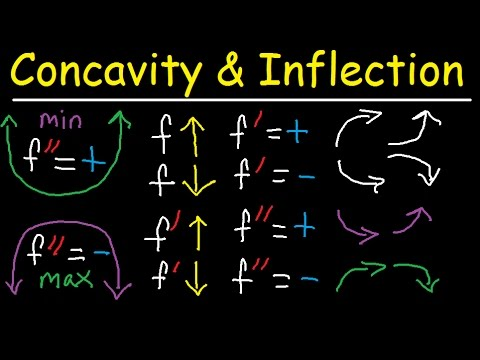

# 4-3 Using Derivatives to Analyze Graphs of Functions

## Learning Targets

You will be able to
- [ ] Use first and second derivatives to identify extrema and points of inflection
- [ ] Use first and second derivatives to analyze and graph functions

## Concepts / Definitions

### The First Derivative Test
Suppose that $c$ is a critical number of a continuous function $f$.
 1. If $f'$ changes from positive to negative at $c$, then $f$ has a local maximum at $c$.
 2. If $f'$ changes from negative to positive at $c$, then $f$ has a local minimum at $c$.
 3. If $f'$ does not change sign at $c$, then $f$ has no local maximum or minimum at $c$.

### Concavity
The graph of a differentiable function $y = f(x)$ is
 1. Concave up on an open interval $I$ if $y'$ is increasing on $I$
 2. Concave down on an open interval $I$ if $y'$ is decreasing on $I$

### Concavity Test
[Suppose the graph $y = f(x)$ is twice differentiable]
 1. If $f''(x) > 0$ for all $x$ in some open interval $I$, then the graph of $f$ is concave upward on $I$
 2. If $f''(x) < 0$ for all $x$ in some open interval $I$, then the graph of $f$ is concave downward on $I$

### Point of Inflection
A point where the graph of a function has a tangent line (is differentiable) and where the concavity changes is a point of inflection.

### Second Derivative Test for Local Extrema
 1. If $f'(c) = 0$ and $f''(c) < 0$$, then $f$ has a local maximum at $x = c$.
 2. If $f'(c) = 0$ and $f''(c) > 0$$, then $f$ has a local minimum at $x = c$.

[==>](4-6-related-rates.md)
