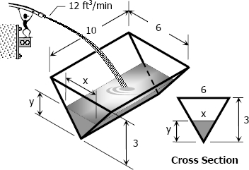

# 4-6 Related Rates

## Learning Targets

You will be able to
- [ ] Solve application problems involving multiple rates

## Concepts / Definitions

Solve related rate problems like any other story problem. 
These problems often involve implicit differentiation because the questions involve problems asking for a rate of change with respect to a variable _different_ than the variables in the equation.

**Important**
 1. _Do not_ substitute given values unless it remains constant in the problem.
 2. Don't forget rule #1.

### The Ladder Question
If you have a ladder leaning against the side of a building, and the bottom is sliding out at a constant 3ft/sec, does the bottom slide down at a constant? 
No, it doesn't. It slides slower at first, then faster at the bottom.

### The Ladder Problem
A 50 foot ladder is placed against a building. The base of the ladder is resting on an oil spill, and it slips at a constant rate of 3 feet per second. Find how fast the top of the ladder is sliding down at the _instant_ when the base of the ladder is 30 feet from the base of the building.

Our one constant value is the length of the ladder, always staying at 50. Knowing this and knowing that the ladder forms a right triangle with the wall, we can establish the equation $x^2 + y^2 = 50^2$. 
From this, we can take the derivative with respect to time ($\frac{d}{dt}) of the whole equation. $\frac{d}{dt}[x^2 + y^2 = 50^2] \to 2x\frac{dx}{dt} + 2y\frac{dy}{dt} = 0 \to x\frac{dx}{dt} + y\frac{dy}{dt} = 0$. 
At this point, we have four undefined variables - $x,\ \frac{dx}{dt},\ y,$ and $\frac{dy}{dt}$. We know that $x = 30$, and $\frac{dx}{dt}$ is equivalent to distance over time. Our distance over time is 3ft/sec. 
It's easy enough to find $y$ from the original Pythagorean equation - $y^2 = 50^2 - 30^2$, and from that $y = 40$. 
All that's left to find is $\frac{dy}{dt}$, or the instantaneous speed of the ladder at x = 30 feet. $x\frac{dx}{dt} + y\frac{dy}{dt} = 0 \to (30)(3) + (40)\frac{dy}{dt} = 0 \to \frac{dy}{dt} = -\frac{(30)(3)}{40} = -\frac 94$

The top of the ladder is sliding at $-\frac 94 \frac{ft}{sec}$.

## Examples

### Example 1
A ladder 10 feet long rests against a vertical wall. Let $\theta$ be the angle between the top of the ladder and the wall, and let $x$ be the distance from the bottom of the ladder to the wall. 
If the bottom of the ladder slides away from the wall, how fast does $x$ change with respect to $\theta$ when $\theta = \pi / 3$?

### Example 2
A trough has a triangular cross section. The trough is 6ft across the top, 3ft deep, and 10ft long. Water is being pumped into the trough at a rate of 12 cubic feet per minute. Find the rate at which the height of water is increasing at the instant the height is 2ft.

$V = \frac 12 xyz \to V = \frac 12 xy(10) \to V = 5xy$

[==>](4.7.md)
