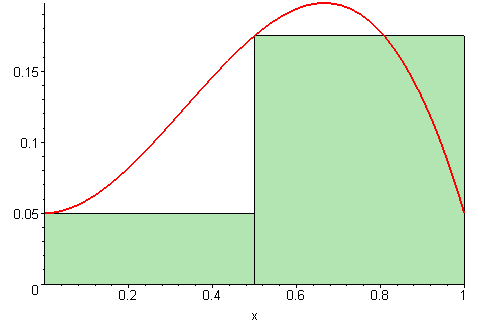

# 5-1 Estimating with Finite Sums

## Learning Targets

You will be able to
- [ ] Approximate the area under curves by using rectangular accumulation methods

## Concepts / Definitions

### Definition of a Riemann Sum

Riemann sums are summing areas of rectangles under a curve in a systematic manner.

### LRAM Left Rectangle approximation

Calculate the area, for $f(x)$, for the interval $[0,2]$ with 4 four rectangles ($n=4$), using LRAM.
The area is approximated with the sum of the four rectangles.

$$LRAM = wh_1 + wh_2 + wh_3 + wh_4$$
$$Area \approx \Delta xf(x_1) + \Delta xf(x_2) + \Delta xf(x_3) + \Delta xf(x_4)$$
$$\approx \Delta x [f(x_1) + f(x_2) + f(x_3) + f(x_4)]$$

### RRAM Right Rectangle approximation

Calculate the area, for $f(x)$, for the interval $[0,2]$ with 4 four rectangles ($n=4$), using RRAM.
The area is approximated with the sum of the four rectangles.

### Sigma Notation

$$A = \sum_{i=1}^n\Delta x\ f(x_i)$$

Write long hand form $\Delta x (f(x_1) + f(x_2) + f(x_3) + ... + f(x_n))$

Formula to use on calculator for adding many areas
$sum(seq(f(x), x, x_1, x_n, \Delta x) \bullet \Delta x)$

### Ways to make estimates better

#### Many Rectangles - Less Error

### Midpoint Method

### Rectangle Approximation Method (RAM)

Since the height of the rectangle varies along the subinterval, in order to find the area of the rectangle, we must use either the left hand endpoint (LRAM) to find the height, the right hand endpoint (RRAM), or the midpoint (MRAM).

The more rectangles you make, the better the approximation.

