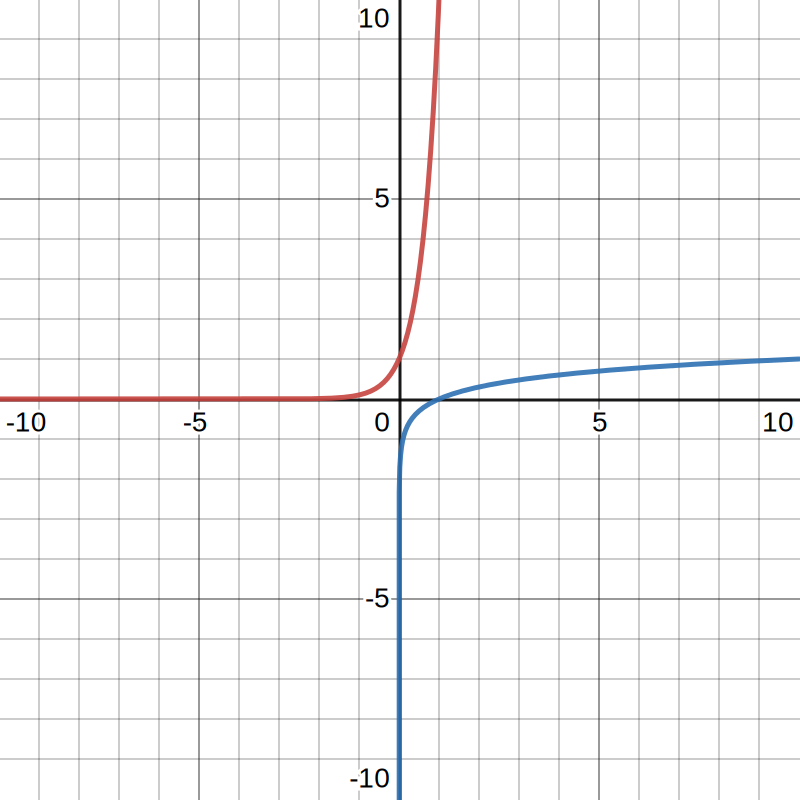
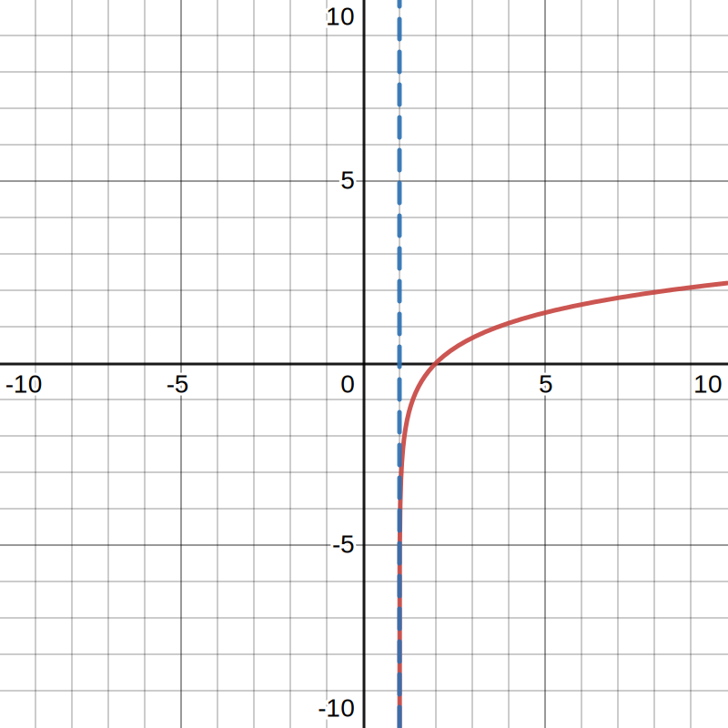
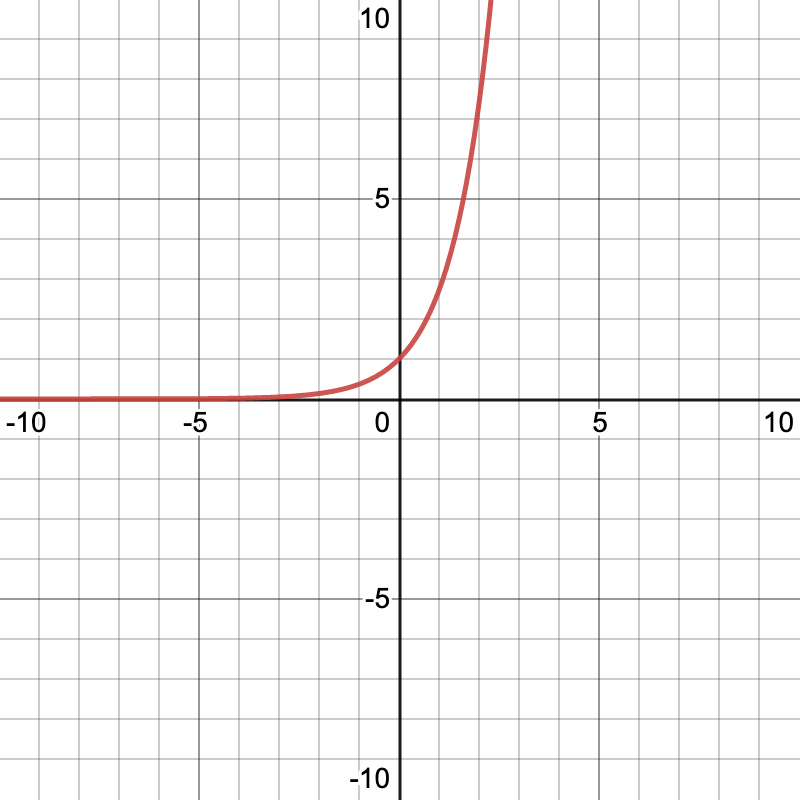
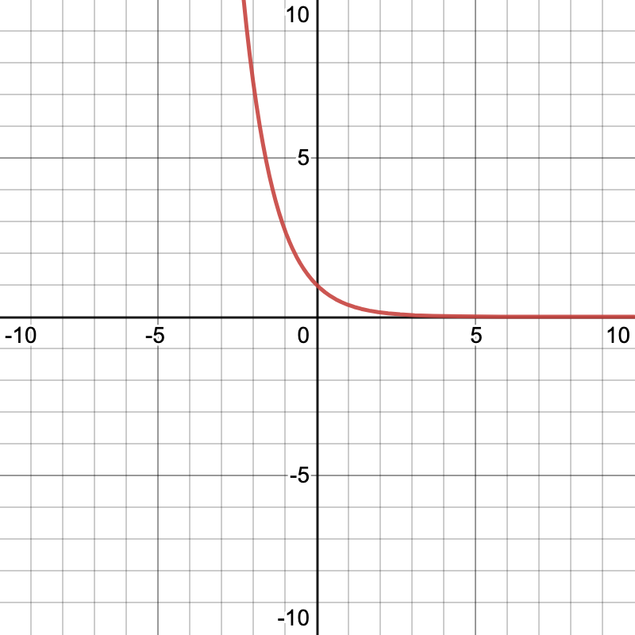
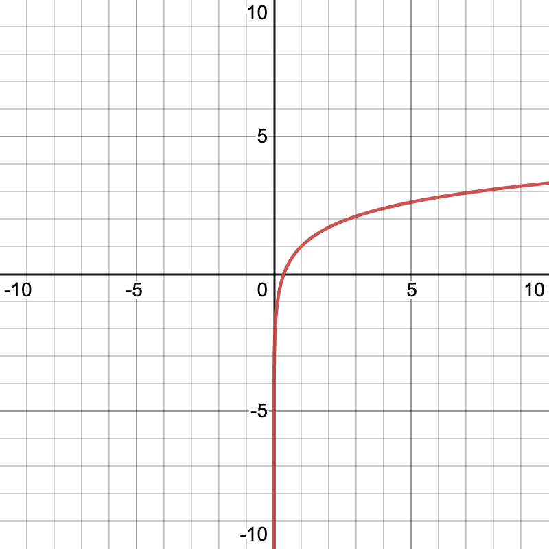
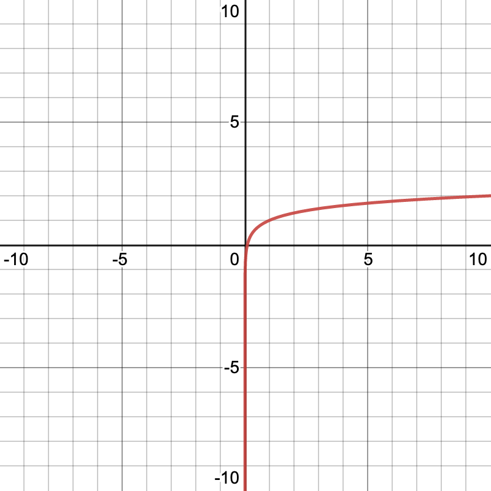

# Exponential and Logarithmic Functions

## What are exponential functions?

Linear functions are special because they have a _constant_ rate of change.

Exponential functions have an _exponential_ rate of change.

## Standard form of an exponential function

The exponential function $$f$$ in standard form is denoted by:

$$
f(x) = a^x
$$

Here, $$a$$ is called the _base_, and $$a > 0, a \neq 1, x \in \mathbb{R}$$. That means $$a$$ cannot be equal to a negative number or 1.

Each exponential function has a horizontal asymptote, but no vertical asymptote.

## Parent graph of an exponential function

| Equation | Domain | Range | Intercept | Change in values | Horizontal asymptote | Continuous? |
|--------|--------|---------|------------|-----------|----------|---|
| $$y = a^x$$ | $$(-\infty, \infty)$$ | $$(0, \infty)$$ | $$(0, 1)$$ | Increasing | $$y=0$$ | Yes |
| $$y = a^{-x}$$ | $$(-\infty, \infty)$$ | $$(0, \infty)$$ | $$(0, 1)$$ | Decreasing | $$y=0$$ | Continuous |

## One to One Property

A function is said to be a one-to-one function when each value in its domain corresponds to the same value in its range. In context of exponential functions, it means that if the bases are equal, the exponents are equal. So, if $$a^n = b^m$$ and $$a = b$$, then $$n = m$$.

We can use the one-to-one property to solve algebraic problems involving exponential functions. For instance, consider the equation $$4^{2x-3} = 4^{x+7}$$. Since both sides of the equation share the same base, we may solve it as follows:

$$
4^{2x-3} = 4^{x+7}
$$

$$
\cancel{4}^{2x-3} = \cancel{4}^{x+7}
$$

$$
2x-3 = x+7
$$

$$
x = 10
$$

## Shifts of exponential functions

An exponential function can be horizontally shifted:

$$
f(x) = e^x \rightarrow f(x) = e^{x\pm n}
$$

In a horizontal shift, there is no change of the (horizontal) asymptote. Also remember that horizontal shifts are "hopposites", so a positive shift corresponds with a shift in the _negative_ direction, and vice-versa.

An exponential function can also be vertically shifted:

$$
f(x) = e^x \pm n
$$

In a vertical shift, the asymptote will move by $$n$$ units up or down. Vertical shifts are "keep-the-sames", so a positive shift is a shift up, and a negative shift is a shift down.

We can flip an exponential function over the x-axis (left/right):

$$
f(x) = e^x \rightarrow f(x) = e^{-x}
$$

If the exponent is negative, then the function is a _decreasing_ function, and if the exponent is positive, then the function is an _increasing_ function.

And we can also flip an exponential function over the y-axis (up/down):

$$
f(x) = e^x \rightarrow f(x) = -(e^{x})
$$

### Examples of Exponential Functions

The compound interest formula is a exponential function:

$$
A = P \left(1 + \frac{r}{n}\right)^{nt}
$$

The continuous interest formula is also an exponential function:

$$
A = P \cdot e^{rt}
$$

## Logarithmic Functions

The logarithmic function is a function in the form:

$$
y = \log_a x
$$

Where:

$$
a^y = x
$$

We call it  "log base $$a$$ of $$x$$ is $$y$$".

By convention, if the function is in the form $$y = \log_{10} x$$, we can omit $$a$$ and write it as $$y = \log x$$. This is called the **common logarithm**. If any logarithm doesn't have a base explicitly written, they are common logarithms with a base of 10.

Also, if the function is in the form $$y = \log_e x$$, we often write it in the form $$y = \ln x$$. This is called the **natural logarithm**.

A good way to remember logs is with this:

Remember this trick to convert an exponential (e.g. $$5^x = 25$$) to a logarithm:
* **B**ases are in the **b**asement (the subscript), so because our base is 5, we have $$\log_5 ? = ?$$
* **A**nswers go next to the **b**ase (because A is next to B in the alphabet), so because our base is 25, we now have $$\log_5 25 = ?$$
* Finally, **e**xponents are after the **e**quals sign, so because our exponent is $$x$$, we finally have $$\log_5 25 = x$$

### Properties of Logarithms

* $$\log_a 1 = 0$$ because $$a^0 = 1$$
* $$\log_a a = 1$$ because $$a^1 = a$$
* $$\log_a a^x = x$$ and $$a^{\log_a x} = x$$
* If $$log_a x = \log_a y$$, then $$x = y$$

### Properties of Natural Logarithms

* $$\ln 1 = 0$$ because $$e^0 = 1$$
* $$\ln e = 1$$ because $$e^1 = e$$
* $$\ln e^x = x$$ and $$e^{\ln x} = x$$
* If $$\ln x = \ln y$$, then $$x = y$$

## Graphing Logarithmic Functions

Suppose we were to graph the logarithmic function $$f(x) = \log_{(10)} x$$. How would we do this?

Well, first, we'll need to know the asymptotes and intercepts.

The asymptote - there's only ever one - is found by setting $$x$$ equal to zero. In our case, $$f(0) = \log_{10} 0$$ causes the function to be undefined, and the function gets really close to zero without ever touching it.

Remember that logarithmic functions are _inverses_ of exponential functions. So, if we find the domain (x-values) of the corresponding exponential function, we would know the range (y-values) of the logarithmic function, and vice versa.

Let's see how we can actually do this. First, to find the corresponding exponential function of $$f(x)$$, we simply swap $$x$$ and $$y$$.

$$y = \log_{10} x$$ -> flip:

$$x = \log_{10} y$$

$$y = 10^x$$

$$f^{-1}(x) = 10^x$$

Now, we can easily create a table of values for $$f^{-1}$$, the corresponding exponential function:

| $$x$$ | $$f(x)$$ |
|-----|---------|
| $$-2$$ | $$\frac{1}{100}$$ |
| $$-1$$ | $$\frac{1}{10}$$ |
| $$0$$ | $$1$$ |
| $$1$$ | $$10$$ |
| $$2$$ | $$100$$ |

And if we flip the $$x$$ and $$y$$ values, we can find the table of values for $$f(x)$$, our logarithmic function! Here it is:

| $$x$$ | $$f(x)$$ |
|-----|---------|
| $$\frac{1}{100}$$ | $$-2$$ |
| $$\frac{1}{10}$$ | $$-1$$ |
| $$1$$    | $$0$$ |
| $$10$$   | $$1$$ |
| $$100$$  | $$2$$ |
| ... | ...|

Notice that our logarithmic function $$f(x)$$'s x-intercept is the inverse exponential function $$f^{-1}$$'s y-intercept, its vertical asymptote is the inverse of $$f^{-1}$$'s horizontal asymptote, and its domain is the range of $$f^{-1}$$. Put it another way, just reverse everything for one function, and you'll get the other function!

In fact, if we plot the function, it's evident that $$f(x)$$ is essentially a reflection of the corresponding exponential function $$f^{-1}(x)$$ over the line $$y = x$$:

(Top left is the inverse exponential function $$f^{-1}$$, bottom right is the logarithmic function $$f$$)

### Graphing the natural logarithm

Plotting the graph of the natural logarithm is very similar to plotting the graph of any other logarithmic function: find the vertical asymptote and x-intercept, and you're done.

For instance, let's try to plot the graph of $$f(x) = \ln(x-1)$$. We know that the vertical asymptote is $$x=0$$ for the parent graph $$f(x)=\log x$$. However, since the entire graph is shifted by 1 to the right (remember - interior transforms are "hopposite"), the asymptote shifts one to the right as well. So the asymptote is $$x=1$$.

The x-intercept is found from $$f(x) = 0$$. In our case, that would be $$0 = \ln(x-1)$$, which results in $$e^0 = x-1$$, or more simply, $$x = 2$$. We can then plot this at $$(2, 0)$$.

Now, we can finally start graphing!

## Using the one-to-one property on logarithmic functions

The one-to-one property applies to logarithmic functions as well as exponential functions. In fact, it's one of the logarithmic function properties.

Let's see this in action by solving $$\ln(x^2 - x) = \ln 6$$:

$$
\cancel\ln(x^2 -x) = \cancel\ln6
$$

$$
x^2 -x = 6
$$

$$
x^2 -x - 6 = 0
$$

$$
(x+2)(x-3) = 0
$$

$$
x = -2, x = 3
$$

## Change of Base Formula

The change of base formula allows us to rewrite any logarithm as a rational function with any arbritrary base $$b$$:

$$
\log_a x = \frac{\log_b x}{\log_b a}
$$

For example, 

$$
\log_3 81 = \frac{\log_{10} 81}{\log_{10}  3} = \frac{\log 81}{\log 3}
$$

You can even do this with natural logs! Like this:

$$
\log_5 31 = \frac{\ln 31}{\ln 5}
$$

In fact, this rule works no matter what base the logarithm is. This is very powerful, as it allows us to evaluate any logarithm, even if the base and the exponent don't match.

### Quick review of exponent properties

$$
x^a \cdot x^b = x^{a+b}
$$

$$
x^a \div x^b = x^{a-b}
$$

$$
(x^a)^b = x^{a \cdot b}
$$

$$
\sqrt[a]{x^b} = x^\frac{b}{a}
$$

$$
\sqrt{\frac{x^a}{x^b}} = \frac{\sqrt{x^a}}{\sqrt{x^b}}
$$

## Properties of Logs

### The Product Property

For all logs, $$log_a (uv)$$ expands to $$\log_a u + \log_a v$$.

For natural logs, $$\ln(uv)$$ expands to $$\ln u + \ln v$$.

### The Quotient Property

For all logs, $$\log_a \frac{u}{v}$$ expands to $$\log_a u - \log_a v$$.

For natural logs, $$\ln \frac{u}{v}$$ expands to $$\ln u - \ln v$$.

### The Power Property

For all logs, $$\log_a u^n = n \log_a u$$.

For natural logs, $$ln u^n = n \ln u$$.

### Using the properties of logs to simplify logs

Let's try to simplify $$\log_2 (4^2 \cdot 3^4)$$ with the properties of logs.

First, we can use the product property:

$$
\log_2 4^2 + \log_2 3^4
$$

Then, let's use the power property:

$$
2 \log_2 4 + 4\log_2 3
$$

Then, we can rewrite 4 as $$2^2$$, which leads us to:

$$
2 \log_2 (2^2) + 4\log_2 3
$$

And since $$\log _2\left(2^2\right)=2$$, this simplifies to:

$$
(2 \cdot 2) + 4 \log_2 3
$$

And we can finallly simplify to:

$$
4 + 4\log_2 3
$$

### Condensing logs using the properties of logs

Let's try to simplify the expression $$3\ln x + 4\ln y - 9 \ln w$$.

First, we can use the power property to condense the coefficients of each log:

$$
\ln x^3 + \ln y^4 - \ln w^9
$$
Now, we can use the product rule:

$$
(\ln x^3 + \ln y^4) - \ln w^9
$$
$$
(\ln x^3 y^4) - (\ln w^9)
$$

Finally, we can use the quotient property:

$$
\ln \left(\frac{x^3 y^4}{w^3}\right)
$$
We've condensed our logarithmic expression!

### Expanding logs using the properties of logs

Let's try to expand the expression $$\log_2 \left(\frac{a^6}{b}\right)^3$$.

We can first move the exponent to the front using the power rule:

$$
3 \log_2 \left(\frac{a^6}{b}\right)
$$
Then, we can use the quotient rule to separate the fraction:

$$
3 \log_2 a^6 - 3\log_2 b
$$
Finally, we can use the quotient rule once again, this time to get rid of the first term's exponent:

$$
(3 \cdot 6) \log_2 a - 3 \log_2 b
$$
So we end with:
$$
18 \log_2 a - 3 \log_2 b
$$
We're done expanding our logarithmic expression!

## Strategies for solving exponential and logarithmic functions

Remember, when solving all **logarithmic** functions, negative answers are extraneous. For all exponential functions, there are no extraneous answers.

### Using the One-To-One Property

The **one to one property** states that if two expressions have the same base, their exponents must be equal as well.

For example, let's try to solve the equation $$\left(\frac{1}{4}\right)^x = 64$$. Notice how both the left and right can be converted into bases of 4:

$$
\left(4^{-1}\right)^x = 4^3
$$
And we can simplify this:

$$
4^{-x} = 4^3
$$

That means:

$$
-x = 3
$$

So, $$x = -3$$.

Okay, let's now solve a more difficult question:

$$
4^{(3x-4)} = \left(\frac{1}{8}\right)^{x-1}
$$

Realize that both sides of the equation can be expressed using a base of 2:

$$
2^{2(3x-4)} = 2^{-3(x-1)}
$$

Now, we can easily solve:

$$
2(3x-4) = -3(x-1)
$$

And simplify:

$$
6x - 8 = -3x +3
$$

Solving that, we find that $$x = \frac{11}{9}$$.

### Using the inverse property by rewriting exponential functions in logarithmic form

Let's try to solve $$4e^x = 91$$. Unfortunately, the one-to-one property is not as easy to apply here. But there's another way: we can use the _inverse property_ by converting an exponential function to a logarithmic function.

Ok, but let's first simplify to isolate $$e^x$$:

$$
e^x = \frac{91}{4}
$$

Now, we can start applying the inverse property, by multipying our exponential with its inverse. In this case, the inverse of $$e^x$$ is $$\ln$$ (the natural log):

$$
\ln e^x = \ln \frac{91}{4}
$$

Because $$\ln e^x = x$$,  we can cancel things out:

$$
x = \ln \frac{91}{4}
$$
So, calculating that, we get $$x \approx 3.12$$.

### Solving algebraic equations with logarithms and exponentials

Let's try to solve:

$$
\log_8 (x-1) = \log_8(x-2) - \log_8 (x+2)
$$

Notice, how we can condense the right-hand side into just one logarithm with the quotient property:

$$
\log_8 (x-1) = \log_8\left(\frac{x-2}{x+2}\right)
$$

We can now use the one-to-one property to remove the logarithm altogether:

$$
x-1 = \left(\frac{x-2}{x+2}\right)
$$

Solving that gives us:

$$
x = 0
$$

But remember, in a logarithmic function, we must account for extraneous solutions! In our case, we know that there is no answer for $$\log 0$$, so $$x = 0$$ is extraneous, and so ***there is no real defined solution***.

### Solving real-life problems with exponential and log functions

You might be asked to find the time required for $$2500, invested in an account with 12% continuous compound interest, to double in value. Here's how to do it.

We know that the formula for continuous compound interest is $$A = Pe^{rt}$$. Substituting our terms (12% = 0.12, principle is $$2500, double is $$5000), we have:

$$
5000 = 2500e^{0.12t}
$$
We can simplify, giving us:

$$
2 = e^{0.12t}
$$
And, we can rewrite it as a logarithm:
$$
\ln 2 = 0.12 t
$$

So:
$$
t = \frac{\ln 2}{0.12} \approx 5\ \mathrm{years}
$$

### Extension: Exponential and Logarithmic Model

| Model Name | Form | Graph Demo |
|--------------|------|---------------|
| Exponential Growth Model | $$y = ae^{bx}$$ |  |
| Exponential Decay Model | $$y = ae^{-bx}$$ |  |
| Natural Logarithm Model | $$y = a + b \ln x$$ |  |
| Common Logarithm Model | $$y = a + b \log x$$ |  |

## Something...
---

Port stuff from [here](https://www.shoreline.edu/math-learning-center/documents/properties-of-logarithms.pdf) over.