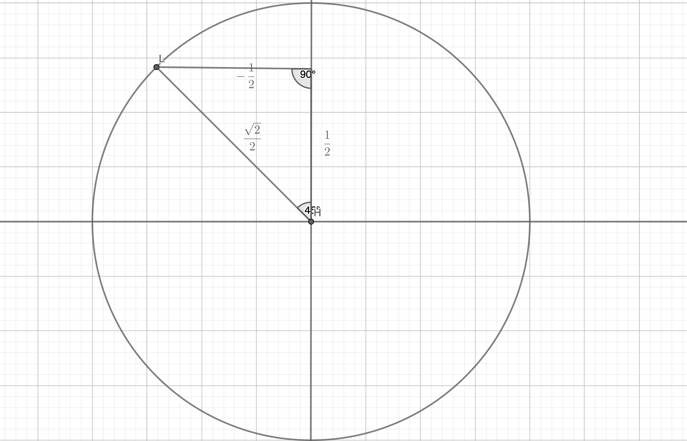
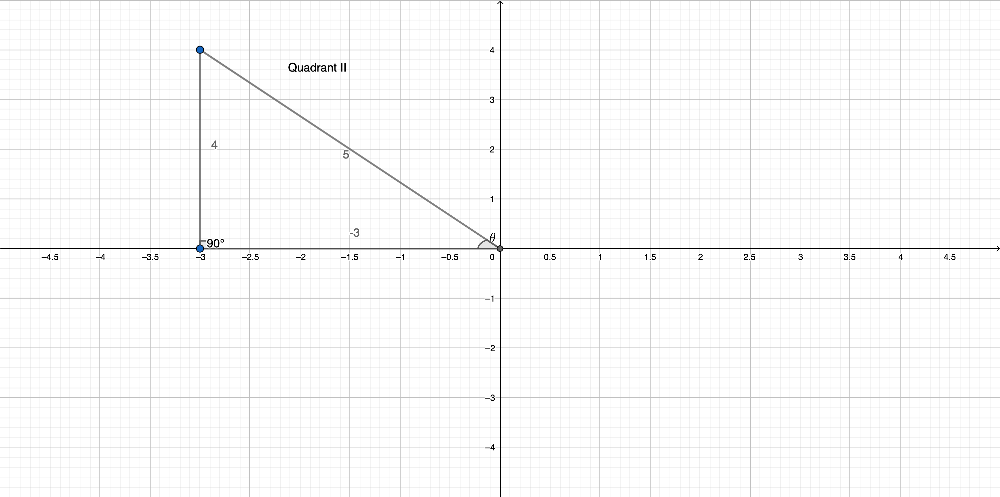
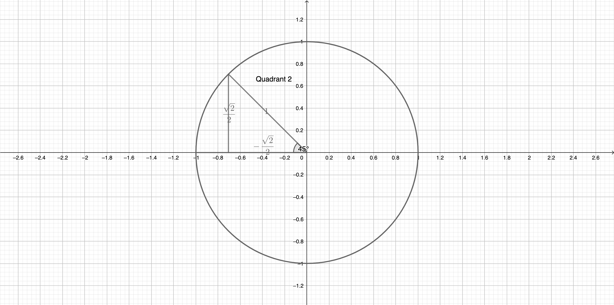

# Trigonometry

## Angles and Measures

* An **angle** is the space between two rays that share a common endpoint
* The point where the two rays of an angle meet is called the **vertex**
* The starting side of an angle is its **initial side**, and the ending side of an angle is its **terminal side**
* Positive angles go counterclockwise from the initial side, negative angles go clockwise from the initial side
* An angle is in **standard position** if its vertex is located at the origin and one ray is on the positive x-axis

### Coterminal Angles

* **Coterminal angles** start from standard position and share the same terminal side
* Two angles that are coterminal satisfy $$\angle \beta = \angle \alpha \pm 360^\circ x$$
	* E.g. they can add up to $$0^\circ$$, $$360^\circ$$, $$720^\circ$$, $$1080^\circ$$ (or negative equivalents, such as $$-360\circ$$, $$-720^\circ$$, $$-1080^\circ$$, etc.)
* To find the coterminal angle, either add or subtract $$360x^\circ$$ from an angle (both work so long as $$x$$ is a whole number)
* $$x$$ here can be any whole number, so you can use $$x=1$$ ($$360^\circ$$), $$x = 2$$ ($$720^\circ$$)
	* E.g. Let's try to find the coterminal angles of $$-520^\circ$$
	* To find a positive coterminal angle $$\theta_+$$, then $$\theta_+ = (-520^\circ) + 360^\circ x$$
	* To get a multiple of $$360^\circ$$ that will make the final coterminal angle positive, we need to set $$x \geq 2$$
	* If we set $$x = 2$$, we get a result of $$200^\circ$$, which is our **positive coterminal angle**
	* Let's also find a negative coterminal angle
	* To find a negative coterminal angle $$\theta_-$$, then $$\theta_- = (-520^\circ - 360^\circ x$$)
	* Since $$-520^\circ$$ is already negative, let's just set $$x = 1$$
	* If we set $$x = 1$$, we get a result of $$-880^\circ$$, which is our **negative coterminal angle**

### Complementary and Supplementary Angles

* **Complementary angles** are two angles that add up to 90 degrees
* A complementary angle _must_ be positive
	* This is why no angle above $$90^\circ$$ has a complement
* **Supplementary angles** are two angles that add up to 180 degrees
* A supplementary angle _must_ also be positive
	* This is why no angle above $$180^\circ$$ has a complement

### Decimal Degrees

* Historically, fractional parts of degrees were expressed in _minutes_ and _seconds_, e.g. $$\theta = 64^\circ\ 32'\ 47''$$ instead of decimal degrees (e.g. $$\theta = 64.2345^\circ$$) - this is called the **DMS system**
	* One minute, represented with the prime (\`) symbol, is defined as $$\left(\frac{1}{60} \cdot 1^\circ\right)$$
	* One second, represented with the double prime (\`\`) symbol, is defined as $$\left(\frac{1}{3600} \cdot 1^\circ\right)$$
* To convert from DMS to degrees we use:

$$
\mathrm{Degrees} = \mathrm{DMS\ Degrees} + \frac{\mathrm{DMS\ Minutes}}{60} + \frac{\mathrm{DMS\ Seconds}}{3600}
$$

* To convert from degrees to DMS we use:

$$
\mathrm{DMS\ Degrees} = \mathrm{Degrees} + \frac{\mathrm{Decimal\ part\ of\ degrees}}{60} + \frac{\mathrm{Decimal\ part\ of\ (decimal \ part\ of\ degrees)}}{60}
$$

## Radians

Take a look at this special circle. What do you notice?

Well, firstly, the radius is 1. So we call the circle a **unit circle**.

Second, the radius is actually part of a very special arc. We know that the radius is equal to one, which means the circle's circumference is $$\pi (2 \cdot 1)$$ which  is $$2\pi$$. Meanwhile, the arc length ($$s$$), radius (1), and central angle ($$\theta$$) are related like this:

$$
\theta = \frac{s}{r}
$$

In our case, since $$r = 1$$, we simplify to:

$$
\theta = s
$$

Wow! So the arc length is _also_ the measure of the angle? How could this be possible?

It makes more sense if we start thinking of angles as units of $$\pi$$.  Let's imagine that the central angle $$\theta = 180^\circ$$.  If that was the case, the arc would be a semicircle, like this:

And since the arc length $$s$$ of a semicircle is exactly half of the circumference of a full circle, we can say that:

$$
s = \frac{1}{2}C = \frac{1}{2}\pi 2r = \pi r
$$

Based on our formula $$\theta = s$$ (because our radius is 1), we can also find that:

$$
\theta = s = \pi r
$$

And again, since we know that $$r = 1$$, this simplifies to:

$$
\theta = (\pi \cdot 1) = \pi
$$

So we find that $$\theta$$ is equal to $$\pi$$ degrees. We now have a new unit to measure angles: the **radian**. 

We also know that a **radian** can be roughly defined as degrees expressed in units of $$\pi$$ rather than decimal units. $$2 \pi$$ radians is a full 360 degrees, $$\pi$$ radians is 180 degrees, and we can keep dividing so on. Instead of counting from 0 to 360 degrees, in radians, we count from 0 to $$2\pi$$. And since $$\pi$$ radians is equal to $$180^\circ$$, 1 radian is also equal to $$\frac{180^\circ}{\pi}$$ which resolves to approximately $$57.3^\circ$$.

### Rules of radians

Radians are a **unit of measurement** for angles. We can express angles in:

* $$\pi$$ form, where we state radians in terms of $$\pi$$ (e.g. $$2\pi \mathrm{\ rad.} = 360^\circ$$)
* Exact form, where we state radians in terms of decimal units (e.g. $$1.3\mathrm{\ rad.}$$)

$$
1 \mathrm{\ radian} = 1^\circ \cdot \left(\frac{\pi}{180}\right)
$$

$$
1^\circ = 1 \mathrm{\ radian} \cdot \left(\frac{\pi}{180}\right)
$$

$$
\pi \mathrm{\ rad.} = 180^\circ
$$

| Radians ($$\pi$$) | Radians (exact) | Degrees |
|---------|----------|------|
| 0 radians | 0.0 radians | 0 degrees |
| $$\frac{\pi}{2}$$ radians | ~1.57 radians | 90 degrees |
| $$\pi$$ radians | ~3.14 radians | 180 degrees |
| $$\frac{3\pi}{2}$$ radians | ~4.7 radians | 270 degrees |
| $$2\pi$$ radians | ~6.28 radians | 360 degrees |

### Counting in Radians

Imagine you were given an angle $$\theta = \frac{9\pi}{4}\mathrm{\ rad.}$$ How would you be able to draw it?

Well, we know that $$\frac{9\pi}{4}$$ is just $$\frac{\pi}{4}$$ repeated 9 times. And $$\frac{\pi}{4}$$ is just a 45 degree angle. So let's try counting in 45 degrees around the graph:

(Add gif of counting in 45 degrees 9 times to get to the final position)

### Drawing radians in Standard Position

We can use the rules of radians and coterminal angles to help us draw radians.

For instance, let's try to draw $$\theta = \frac{5\pi}{2}$$. We know that $$\frac{5\pi}{2}$$ is equal to $$\frac{4\pi}{2} + \frac{\pi}{2}$$, so:

$$
\theta = 2\pi + \frac{\pi}{2}
$$

So, we'll need to rotate 360 degrees once (because $$2\pi$$ is one full revolution), and then we need to rotate by 1/4 of a revolution (because $$\frac{\pi}{2}$$ is 90 degrees)

Now for a harder example. Let's try to draw 4 radians on the graph.

### Finding coterminal angles for radians

Add 2 pi, minus 2 pi...

### Arc length

If we're using degrees, the arc length $$s$$ is given by:

$$
s = \frac{\theta}{360^\circ} \cdot 2 \pi r
$$

If we're using radians, the arc length is given by:

$$
s = r \theta
$$

where $$\theta$$ is in radians.

### Linear and angular speeds

**Linear speed** is distance travelled over time elapsed. We measure it in units of _distance_ per _time interval_ (e.g. meters per second)

Linear speed is given by:

$$
v = \frac{\mathrm{arc\ length}}{\mathrm{time}} = \frac{s}{t}
$$

A **revolution** is the fraction of a circumference travelled over time elapsed. We often abbreviate this as RPM (revolutions per minute) or RPS (revolutions per second). To get from linear speed to revolutions, we use:

$$
\mathrm{revolutions} = \frac{v}{\mathrm{circumference}}
$$

**Angular speed** is the angle displaced over time elapsed. We measure it in units of _angles_ per _time interval_ (e.g. degrees per second)

Angular speed in degrees is given by:

$$
\omega = \frac{v}{\mathrm{circumference}} \cdot 360^\circ = \mathrm{revolutions} \cdot360^\circ
$$

Similarly, angular speed in radians (e.g. radians per second) is given by:

$$
\omega = \frac{v}{\mathrm{circumference}} \cdot 2 \pi \mathrm{\ rad.} = \mathrm{revolutions} \cdot 2\pi \mathrm{\ rad.}
$$

## The Six Trigonometric Functions

### Definitions

$$
\sin \theta = \frac{\mathrm{opposite}}{\mathrm{adjacent}}
$$

$$
\cos \theta = \frac{\mathrm{adjacent}}{\mathrm{hypotenuse}}
$$

$$
\tan \theta = \frac{\mathrm{opposite}}{\mathrm{hypotenuse}} = \frac{\sin \theta}{\cos \theta}
$$

The _reciprocal trigonometric functions_ are the normal trig functions but "flipped over", and they look like this:

$$
\csc \theta = \frac{1}{\sin}
$$

$$
\sec \theta = \frac{1}{\cos}
$$

$$
\cot \theta = \frac{1}{\tan}
$$

### Special Right Triangles

In the 45-45-90 triangle, the sides are in the ratio $$a: a\sqrt{2}:a$$, where two sides are congruent, and the hypotenuse is $$a \sqrt{2}$$:

In the 30-60-90 triangle, the sides are in the ratio $$a:2a:a\sqrt{3}$$, where $$a$$ is the shortest side, and the hypotenuse is $$2a$$:

### Trigonometric Identities

We already know that $$\csc$$, $$\sec$$, and $$\cot$$ are reciprocals of the three base trigonometric functions, $$\sin$$, $$\cos$$, and $$\tan$$. Additionally, there are several others that are helpful to know:

$$
\tan \theta = \frac{\sin \theta}{\cos \theta}
$$

$$
\cot \theta = \frac{\cos \theta}{\sin \theta}
$$

Based on the pythagorean theorem, we can find a few others:

$$
\sin^2 \theta + \cos^2 \theta = 1
$$

$$
1 + \tan^2 \theta = \sec^2 \theta
$$

$$
1 + \cot^2 \theta = \csc^2 \theta
$$

Here, $$\sin^2 \theta$$ is equal to $$(\sin \theta)^2$$.

If you forget these, it's okay! You can manually derive all of them from the **unit circle**, which we'll explore next.

## The Unit Circle

Imagine a circle with a radius of exactly one radius. It would look something like this:

Why would this be helpful, you ask? Well, a unit circle helps us to find the exact values of the trigonometric functions.

Take a look at the right triangle inscribed within the unit circle:

That's interesting, isn't it? If the angle is 30 degrees, then we know that $$x$$, $$y$$, and the radius form a 30-60-90 triangle. From there, we can calculate the values for all 6 trigonometric functions, from the sides of the triangle. And, we know that the point $$\frac{\pi}{6}$$ on the unit circle's circumference must therefore equal $$\left(\frac{\sqrt{3}}{2}, \frac{1}{2}\right)$$.

What if the angle is 45 degrees? Same deal, just with a 45-45-90 triangle:

So we know that the point $$\frac{\pi}{4}$$ must equal $$\left(\frac{\sqrt{2}}{2}, \frac{\sqrt{2}}{2}\right)$$.

And we can do more, because we can use the same method to find the positions of points in other quadrants, too. For example:

Here, we've found that the point $$-\frac{2\pi}{3}$$ is equal to $$\left(-\frac{1}{2}, -\frac{\sqrt{3}}{2}\right)$$. 

Finally, for whoever just wants to have a good quick reference, this is a fully labelled unit circle:

## Trigonometric Functions of Any Angle on the Unit Circle

We can define trigonometric functions of any angle, not just the special 30-45-60 degree angles. To do this, we write the $$(x, y)$$ coordinates of the terminal side of the angle at the point it intercepts the circumference of the unit circle:

For example, a $$90^\circ$$ (or $$\frac{\pi}{2}$$ radian) angle would have the position $$(0, 1)$$ on the unit circle, where the $$x$$ coordinate would be 0, and the $$y$$ coordinate would be 1. We can then use the following rules:

$$
\sin \theta = y
$$

$$
\cos \theta = x
$$

$$
\tan \theta = \frac{y}{x}, x \neq 0
$$

From these, we can derive the inverse variants of the trig functions as well. So, for our 90 degree angle, $$\sin\theta = 1$$, $$\cos \theta = 0$$, and $$\tan \theta = \frac{1}{0} = \mathrm{undef.}$$

## Trigonometric Functions of Quadrant Angles

| Quadrant | Sign |
|-----------|------|
| Quadrant I | **A**ll are positive |
| Quadrant II | **S**ine is positive, rest are negative |
| Quadrant III | **T**angent is positive, rest are negative |
| Quadrant IV | **C**osine is positive, rest are negative |

In fact, we can just remember a simple rule to "translate" the trig function measures from one quadrants to all the other ones:

## Reference Angles

A **reference angle** is the the smallest angle that the terminal side of a given angle makes with the x-axis. They are especially important in trigonometry, because a reference angle results in the same values for all the trigonometric functions as its original angle.

Here is an [interactive visualization](https://www.mathopenref.com/reference-angle.html) of reference angles.

To find the reference angle, we will use a different formula depending on the size of the angle:

1.  0° to 90°: reference angle = angle ,
2.  90° to 180°: reference angle = 180° - angle ,
3.  180° to 270°: reference angle = angle - 180° ,
4.  270° to 360°: reference angle = 360° - angle

(If you're working with radians, substitute 0, 90, 180, 270, and 360 degrees with $$\frac{\pi}{2}$$ radians, $$\pi$$ radians, $$\frac{3\pi}{2}$$ radians, and $$2\pi$$ radians)

To find the reference angle of a negative angle, we first find the smallest positive coterminal angle of the negative angle, and then find the reference angle of the coterminal angle. For example, the smallest coterminal angle of $$-245^\circ$$ is $$115^\circ$$, and the reference angle of $$115^\circ$$ is $$65^\circ$$, so the reference angle of $$-245^\circ$$ is $$65^\circ$$.

Remember that **reference angles must be acute**. That is, if you find a reference angle greater than $$90^\circ$$ or greater than $$\frac{\pi}{2}$$ radians, then there's probably something wrong with your calculations.

### Reference angles to memorize

For any angle $$\dfrac{k\pi}{3}$$, the reference angle is $$\dfrac{\pi}{3}$$ or $$60^\circ$$.

For any angle $$\dfrac{k\pi}{4}$$, the reference angle is $$\dfrac{\pi}{4}$$ or $$45^\circ$$.

For any angle $$\dfrac{k\pi}{6}$$, the reference angle is $$\dfrac{\pi}{6}$$ or $$30^\circ$$.

## Trigonometry with any angle

### Finding the trigonometric functions from any point on the unit circle

Let's say you were given a point $$t = -\frac{5\pi}{4}$$. How can we find the 6 trig functions from it?

Well, the first part we know is that $$-\frac{5\pi}{4} = -225^\circ$$, which means that it will land in Quadrant 2. So, the $$x$$ coordinate will be negative, and the $$y$$ coordinate will be positive.

We also know that the reference angle is $$\frac{\pi}{4}$$, from which we can draw a 45-45-90 triangle like this:

Now we can use our special right triangle to find that:

$$
\sin \left(-\frac{5\pi}{4}\right) =  \frac{\sqrt{2}}{2}
$$

$$
\cos \left(-\frac{5\pi}{4}\right) = -\frac{\sqrt{2}}{2}
$$

$$
\tan \left(-\frac{5\pi}{4}\right) = -1
$$

There we go!

### Worked Example 1

Find the trigonometric functions given $$\sin \theta = \frac{4}{5}$$ and $$\tan \theta < 0$$:

First, we know that since $$\sin \theta = \frac{4}{5}$$ is positive, then sine must be positive. Using our **ASTC** chart, that means it can't be any of the quadrants where sine is negative. Since sine is negative in quadrants 3 and 4, we can rule those out.

Now, we are also told that $$\tan \theta < 0$$, so it can't be any of the quadrants where tangent is positive. Since tangent is positive in quadrant 1, we know it can't be quadrant 1. So we are left with just quadrant 2. Now, we can draw out our triangle in quadrant 2 and add in the appropriate +/- signs to each side:

### Worked Example 2

Let's evaluate the value of $$\csc 0$$.

We know that $$0^\circ$$ would have the coordinates $$(0, 1)$$ on the unit circle. Since $$\sin \theta = y$$, and $$\csc \theta = \frac{1}{\sin \theta}$$, we can find that $$\csc \theta = \frac{1}{y} = \frac{1}{1}$$. Additionally, since cosine is positive in the first quadrant, cosecant also is, and so our answer is also positive.

So $$\csc 0 = 1$$.

### Worked Example 3

Let's say you were told that $$\theta = 495^\circ$$, and you needed to find the values of the trig functions at $$\theta$$. So how would we do it?

First, we can find the smallest coterminal angle of $$495^\circ$$, which is $$135^\circ$$, because trig functions output the same number from coterminal angles. Knowing that the coterminal angle is $$135^\circ$$, we know that it has to lie in Quadrant 2, where only sine is positive.

We can then find the reference angle of $$135^\circ$$ to find the exact values of the trig functions. The reference angle would be $$45^\circ$$, so we can build a 45-45-90 triangle to solve.

Using our constructed triangle, we can finally find that:

$$
\sin \theta = \frac{\sqrt{2}}{2}
$$

$$
\cos \theta = \frac{\sqrt{2}}{2}
$$

$$
\tan \theta = -1
$$

## Trigonometric Identities

**Trigonometric identities** are general rules that relate the trigonometric functions together. There are only two real trigonometric identities that are worth memorizing, because all other trigonometric identities can be derived easily from them.

First, we have the Pythagorean identity:

$$
\sin ^{2} \theta+\cos ^{2} \theta=1
$$

And second, the quotient identity:

$$
\tan \theta = \frac{\sin \theta}{\cos \theta}
$$

We also have already mentioned the _reciprocal identities_, which essentially define $$\csc$$, $$\sec$$, and $$\cot$$ as the inverse of their parent functions.

If you want a full chart of all the trig identities, here it is:

## The trig song

_Mr. Darnbrook, wherever you are - countless students will thank you for this song you taught me 5 years ago..._

One, two three!

Three, two, one!

Two under the bar!

Square root all that's not one!

Square root of three over three!

One, then square root of three!

Now that you know the song!

You can sing it again, to me!

*And this is how you get to this:*

|         | 30 degrees           | 45 degrees           | 60 degrees           |
| ------- | -------------------- | -------------------- | -------------------- |
| sine    | $$\frac{1}{2}$$        | $$\frac{\sqrt{2}}{2}$$ | $$\frac{\sqrt{3}}{2}$$ |
| cosine  | $$\frac{\sqrt{3}}{2}$$ | $$\frac{\sqrt{2}}{2}$$ | $$\frac{1}{2}$$        |
| tangent | $$\frac{\sqrt{3}}{3}$$ | $$1$$                  | $$\sqrt{3}$$           |

**Explanation:**

"One, Two, Three" is the first row of the table

"Three, Two, One" is the second row

"Two under the bar" means to make 2 the denominator of every number (so 1 will become $$\frac{1}{2}$$, 2 will become $$\frac{2}{2}$$, you get the idea)

"Square root all that's not one" means to add a square root to every number (in rows 1) and 2) that, as you might have guessed, is **not 1**)

"Square root of three over three" is for the first column of the third row ($$\tan 30^\circ$$)

"One, then square root of three" is for the second and third columns of the third row ($$\tan 45^\circ$$ and $$\tan 60^\circ$$)

And you've got that done!

## Graphs of Sine and Cosine

### The Sine Graph

* The "surfer" - starts at the beach $$(0, 0)$$ and ends at the beach $$(2\pi, 0)$$
* Has a range of $$-1 \leq y \leq 1$$
* Has a period of $$2\pi$$ (that is, it repeats every $$2\pi$$ radians or $$360^\circ$$)

### The Cosine Graph

* The "skier" - starts at the peak $$(0, 1)$$ and ends at the peak $$(2\pi, 1)$$
* Has a range of $$-1 \leq y \leq 1$$
* Has a period of $$2\pi$$ (that is, it repeats every $$2\pi$$ radians or $$360^\circ$$)

### Transformations of Trig Function Graphs

When fully simplified and factored out, the trigonometric functions follow the general pattern of:

$$
f(x) = a \sin b (x - c) + d
$$

Here:

* $$a$$ is the vertical stretch or shrink - that is, the **amplitude**, and it is always positive (even if $$a$$ has a negative sign)
* $$b$$ is the horizontal stretch or shrink - that is, the **frequency**, and it is related to the period with $$P = \frac{2\pi}{|b|}$$
* $$c$$ is the horizontal shift - that is, the **phase shift**
* $$d$$ is the vertical shift

It is helpful to know the five key points of cosine and sine graphs:

| Sine | Cosine |
|------|--------|
| $$(0, 0)$$ | $$(0, 1)$$ |
| $$\left(\frac{\pi}{2}, 1\right)$$ |  $$\left(\frac{\pi}{2}, 0\right)$$|
| $$(\pi, 0)$$ | $$(\pi, -1)$$ |
| $$\left(\frac{3\pi}{2}, -1\right)$$ | $$\left(\frac{\pi}{2}, 0\right)$$ |
| $$(2\pi, 0)$$ | $$\left(2\pi, 1\right)$$ |

To find the transformed version of a sinusoidal graph (sine or cosine graph), we take the original 5 points and transform each point $$(x, y)$$ into $$\left(\frac{1}{b}(x + c), ay + d\right)$$.

Tip: you really just need to figure out the first row. After that, just increment the difference in the x-values between the first two rows over and over. For example, if the increment is $$\frac{\pi}{2}$$ between rows 1 and 2 (which is $$\frac{\pi}{2} - 0$$), just add that each time to get the values of the remaining rows.

### Worked Example

Let's try to graph out the function $$f(x)= 2\cos (3x)$$.

First, let's find its amptitude and period. We know that $$a = 2$$ and $$b = 3$$, so the amplitude is 2, and the period is $$\frac{2\pi}{b} = \frac{2\pi}{3}$$.

We also know that the graph is not shifted vertically or horizontally. So we don't have to worry about our $$c$$ or $$d$$ (they do not exist).

Let's consider the amplitude of 2. Since the amplitude controls the vertical stretch/shrink, we know that all the y-values are going to be multiplied by the amplitude. So all the y-values from the original cosine graph are multiplied by 2.

Now, let's consider the period of $$\frac{2\pi}{3}$$. We know that the normal cosine graph has a period of $$2\pi$$. This means that we are _shrinking_ the graph horizontally by 3, so all the x-values from the original cosine graph are multiplied by $$\frac{1}{3}$$.

So we now know that our function $$f(x)$$ involves multiplying all the values of the original cosine graph by $$\left(\frac{1}{3}x, 2y\right)$$.

We can now make a table of values:

| Original | Transformed = $$\left(\frac{1}{3}x, 2y\right)$$ |
|---------|--------------|
| $$(0, 1)$$ | $$(0, 2)$$ |
| $$\left(\frac{\pi}{2}, 0\right)$$ | $$\left(\frac{\pi}{6}, 0\right)$$ |
| $$(\pi, -1)$$ | $$\left(\frac{\pi}{3}, -2\right)$$ |
| $$\left(\frac{3\pi}{2}, 0\right)$$ | $$\left(\frac{\pi}{2}, 0\right)$$ |
| $$(2\pi, 1)$$ | $$\left(\frac{2\pi}{3}, 2\right)$$ |

And from there we can plot the graph!

## Inverse Trigonometry

The $$\arccos$$, $$\arcsin$$,  and $$\arctan$$ are the **inverses** (not reciprocals!) of the normal sine, cosine, and tangent functions. This means that, instead of finding a side ratio from an angle, they find the angle from a side ratio, thereby _reversing_ the operation of the original trig function.

Confusingly, they are represented with $$\cos^{-1}$$, $$\sin^{-1}$$, and $$\tan^{-1}$$ even though they are not reciprocals. Don't get them confused!

## Graphs of other trigonometric functions

### The Tangent Graph

* "Starts" low at $$-\frac{\pi}{2}$$ and "ends" high at $$\frac{\pi}{2}$$
	* But it never touches these two points - so they are _asymptotes_
	* This is because $$\tan x = \frac{\sin x}{\cos x}$$, so whenever $$\cos x = 0$$, the tangent function is undefined, and there is an asymptote
* Has a range of $$-\infty \leq y \leq \infty$$
* Has a period of $$\pi$$ (that is, it repeats every $$\pi$$ radians or $$180^\circ$$)
	* We can find the period using $$\frac{\pi}{b}$$
* Amplitude is undefined

### The Cotangent Graph

* "Starts" high at 0 and "ends" low at $$\pi$$
* Has a range of $$-\infty \leq y \leq \infty$$
* Has a period of $$\pi$$ (that is, it repeats every $$\pi$$ radians or $$180^\circ$$)
	* We can find the period using $$\frac{\pi}{b}$$
* Amplitude is undefined

### Graphing the tangent and cotangent graph

* For both the tangent and cotangent graphs, first find the period with $$P = \frac{\pi}{b}$$
*  The left asymptote will be $$x = -\frac{P}{2} - c$$ (where $$c$$ is the phase shift)
*  The right asymptote will be $$x = \frac{P}{2} - c$$ (where $$c$$ is the phase shift)
*  The midpoint will be at $$x = c$$, which in most cases will be $$(0, 0)$$ if you don't have a phase shift
*  Once you know the asymptotes:
	*  If it is a **tangent graph**: just draw a _rising_ curve between the two asymptotes that passes through your midpoint and approaches (but doesn't touch) the asymptotes
	*  If it is a **cotangent graph**: just draw a _falling_ curve between the two asymptotes that passes through your midpoint and approaches (but doesn't touch) the asymptotes

## Equations to remember
$$\sin^2\theta+\cos^2\theta \equiv 1$$
$$\tan^2\theta+1 \equiv \sec^2\theta$$
$$1+\cot^2\theta \equiv \cosec^2\theta$$

## Solving trig equations
### The Cosecant and Secant Graph
