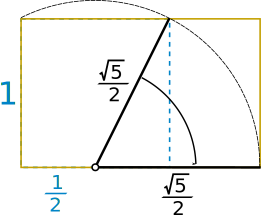

## Concepts / Definitions

A **sequence** is an ordered set of numbers; it is a function with *sequential natural numbers as the domain* and the terms of the sequence as the range.

Sequence values (terms or output numbers) are written by using subscripts. The first term is $$a_1$$, the second term is $$a_2$$, and the $$n$$th term is $$a_n$$.

An explicit formula would have the form $$a_n = \frac{3n}{n+1}$$

Sequences can be finite or infinite. 
Let $$a_n$$ be a sequence of real numbers, and let $$L$$ be a finite number. A sequence will **converge** if
$$\lim_{x \to \infty} a_n = L$$
If the sequence is infinite or nonexistant, the sequence diverges.

A **recursive formula** is a rule in which one or more previous terms are used to generate the next term.

An **arithmetic sequence** has an explicit rule or form $$a_n = a_1 + (n-1)d$$, where $$d$$ is the *common difference* between terms. 
Recursive Rule: $$a_n = a_{n-1} * r$$ for $$n \geq 2$$

A **geometric sequence** has an explicit rule or form $$a_n = a_1 r^{n-1}$$, where $$r$$ is the *common ratio* between terms. 
Recursive Rule: $$a_n = a_{n-1} * r$$ for $$n \geq 2$$

### Fibonacci Sequence

$$ a_1 = 1, \quad a_2 = 2, \quad a_n a_{n-2} + a_{n-1}$$

As the spiral continues, the ratios of the numbers approach a number called the **Golden Ratio**.

$$\frac{a+b}{a} = \frac{1+\sqrt{5}}{2} \approx 1.6180$$
## Bounded Sequences
Various notions of boundedness for sequences parallel the corresponding notions for sets of numbers, as defined in Sect. 2.5:
-  A sequence $$(a_n){n\geq 1}$$ is said to be bounded above if there exists $$K$$ such that $$a_n<K$$ for all $$n$$.
-  A sequence $$(a_n){n\geq 1}$$ is said to be bounded below if there exists $$K$$ such that $$a_n>K$$ for all $$n$$. 
-  A sequence $$(a_n)_{n\geq 1}$$ is said to be bounded if there exists $$K$$ such that $$|a_n|\leq K$$ for all $$n$$. 
<!-- \end{enumerate} -->
Obviously a sequence is bounded if and only if it is both bounded above and bounded below. As usual it is sometimes convenient to write the inequality as $$-K\leq a_n\leq K$$, or using set theory as $$a_n\in [-K, K]$$. 

$$\textbf{Proposition 3.2}$$ A convergent sequence is bounded. 

$$\textbf{Proof}$$ Assume that $$\lim\limits_{n\to\infty} a_n=t$$.  
Apply the definition of limit with $$\varepsilon = 1$$. There exists $$N$$ such that $$\left|a_n-t\right|<1$$ for all $$n\geq N$$. But then $$\left|a_n\right|<\left|t\right|+1$$ for all $$n\geq N$$. Choose $$k=\max_{1\leq n\leq N-1} \left|a_n\right|$$ and we then have for all $$n$$ that $$\left|a_n\right|\leq K$$ where $$K=\max(k, \left|t\right|+1)$$.

$$\textbf{Definition}$$ The sequence $$(a_n){n\geq 1}$$ tends to infinity (or has the limit $$\infty$$), and we write $$\lim\limits{n\to\infty} a_n=\infty$$, if the following condition is satisfied:

For each real number $$K$$ there exists a natural number $$N$$ such that $$a_n>K$$ for all $$n\geq N$$.

$$\textbf{Definition}$$ The sequence $$(a_n){n\geq 1}$$ tends to minus infinity (or has the limit $$-\infty$$), and we write $$\lim\limits{n\to\infty} a_n=-\infty$$, if the following condition is satisfied:

For each real number $$K$$ there exists a natural number $$N$$ such that $$a_n<K$$ for all $$n\geq N$$.

A sequence with limit $$\infty$$ or $$-\infty$$ is not considered to be convergent. We sometimes say that it is divergent to $$\infty$$, or $$-\infty$$. The elements $$\infty$$ and $$-\infty$$ are not numbers, but they may be limits. We still say of such a sequence, though not convergent, that the limit exists.

## Monotonic Sequences

\textbf{Although a convergent sequence is always bounded, it is far from the case that a bounded sequence is always convergent.} There is though one important case when a bounded sequence is convergent. It gives us a tool that is used over and over again; a simple instance of the structure of a sequence ensuring its convergence. Its proof is perhaps the first really important application of supremum and infimum.

\textbf{Definition} A sequence $$(a_n){n=0}^\infty$$ is said to be increasing if $$a_n \leq a{n+1}$$ for all $$n$$. It is said to be decreasing if $$a_n \geq a_{n+1}$$ for all $$n$$. A sequence that is either increasing or decreasing is said to be monotonic (or monotone).

We shall sometimes refer to a sequence as being strictly increasing. This will mean rather obviously that $$a_n < a_{n+1}$$ for all $$n$$, similarly for strictly decreasing. A sequence can be both increasing and decreasing, if it is constant; a fact that we just have to live with. The terminology varies somewhat, but we want the simpler terminology for the more frequently encountered cases; and they are that $$a_n \leq a_{n+1}$$ for each $$n$$, or $$a_n \geq a_{n+1}$$ for each $$n$$.

\textbf{Proposition 3.3} Let $$(a_n)_{n=0}^\infty$$ be a monotonic sequence. Then exactly one of the following is the case:

(1) It is convergent. (2) It tends to $$+\infty$$. (3) It tends to $$-\infty$$.

These three conclusions correspond respectively to the cases: (1) It is bounded. (2) It is unbounded and increasing. (3) It is unbounded and decreasing.

\textbf{Proof} Consider the case where $$(a_n)_{n=0}^\infty$$ is bounded and increasing. The set

$$ A = {a_{n}: n \in \mathbb{N}}$$

is then bounded. Note carefully that $$A$$ is the set of values that occur in the sequence. This is shown by the use of curly brackets. Let $$t = \sup A$$. We shall show that $$\lim_{n \to \infty} a_n = t$$.

Let $$\epsilon > 0$$. Since $$t$$ is the supremum there exists $$N$$, such that $$t - \epsilon < a_N \leq t$$. As the sequence is increasing and $$t$$ is an upper bound, we have $$t - \epsilon < a_n \leq t$$ for all $$n \geq N$$. We conclude that $$\lim_{n \to \infty} a_n = t$$.

Consider next the case when $$(a_n){n=0}^\infty$$ is unbounded but increasing. We shall show that $$\lim{n \to \infty} a_n = +\infty$$.

Let $$K$$ be a real number. As the sequence is unbounded and increasing it is not bounded above. So there exists $$N$$, such that $$a_N > K$$. But then $$a_n > K$$ for all $$n \geq N$$. We conclude that $$\lim_{n \to \infty} a_n = +\infty$$.

The case when the sequence is decreasing is similar and is left to the reader.

### Examples

#### Example 1
Write an explicit rule for $$5, -7, 9, 11, 13, ...$$

#### Example 2
Determine if the following sequence converges or diverges. $$2, \frac 32, \frac 43, \frac 54, ...$$

#### Example 3
Write an explicit rule for the following sequence. $$3, 9, 17, 27, 39$$

#### Example 4
Write an explicit rule for a geometric sequence given that $$a_3 = 54$$, and $$a_6 = 2$$

## Exercises
Calculator okay, find with algebra.
  1. Determine if the following sequences converge or diverge.
     1. $$\frac 12, \frac 14, \frac 18, \frac{1}{16}, ...$$
     2. $$-1,1,-1,1,-1,...$$
     3. $$a_n = 1.3^{n-1}$$
     4. $$a_n = \frac{1-2n}{n+1}$$
  2. Write an explicit and recursive rule for $$-5, -2, 1, 4, ...$$
  3. Write an explicit rule for $$\frac e2, \frac{e^2}{3}, \frac{e^3}{4}, ...$$
  4. Write an explicit rule for $$\frac{-6}{5}, \frac{7}{15},\frac{-8}{45},\frac{1}{15},\frac{-2}{81}, ...$$
  5. Write an explicit rule for $$2, 7, 16, 29, 46$$
  6. Write an explicit rule $$1\frac 12, 3\frac 14, 5\frac 16, 7\frac 18, ...$$
  7. Given the ninth term is -5 and the fifteenth term is 31, write an arithmetic explicit rule.
  8. Given $$a_4 = 2$$, and $$a_7 = \frac{54}{125}$$, write a geometric explicit rule.
  9. Find $$x$$ so that $$x$$, $$x+2$$, and $$x+3$$ are consecutive terms of a geometric sequence.
  10. Suppose that you have been hired at an annual salary of $$30,000 and expect to receive annual increases of 3%. What will your salary be when you begin your fifth year?
