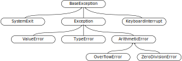

You may recall that we calculated the mean of a Numpy array by using
`numpy.mean`, as

~~~
import numpy
numbers = numpy.arange(10)
print(numpy.mean(numbers))
~~~
{: .language-python}

~~~
4.5
~~~
{: .output}

However, we can also calculate the mean of a Numpy array as:

~~~
print(numbers.mean())
~~~
{: .language-python}

~~~
4.5
~~~
{: .output}

Let's see if we can do this with a normal list:
~~~
more_numbers = [1, 2, 3, 4]
print(more_numbers.mean())
~~~
{: .language-python}

In this case Python will complain with an error. How does Python know it can do this for `numbers` but not `more_numbers`?

## What type is it?
Let's investigate this further by using `type` to identify what the data type of `numbers` is:

~~~
type(numbers)
~~~
{: .language-python}

~~~
<class 'numpy.ndarray'>
~~~
{: .output}

What about the type of the variable `more_numbers`?

~~~
type(more_numbers)
~~~
{: .language-python}

~~~
<class 'list'>
~~~
{: .output}
We can see here that `numbers` is an object of the type `numpy.ndarray`. In Python, anything which can be stored in a variable or passed to a function is called an _object_. Objects are classified by their `type`, or their `class`.

> ## Class or Type?
>
> Note that in literature, you'll find a subtle
> distinction between _class_ and _type_. However, since in Python 3
> we can't have one without the other, we will use both terms interchangably.
{: .callout}

> ## Let's find some types
>
> Can you find anything that you can store in a variable which
> does not have a class? What is the type of the number `1`,
> or the string `"hello"`?
>
> Does the class change if they are passed directly to `type`,
> or if they are stored in a variable?
>
>> ## Solution
>>
>> ~~~
>> type(1)
>> ~~~
>> {: .language-python}
>>
>> ~~~
>> <class 'int'>
>> ~~~
>> {: .output}
>>
>> ~~~
>> type("hello")
>> ~~~
>> {: .language-python}
>>
>> ~~~
>> <class 'string'>
>> ~~~
>> {: .output}
> {: .solution}
{: .challenge}

> ## Does everything have a class?
>
> Try to find words that Python recognises that do not have classes. What about `numpy.mean` or `numpy`?
> What about `if` or `for`? Can you think of others?
>
>> ## Solution
>>
>> ~~~
>> type(numpy.mean)
>> ~~~
>> {: .language-python}
>>
>> ~~~
>> <class 'function'>
>> ~~~
>> {: .output}
>>
>> ~~~
>> type(numpy)
>> ~~~
>> {: .language-python}
>>
>> ~~~
>> <class 'module'>
>> ~~~
>> {: .output}
>> The objects `numpy.mean` and `numpy` are things that we typically wouldn't store in variables or passed around. However, they could in principle be stored in variables, and therefore are objects with a class.
>> ~~~
>> type(if)
>> ~~~
>> {: .language-python}
>>
>> ~~~
>>  File "<stdin>", line 1
>>    type(if)
>>          ^
>>SyntaxError: invalid syntax
>> ~~~
>> {: .output}
>> ~~~
>> type(for)
>> ~~~
>> {: .language-python}
>>
>> ~~~
>>  File "<stdin>", line 1
>>    type(for)
>>          ^
>>SyntaxError: invalid syntax
>> ~~~
>> {: .output}
>> The words `if` and `for` are part of the Python language itself, they can't be stored in variables. Only things which can be stored in variables can have a class.
> {: .solution}
{: .challenge}

## Changing things

In Python, there are two ways in which objects can behave. The most intuitive case is when object are created with a value, and they keep the value forever. Many objects we're familiar with, such as integers or strings, are objects which hold a value.

Let's store a string in a variable:
~~~
message = "Hello"
~~~
{: .language-python}

The variable `message` now refers to an object, which has the value
`"Hello"`. We can point another variable at the same object with:
~~~
second_message = message
~~~
{: .language-python}

But, we can never change the value of the string object itself. The
string "hello" will always be the string "hello". We can set the
variable `second_message` to a new object, with
~~~
second_message = message + ", world"
~~~
{: .language-python}

But the original object is still there, unchanged. We can still get to it by typing
~~~
print(message)
~~~
{: .language-python}

This may not seem surprising, but not all objects in Python behave this way. Consider the following list of strings:
~~~
messages = ["Hello", "world!"]
~~~
{: .language-python}

Let's point new variable `duplicate_messages` at the list named `messages`
~~~
duplicate_messages = messages
~~~
{: .language-python}

Think of this as pointing `duplicate_messages` at the _same underlying
object_ contained in `messages`: Now let's change a part of
`duplicate_messages`:
~~~
duplicate_messages[1] = "there!"
~~~
{: .language-python}

What is the value of `messages` now?
~~~
print(messages)
~~~
{: .language-python}

~~~
['Hello', 'there!']
~~~
{: .output}

Note how we changed `messages` through the variable
`duplicate_messages`. We can do this because both `messages` and
`duplicate_messages` refer to the same underlying object, and that
underlying object can be changed.

We say that objects which can't be changed, like numbers and string, are _immutable_. Numbers are an intuitive example of immutable objects, the number 1000 will always be the number 1000. We say that these objects that can be changed are _mutable_, they can be "mutated" after they've created.

> ## Immutable lists
>
> Python has a class similar to a list called a `tuple`. Is a `tuple` mutable or immutable?
>
> Check if you can change a tuple by setting:
>
> ~~~
> messages = ("Hello", "world!")
> ~~~
> {: .language-python}
>
> and trying to modify the second element with:
> ~~~
> messages[1] = "there!'
> ~~~
> {: .language-python}
>
>> ## Solution
>>
>> ~~~
>> messages = ("Hello", "world!")
>> messages[1] = "there!"
>> ~~~
>> {: .language-python}
>>
>> You should see an error containing the text:
>> ~~~
>> TypeError: 'tuple' object does not support item assignment
>> ~~~
>> {: .output}
>>
>> This is telling you that you can't modify the tuple object, this is true because the tuple object is immutable.
> {: .solution}
{: .challenge}

> ## What kind of objects?
>
> List some objects that you think are mutable and immutable. Verify this by trying to find ways to change the objects.
>
> Note: Be careful that you're not "cheating" by using `=` to point to a new object.
{: .challenge}

## Instances and Methods

We say that an object of a particular class is an _instance_ of that
class. To use a real world example, we could have the type or class
`Chair` which describes to all the chairs in the world. The chair that
you are sitting on right now is a specific _instance_ of the chair
class.

We can check if an object is an _instance of_ a particular class with the `isinstance` function.

~~~
isinstance(numbers, numpy.ndarray)
~~~
{: .language-python}

~~~
True
~~~
{: .output}

Every object is created with a single class, and which can't be changed. The class of an object can also provide behaviour that the object might have, by providing functions to objects in its class. These functions can be called by using a dot after the variable name, for example:
~~~
numbers.mean()
~~~
{: .language-python}

The functions which are associated with an object are provided by the class of the object. When a class provides a function to an object we call that function a _method_ of the class.

We say that the `numpy.ndarray` class provides the `mean` _method_. Since `numbers` belongs to the class `numpy.ndarray`, we can use the `mean` method on the object referred to by `numbers`, by calling `numbers.mean()`. This allows objects of a `numpy.ndarray` to provide functionality specific to objects of class `numpy.ndarray`.

It's worth noting that both mutable and immutable objects can have methods. Methods of immutable objects, however, can't change
the underlying object. If needed, they will return a brand new object, and set the expected value in the new object. To keep this change,
you will need to store it in a variable, for example:
~~~
hello = "hello, world"
capital_hello = hello.capitalize()
print(capital_hello)
~~~
{: .language-python}

Methods of mutable objects can, and often do, change the class.
~~~
grades = [84, 78, 91]
grades.append(66)
print(grades)
~~~
{: .language-python}

~~~
[84, 78, 91, 66]
~~~
{: .output}

In this case, we don't need the extra `=` to assign the value to a new object.

> ## Finding out what things are
>
> use `type()` to find the type of `students`, defined as
>
> ~~~
> students = ['Petra', 'Aalia', 'Faizan', 'Shona']
> ~~~
> {: .language-python}
>
> and check this with `isinstance`.
>
>> ## Solution
>>
>> ~~~
>> type(students)
>> ~~~
>> {: .language-python}
>>
>> ~~~
>> <class 'list'>
>> ~~~
>> {: .output}
>>
>> ~~~
>> isinstance(students, list)
>> ~~~
>> {: .language-python}
>>
>> ~~~
>> True
>> ~~~
>> {: .output}
> {: .solution}
{: .challenge}

> ## Other common classes
>
> What other classes have you encountered previously when using Python?
> What methods did they provide?
{: .challenge}

## Making an object

A class can be called as a function, in which case it constructs new instances
of itself. While this is not the only way to make objects, it is one that all
classes offer. For example, a new list can be created as:

~~~
students = list()
print(students)
print(type(students))
~~~
{: .language-python}

~~~
[]
<class 'list'>
~~~
{: .output}

> ## Making a Numpy array
>
> While all classes can be constructed by calling their name, some classes
> don't recommend this route. For example, `numpy.ndarray` is used internally
> by Numpy to initialise its arrays, but Numpy recommends using one of the
> higher-level functions like `numpy.zeros`, `numpy.ones`, `numpy.empty`, or
> `numpy.asarray` to construct an array (of zeroes, of ones, without
> initialising the data, and initialising from an existing data structure like
> a list, respectively).
{: .callout}

> ## Make a dict
>
> Given the following list of students and their grades, how would you
> construct a `dict` with students as keys, and grades as values?
>
> ~~~
> students = ['Petra', 'Aalia', 'Faizan', 'Shona']
> grades = [84, 78, 91, 66]
> ~~~
> {: .language-python}
>
> You can check the type of the object you've created with `isinstance`
>
> Hint: `zip()` can be used to turn two lists into tuples of corresponding
> pairs of elements.
>
>> ## Solution
>>
>> ~~~
>> student_grades = dict(zip(students, grades))
>> isinstance(student_grades, dict)
>> ~~~
>> {: .language-python}
>>
>> ~~~
>> True
>> ~~~
>> {: .output}
> {: .solution}
{: .challenge}

## Equality and identity

Python has two ways of testing whether two objects are the "same". The first
is _equality_, or whether the associated values or contents of the object are
the same.

The second is _identity_, or whether the objects are in fact the
same instance, with names referring to the same underlying object.

Equality is tested with `==`, which you have probably used before. We can test for identity with the `is` keyword:

~~~
old_students = students
new_students = ['Petra', 'Aalia', 'Faizan', 'Shona']

if old_students == students:
    print("old_students is equal to the students list")
if new_students == students:
    print("new_students is equal to the students list")
if old_students is students:
    print("old_students is identical to the students list")
if new_students is students:
    print("new_students is identical to the students list")
~~~
{: .language-python}

Constructing a new list that has the same elements as an existing list
gives a list that is equal, but not identical, to the existing one. This is
true for any class: constructing a new object that is the same as an existing
one will give a result that is equal, but not identical, to the existing one.

## Inheritance

Object-oriented programming allows relationships to be defined between classes or types.
One class may be considered to be a specialisation or _subclass_ of another.
For a real world example, a car could be considered a specialisation or subclass of the class of all vehicles.

This is very frequently seen in the way Python handles exceptions. For example,
if we check what type a `ValueError` is, we see that it is of
`class 'ValueError'`:

~~~
an_error = ValueError("A value must be provided")
print(type(an_error))
if isinstance(an_error, ValueError):
    print("an_error is a ValueError")
~~~
{: .language-python}

~~~
<class 'ValueError'>
an_error is a ValueError
~~~
{: .output}

However, we can also check if it is an `Exception`:

~~~
if isinstance(an_error, Exception):
    print("an_error is an Exception")
~~~
{: .language-python}

~~~
an_error is an Exception
~~~
{: .output}

This is because `ValueError` is a subclass of `Exception`: value errors are a
specific type of exception that can occur, and so should have all the same
logic that is common to all exceptions.

One place this can be used is to structure exception handling; for example:

~~~
numerator = 5
denominator = 0

try:
    print(numerator, "divided by", denominator, "is", numerator / denominator)
except ZeroDivisionError:
    print("You can't divide by zero!")
except Exception:
    print("Something else went wrong.")
~~~
{: .language-python}

`ZeroDivisionError` is another subclass of `Exception`. On encountering an
exception, Python checks each `except` in turn to see whether the exception
matches the class being tested for. The more specific `ZeroDivisionError`
catches the specific case of dividing by zero, but the block is skipped for
all other issues, which are then handled by the more general `Exception`.



