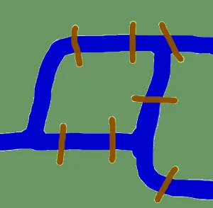
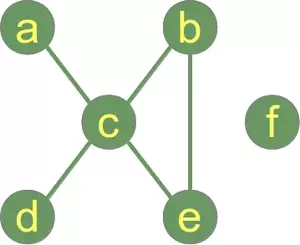
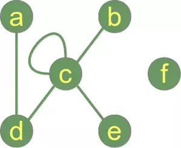
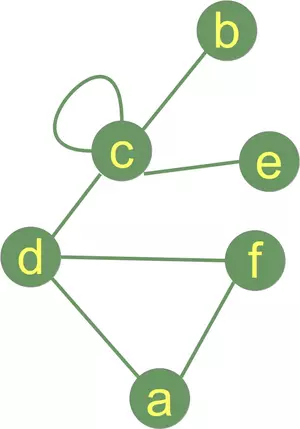

## Origins of Graph Theory
Before we start with the actual implementations of graphs in Python and before we start with the introduction of Python modules dealing with graphs, we want to devote ourselves to the origins of graph theory.

The origins take us back in time to the Künigsberg of the 18th century. Königsberg was a city in Prussia that time. The river Pregel flowed through the town, creating two islands. The city and the islands were connected by seven bridges as shown. The inhabitants of the city were moved by the question, if it was possible to take a walk through the town by visiting each area of the town and crossing each bridge only once? Every bridge must have been crossed completely, i.e. it is not allowed to walk halfway onto a bridge and then turn around and later cross the other half from the other side. The walk need not start and end at the same spot. Leonhard Euler solved the problem in 1735 by proving that it is not possible.

He found out that the choice of a route inside each land area is irrelevant and that the only thing which mattered is the order (or the sequence) in which the bridges are crossed. He had formulated an abstraction of the problem, eliminating unnecessary facts and focussing on the land areas and the bridges connecting them. This way, he created the foundations of graph theory. If we see a "land area" as a vertex and each bridge as an edge, we have "reduced" the problem to a graph.
> ## Episode Prerequisites
>
> If you are continuing in the same notebook from the previous episode, you already
> have a `data` variable and have imported `numpy`.  If you are starting a new 
> notebook at this point, you need the following two lines:
>
> ~~~
> import numpy
> data = numpy.loadtxt(fname='inflammation-01.csv', delimiter=',')
> ~~~
> {: .language-python}
{: .prereq}

~~~
import matplotlib.pyplot
image = matplotlib.pyplot.imshow(data)
matplotlib.pyplot.show()
~~~
{: .language-python}

## Introduction into Graph Theory Using Python
Before we start our treatize on possible Python representations of graphs, we want to present some general definitions of graphs and its components.

A "graph"1 in mathematics and computer science consists of "nodes", also known as "vertices". Nodes may or may not be connected with one another. In our illustration, - which is a pictorial representation of a graph,
* the node "a" is connected with the node "c", but "a" is not connected with "b". The connecting line between two nodes is called an edge. If the edges between the nodes are undirected, the graph is called an undirected graph. If an edge is directed from one vertex (node) to another, a graph is called a directed graph. An directed edge is called an arc.
Though graphs may look very theoretical, many practical problems can be represented by graphs. They are often used to model problems or situations in physics, biology, psychology and above all in computer science. In computer science, graphs are used to represent networks of communication, data organization, computational devices, the flow of computation,
In the latter case, the are used to represent the data organisation, like the file system of an operating system, or communication networks. The link structure of websites can be seen as a graph as well, i.e. a directed graph, because a link is a directed edge or an arc.
Python has no built-in data type or class for graphs, but it is easy to implement them in Python. One data type is ideal for representing graphs in Python, i.e. dictionaries. The graph in our illustration can be implemented in the following way:
graph = { "a" : {"c"},
          "b" : {"c", "e"},
          "c" : {"a", "b", "d", "e"},
          "d" : {"c"},
          "e" : {"c", "b"},
          "f" : {}
        }
The keys of the dictionary above are the nodes of our graph. The corresponding values are sets with the nodes, which are connectrd by an edge. A set is better than a list or a tuple, because this way, we can have only one edge between two nodes. There is no simpler and more elegant way to represent a graph.

An edge can also be ideally implemented as a set with two elements, i.e. the end nodes. This is ideal for undirected graphs. For directed graphs we would prefer lists or tuples to implement edges.

Function to generate the list of all edges:
~~~
def generate_edges(graph):
    edges = []
    for node in graph:
        for neighbour in graph[node]:
            edges.append({node, neighbour})

    return edges

print(generate_edges(graph))
~~~
{: .language-python}

~~~
[{'c', 'a'}, {'c', 'b'}, {'b', 'e'}, {'c', 'd'}, {'c', 'b'}, {'c', 'e'}, {'c', 'a'}, {'c', 'd'}, {'c', 'e'}, {'b', 'e'}]
~~~
{: .output}

As we can see, there is no edge containing the node "f". "f" is an isolated node of our graph. The following Python function calculates the isolated nodes of a given graph:
~~~
def find_isolated_nodes(graph):
    """ returns a set of isolated nodes. """
    isolated = set()
    for node in graph:
        if not graph[node]:
            isolated.add(node)
    return isolated
~~~
{: .language-python}

If we call this function with our graph, a list containing "f" will be returned: ["f"]

## Graphs as a Python Class

Before we go on with writing functions for graphs, we have a first go at a Python graph class implementation.

If you look at the following listing of our class, you can see in the init-method that we use a dictionary "self._graph_dict" for storing the vertices and their corresponding adjacent vertices.

~~~

""" A Python Class
A simple Python graph class, demonstrating the essential 
facts and functionalities of graphs.
"""

class Graph(object):

    def __init__(self, graph_dict=None):
        """ initializes a graph object 
            If no dictionary or None is given, 
            an empty dictionary will be used
        """
        if graph_dict == None:
            graph_dict = {}
        self._graph_dict = graph_dict

    def edges(self, vertice):
        """ returns a list of all the edges of a vertice"""
        return self._graph_dict[vertice]
        
    def all_vertices(self):
        """ returns the vertices of a graph as a set """
        return set(self._graph_dict.keys())

    def all_edges(self):
        """ returns the edges of a graph """
        return self.__generate_edges()

    def add_vertex(self, vertex):
        """ If the vertex "vertex" is not in 
            self._graph_dict, a key "vertex" with an empty
            list as a value is added to the dictionary. 
            Otherwise nothing has to be done. 
        """
        if vertex not in self._graph_dict:
            self._graph_dict[vertex] = []

    def add_edge(self, edge):
        """ assumes that edge is of type set, tuple or list; 
            between two vertices can be multiple edges! 
        """
        edge = set(edge)
        vertex1, vertex2 = tuple(edge)
        for x, y in [(vertex1, vertex2), (vertex2, vertex1)]:
            if x in self._graph_dict:
                self._graph_dict[x].add(y)
            else:
                self._graph_dict[x] = [y]

    def __generate_edges(self):
        """ A static method generating the edges of the 
            graph "graph". Edges are represented as sets 
            with one (a loop back to the vertex) or two 
            vertices 
        """
        edges = []
        for vertex in self._graph_dict:
            for neighbour in self._graph_dict[vertex]:
                if {neighbour, vertex} not in edges:
                    edges.append({vertex, neighbour})
        return edges
    
    def __iter__(self):
        self._iter_obj = iter(self._graph_dict)
        return self._iter_obj
    
    def __next__(self):
        """ allows us to iterate over the vertices """
        return next(self._iter_obj)

    def __str__(self):
        res = "vertices: "
        for k in self._graph_dict:
            res += str(k) + " "
        res += "\nedges: "
        for edge in self.__generate_edges():
            res += str(edge) + " "
        return res
        
~~~
{: .language-python}

We want to play a little bit with our graph. We start with iterating over the graph. Iterating means iterating over the vertices.

~~~
g = { "a" : {"d"},
      "b" : {"c"},
      "c" : {"b", "c", "d", "e"},
      "d" : {"a", "c"},
      "e" : {"c"},
      "f" : {}
    }

graph = Graph(g)

for vertice in graph:
    print(f"Edges of vertice {vertice}: ", graph.edges(vertice))
~~~
{: .language-python}

~~~
Edges of vertice a:  {'d'}
Edges of vertice b:  {'c'}
Edges of vertice c:  {'c', 'd', 'b', 'e'}
Edges of vertice d:  {'c', 'a'}
Edges of vertice e:  {'c'}
Edges of vertice f:  {}
~~~
{: .output}

~~~
graph.add_edge({"ab", "fg"})
graph.add_edge({"xyz", "bla"})
print("")
print("Vertices of graph:")
print(graph.all_vertices())

print("Edges of graph:")
print(graph.all_edges())
~~~
{: .language-python}

~~~
Vertices of graph:
{'d', 'b', 'e', 'f', 'fg', 'c', 'bla', 'xyz', 'ab', 'a'}
Edges of graph:
[{'d', 'a'}, {'c', 'b'}, {'c'}, {'c', 'd'}, {'c', 'e'}, {'ab', 'fg'}, {'bla', 'xyz'}]
~~~
{: .output}

Let's calculate the list of all the vertices and the list of all the edges of our graph:
~~~

print("")
print("Vertices of graph:")
print(graph.all_vertices())

print("Edges of graph:")
print(graph.all_edges())
~~~
{: .language-python}

~~~
Vertices of graph:
{'d', 'b', 'e', 'f', 'fg', 'c', 'bla', 'xyz', 'ab', 'a'}
Edges of graph:
[{'d', 'a'}, {'c', 'b'}, {'c'}, {'c', 'd'}, {'c', 'e'}, {'ab', 'fg'}, {'bla', 'xyz'}]

~~~
{: .output}
We add a vertex and and edge to the graph:

~~~

print("Add vertex:")
graph.add_vertex("z")

print("Add an edge:")
graph.add_edge({"a", "d"})

print("Vertices of graph:")
print(graph.all_vertices())

print("Edges of graph:")
print(graph.all_edges())
~~~
{: .language-python}

~~~
Add vertex:
Add an edge:
Vertices of graph:
{'d', 'b', 'e', 'f', 'fg', 'z', 'c', 'bla', 'xyz', 'ab', 'a'}
Edges of graph:
[{'d', 'a'}, {'c', 'b'}, {'c'}, {'c', 'd'}, {'c', 'e'}, {'ab', 'fg'}, {'bla', 'xyz'}]
~~~
{: .output}

~~~

print('Adding an edge {"x","y"} with new vertices:')
graph.add_edge({"x","y"})
print("Vertices of graph:")
print(graph.all_vertices())
print("Edges of graph:")
print(graph.all_edges())
~~~
{: .language-python}

~~~

Adding an edge {"x","y"} with new vertices:
Vertices of graph:
{'d', 'b', 'e', 'f', 'fg', 'z', 'x', 'c', 'bla', 'xyz', 'ab', 'y', 'a'}
Edges of graph:
[{'d', 'a'}, {'c', 'b'}, {'c'}, {'c', 'd'}, {'c', 'e'}, {'ab', 'fg'}, {'bla', 'xyz'}, {'x', 'y'}]
~~~
{: .output}

## Paths in Graphs
We want to find now the shortest path from one node to another node. Before we come to the Python code for this problem, we will have to present some formal definitions.

### Adjacent vertices:
Two vertices are adjacent when they are both incident to a common edge.

### Path in an undirected Graph:
A path in an undirected graph is a sequence of vertices P = ( v1, v2, ..., vn ) ∈ V x V x ... x V such that vi is adjacent to v{i+1} for 1 ≤ i < n. Such a path P is called a path of length n from v1 to vn.
### Simple Path:
A path with no repeated vertices is called a simple path.

Example:

(a, c, e) is a simple path in our graph, as well as (a,c,e,b). (a,c,e,b,c,d) is a path but not a simple path, because the node c appears twice.

We add a method find_path to our class Graph. It tries to find a path from a start vertex to an end vertex. We also add a method find_all_paths, which finds all the paths from a start vertex to an end vertex:

~~~
""" A Python Class
A simple Python graph class, demonstrating the essential 
facts and functionalities of graphs.
"""

class Graph(object):

    def __init__(self, graph_dict=None):
        """ initializes a graph object 
            If no dictionary or None is given, 
            an empty dictionary will be used
        """
        if graph_dict == None:
            graph_dict = {}
        self._graph_dict = graph_dict

    def edges(self, vertice):
        """ returns a list of all the edges of a vertice"""
        return self._graph_dict[vertice]
        
    def all_vertices(self):
        """ returns the vertices of a graph as a set """
        return set(self._graph_dict.keys())

    def all_edges(self):
        """ returns the edges of a graph """
        return self.__generate_edges()

    def add_vertex(self, vertex):
        """ If the vertex "vertex" is not in 
            self._graph_dict, a key "vertex" with an empty
            list as a value is added to the dictionary. 
            Otherwise nothing has to be done. 
        """
        if vertex not in self._graph_dict:
            self._graph_dict[vertex] = []

    def add_edge(self, edge):
        """ assumes that edge is of type set, tuple or list; 
            between two vertices can be multiple edges! 
        """
        edge = set(edge)
        vertex1, vertex2 = tuple(edge)
        for x, y in [(vertex1, vertex2), (vertex2, vertex1)]:
            if x in self._graph_dict:
                self._graph_dict[x].append(y)
            else:
                self._graph_dict[x] = [y]

    def __generate_edges(self):
        """ A static method generating the edges of the 
            graph "graph". Edges are represented as sets 
            with one (a loop back to the vertex) or two 
            vertices 
        """
        edges = []
        for vertex in self._graph_dict:
            for neighbour in self._graph_dict[vertex]:
                if {neighbour, vertex} not in edges:
                    edges.append({vertex, neighbour})
        return edges
    
    def __iter__(self):
        self._iter_obj = iter(self._graph_dict)
        return self._iter_obj
    
    def __next__(self):
        """ allows us to iterate over the vertices """
        return next(self._iter_obj)

    def __str__(self):
        res = "vertices: "
        for k in self._graph_dict:
            res += str(k) + " "
        res += "\nedges: "
        for edge in self.__generate_edges():
            res += str(edge) + " "
        return res

    def find_path(self, start_vertex, end_vertex, path=None):
        """ find a path from start_vertex to end_vertex 
            in graph """
        if path == None:
            path = []
        graph = self._graph_dict
        path = path + [start_vertex]
        if start_vertex == end_vertex:
            return path
        if start_vertex not in graph:
            return None
        for vertex in graph[start_vertex]:
            if vertex not in path:
                extended_path = self.find_path(vertex, 
                                               end_vertex, 
                                               path)
                if extended_path: 
                    return extended_path
        return None
    
    
    def find_all_paths(self, start_vertex, end_vertex, path=[]):
        """ find all paths from start_vertex to 
            end_vertex in graph """
        graph = self._graph_dict 
        path = path + [start_vertex]
        if start_vertex == end_vertex:
            return [path]
        if start_vertex not in graph:
            return []
        paths = []
        for vertex in graph[start_vertex]:
            if vertex not in path:
                extended_paths = self.find_all_paths(vertex, 
                                                     end_vertex, 
                                                     path)
                for p in extended_paths: 
                    paths.append(p)
        return paths
~~~
{: .language-python}

We check in the following the way of working of our find_path and find_all_paths methods.

~~~
g = { "a" : {"d"},
      "b" : {"c"},
      "c" : {"b", "c", "d", "e"},
      "d" : {"a", "c"},
      "e" : {"c"},
      "f" : {}
    }

graph = Graph(g)

print("Vertices of graph:")
print(graph.all_vertices())

print("Edges of graph:")
print(graph.all_edges())

print('The path from vertex "a" to vertex "b":')
path = graph.find_path("a", "b")
print(path)

print('The path from vertex "a" to vertex "f":')
path = graph.find_path("a", "f")
print(path)

print('The path from vertex "c" to vertex "c":')
path = graph.find_path("c", "c")
print(path)
~~~
{: .language-python}

~~~

Vertices of graph:
{'d', 'b', 'e', 'f', 'c', 'a'}
Edges of graph:
[{'d', 'a'}, {'c', 'b'}, {'c'}, {'c', 'd'}, {'c', 'e'}]
The path from vertex "a" to vertex "b":
['a', 'd', 'c', 'b']
The path from vertex "a" to vertex "f":
None
The path from vertex "c" to vertex "c":
['c']
~~~
{: .language-python}

We slightly changed our example graph by adding edges from "a" to "f" and from "f" to "d" to test the find_all_paths method:

~~~
g = { "a" : {"d", "f"},
      "b" : {"c"},
      "c" : {"b", "c", "d", "e"},
      "d" : {"a", "c", "f"},
      "e" : {"c"},
      "f" : {"a", "d"}
    }

graph = Graph(g)
print("Vertices of graph:")
print(graph.all_vertices())

print("Edges of graph:")
print(graph.all_edges())

print('All paths from vertex "a" to vertex "b":')
path = graph.find_all_paths("a", "b")
print(path)

print('All paths from vertex "a" to vertex "f":')
path = graph.find_all_paths("a", "f")
print(path)

print('All paths from vertex "c" to vertex "c":')
path = graph.find_all_paths("c", "c")
print(path)
~~~
{: .language-python}

~~~

Vertices of graph:
{'d', 'b', 'e', 'f', 'c', 'a'}
Edges of graph:
[{'d', 'a'}, {'f', 'a'}, {'c', 'b'}, {'c'}, {'c', 'd'}, {'c', 'e'}, {'d', 'f'}]
All paths from vertex "a" to vertex "b":
[['a', 'd', 'c', 'b'], ['a', 'f', 'd', 'c', 'b']]
All paths from vertex "a" to vertex "f":
[['a', 'd', 'f'], ['a', 'f']]
All paths from vertex "c" to vertex "c":
[['c']]
~~~
{: .output}

## Degree and Degree Sequence

The degree of a vertex v in a graph is the number of edges connecting it, with loops counted twice. The degree of a vertex v is denoted deg(v). The maximum degree of a graph G, denoted by Δ(G), and the minimum degree of a graph, denoted by δ(G), are the maximum and minimum degree of its vertices.

In the graph on the right side, the maximum degree is 5 at vertex c and the minimum degree is 0, i.e the isolated vertex f.

If all the degrees in a graph are the same, the graph is a regular graph.

In a regular graph, all degrees are the same, and so we can speak of the degree of the graph.

The degree sum formula (Handshaking lemma):

∑v∈ Vdeg(v) = 2|E|

This means that the sum of degrees of all the vertices is equal to the number of edges multiplied by 2. We can conclude that the number of vertices with odd degree has to be even. This statement is known as the handshaking lemma. The name "handshaking lemma" stems from a popular mathematical problem: In any group of people the number of people who have shaken hands with an odd number of other people from the group is even.

The degree sequence of an undirected graph is defined as the sequence of its vertex degrees in a non-increasing order. The following method returns a tuple with the degree sequence of the instance graph:

We will design a new class Graph2 now, which inherits from our previously defined graph Graph and we add the following methods to it:

* vertex_degree
* find_isolated_vertices
* delta
* degree_sequence

~~~
class Graph2(Graph):
    
    def vertex_degree(self, vertex):
        """ The degree of a vertex is the number of edges connecting
        it, i.e. the number of adjacent vertices. Loops are counted 
        double, i.e. every occurence of vertex in the list 
        of adjacent vertices. """ 
        degree =  len(self._graph_dict[vertex]) 
        if vertex in self._graph_dict[vertex]:
            degree += 1
        return degree

    def find_isolated_vertices(self):
        """ returns a list of isolated vertices. """
        graph = self._graph_dict
        isolated = []
        for vertex in graph:
            print(isolated, vertex)
            if not graph[vertex]:
                isolated += [vertex]
        return isolated
        
    def Delta(self):
        """ the maximum degree of the vertices """
        max = 0
        for vertex in self._graph_dict:
            vertex_degree = self.vertex_degree(vertex)
            if vertex_degree > max:
                max = vertex_degree
        return max
    
    def degree_sequence(self):
        """ calculates the degree sequence """
        seq = []
        for vertex in self._graph_dict:
            seq.append(self.vertex_degree(vertex))
        seq.sort(reverse=True)
        return tuple(seq)
g = { "a" : {"d", "f"},
      "b" : {"c"},
      "c" : {"b", "c", "d", "e"},
      "d" : {"a", "c"},
      "e" : {"c"},
      "f" : {"d"}
    }

graph = Graph2(g)
graph.degree_sequence()
~~~
{: .language-python}

~~~
(5, 2, 2, 1, 1, 1)
~~~
{: .output}
Let's have a look at the other graph:

~~~
g = { "a" : {"d", "f"},
      "b" : {"c"},
      "c" : {"b", "c", "d", "e"},
      "d" : {"a", "c", "f"},
      "e" : {"c"},
      "f" : {"a", "d"}
    }

graph = Graph2(g)
graph.degree_sequence()
~~~
{: .language-python}

~~~
(5, 3, 2, 2, 1, 1)
~~~
{: .output}


