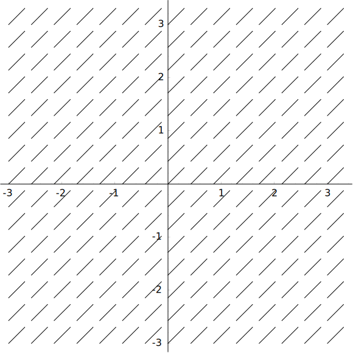
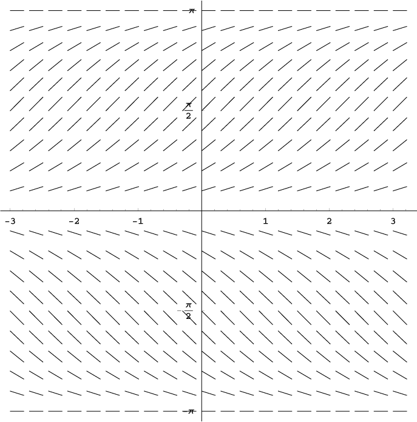

#  Slope Fields and Euler's Method

## Concepts / Definitions

_Slope fields_ are a graphical representation of the family of solutions of a differential equation.

Slope fields can be useful to show you what the graph of the antiderivative looks like without ever solving the differential equation analytically.
Each dash represents a slope at a particular $$(x, y)$$ value.
The solution (antiderivative) is drawn because we know the slopes of each point on the curve.

If you apply this method knowing the location of one point on the curve, you can accurately determine the constant of integration.

### Example Slope Fields of Polynomial Functions

| | |
--|--
 | 
 | 

All the previous derivatives have had the same shape, and only varied in the $$y$$ axis.
Now we come to "dependent" functions, in which the y is part of the derivative. These functions no longer hold the same shape among the $$y$$ axis. Solving the derivatives of these functions is slightly harder, although it can be done.

### Slope Fields of "Dependent" Functions

| | |
--|--
 | 
 | 

### Creating Slope Fields from Derivatives

Creating slope fields from derivatives is a straightforward process - given a point, merely plug the $$x$$ and $$y$$ values into the derivative, provided $$x$$ or $$y$$ exists in the equation.
Draw a short line segment at the provided point on the graph with the slope provided by the derivative.
Repeat for all given points.

### Euler's Method

Euler's method is a method for estimating the graph of a function given its derivative.

> ## For each increment,
- Find the slope at the current $$x$$-value
- Increase $$x$$ by $$\Delta x$$
- Increase $$y$$ by the slope times $$\Delta x$$
- (note that $$\Delta x$$ can be negative)
- Repeat the process with a new point.
{: .challenge}

# More on Limits and using calculator for Numerical Derivatives and Integrals

## Concepts / Definitions

### Theorem for a Limit

$$\lim_{x \to a} f(x) = L \quad iff \quad \lim_{x \to a^-} f(x) = L = \lim_{x \to a^+} f(x)$$

### Theorem

$$\lim_{x \to \infty} \frac{\sin{x}}{x} = 1 \qquad \lim_{x \to 0} \frac{\cos{x}-1}{x} = 0$$

### Derivative and Integral buttons

From Graphing Screen: 
Graph $$f(x)$$, $$2^{nd}$$ TRACE (calc), 6 deriv, 7 integral 
From Main Screen: 
MATH, 8nDeriv$$(f(x), x, x_a)$$, 9fnIn$$t(f(x), x, a, b)$$

Note: Technically the theorem is based on real numbers, we do include infinity as a possible answer to give more information about answer.

### Theorem

If $$r > 0$$ is a rational number, then
$$\lim_{x \to \pm \infty} \frac{1}{x^r} = 0$$

Suppose we want to answer a limit question, and *when we "plug in" the limit value*, this is what we get. So, what would they equal?

$$
\begin{matrix}
    \frac{0}{0}&\frac{\infty}{\infty}&0^{infty}\\
    \frac{some\ number}{\infty}&\infty - \infty&0^0\\
    \frac{\infty}{some\ number}&(0)(\infty)&1^{infty}\\
    \frac{some\ number}{0}\\
\end{matrix}
$$

$$
\begin{matrix}
    indeterminate&indeterminate&???\\
    0&indeterminate&indeterminate\\
    \pm\infty&indeterminate&indeterminate\\
    indeterminate\\
\end{matrix}
$$

undefined: we don't know 
indeterminute: we can find out