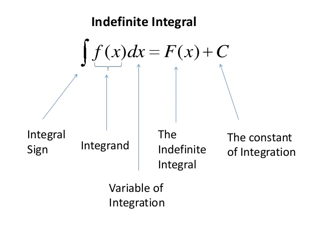

# u-substitution rule

## Concepts / Definitions

### The Indefinite Integral

$$\int f(x)dx$$

read: "The indefinite integral of $$f$$ with respect to $$x$$". 
means: To find the set of all antiderivatives of $$f$$

Don't forget the $$+ C$$!

### Formulas and Properties

$$\int x^n dx = \frac{x^{n+1}}{n+1} + C,\ n\neq -1$$

$$\int e^x dx = e^x + C$$

$$\int \frac 1x dx = \ln \lvert x \rvert + C$$

$$\int k f(x)dx = k\int f(x)dx$$

$$\int [f(x) \pm g(x)]dx = \int f(x)dx + \int g(x)dx$$

$$\int \cos x dx = \sin x + C$$

$$\int \sin x dx = -\cos x + C$$

$$\int \sec^2x dx = \tan x + C$$

$$\int \csc x \cot x dx = -\csc x + C$$

$$\int \sec x \tan x dx = \sec x + C$$

$$\csc^2 x dx = -\cot x + C$$

### u-substitution

The purpose of u-substitution is to undo the chain rule. The process of doing a substitution makes an integral more obvious to evaluate.

It sometimes can be used for a special product.

$$\int 2x\cos x^2 dx = \sin x^2 + C$$

### Integration by Substitution Strategy

Use a _change of variables_, usually $$u = $$ something, to find an indefinite integral.

1. Choose a substitution $$u = g(x)$$, usually the inner part of a composite function;
   1. The quantity under a root or raised to a power
   2. The exponent
   3. The quantity in a denominator
2. Compute the derivative of $$u$$, put the derivative equation in terms of the differential, $$dx = \frac{du}{g(x)}$$ and _do the integral in terms of the new variable $$u$$_.
3. For indefinite integral, put the antiderivative back in terms of $$x$$.

## Examples

$$\int \cos (au) du = \frac{\sin au}{a} + C$$

$$\int a^u du = \int (e^{\ln a})^u du = \int e^{(\ln a)u} du = \frac{e^{u\ln a}}{\ln a} + C = \frac{a^u}{\ln a} + C$$

$$\int f'(x)dx$$

$$\int f'(x)dx = \int \frac{df}{dx}dx = \int \frac{d}{dx}fdx = \int df = f(x) + C$$

$$\int f'(u)dx$$

$$\int f'(u) dx = \int \frac{df}{du} \frac{du}{dx} dx = \int \frac{df}{du}du$$

$$\int 2x\cos x^2 dx$$

$$\int 2x \cos u dx\ (let\ u=x^2,\ therefore\ \frac{du}{dx}=2x) = \int 2x\cos u \frac{du}{2x} = \int \cos u du = \sin u + C = \sin x^2 + C$$
