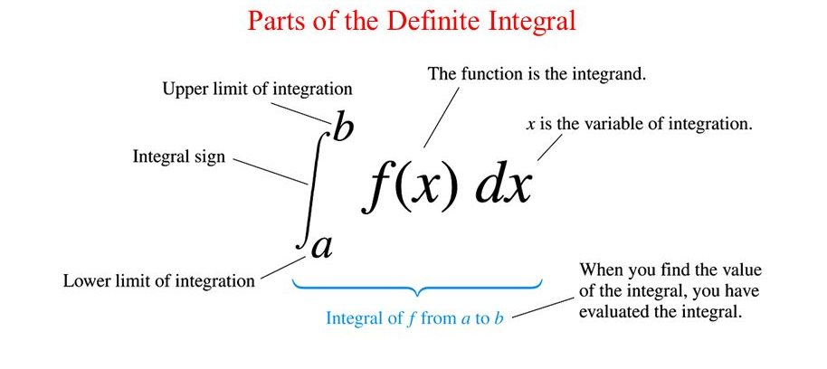

# 5-2 Riemann Sums and Definite Integrals

## Learning Targets

You will be able to
- [ ] Write a Riemann sum or integral to calculate area
- [ ] Converting from Riemann form to integral form and vice versa
- [ ] Calculate integrals using area

## Concepts / Definitions

### Riemann Sums

Note: The area will be _net area_! Example:

### Definition of the Definite Integral

If $f$ is defined on the closed interval $[a, b]$ and the limit of a Riemann sum of $f$ exists, then we say $f$ is integrable on $[a, b]$ and we denote the limit by

$$\lim_{\Delta x\to 0} \sum_{i=1}^{n}f(c_i)\Delta x_i = \int_a^b f(x)dx$$

The limit is called the _definite integral_ of $f$ from $a$ to $b$. The number $a$ is the _lower limit_ of integration, and the number $b$ is the _upper limit_ of integration.

$$\lim_{n\to\infty} \sum_{i=1}^n f(x_i)\Delta x$$

Note: The answer _must be a number_, e.g. your answer cannot be $\int_a^b f(x)dx = \infty$.
Additionally, this means that the variable of integration does not matter (and not $a$ or $b$.)

$\int_a^b f(x)dx = \int_a^b f(t)dt = \int_a^b f(u)du$

### Definitions

#### Displacement

$$Displacement\ = \int_a^b (velocity)\ dt$$

#### Distance

$$Distance\ = \int_a^b \lvert\ velocity\ \rvert\ dt$$
