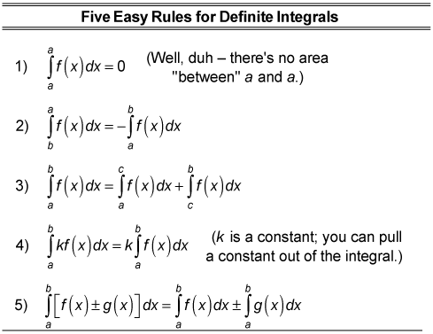
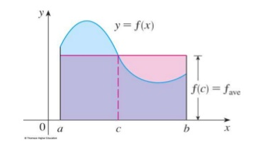

# 5-3 Integrals and Antiderivatives

## Learning Targets

You will be able to
- [ ] Find the average value of a function
- [ ] Evaluate definite integrals
- [ ] Apply definite integral properties

## Concepts / Definitions

### Rectangle Area

For 'positive' functions $f$, there is a number $c$ such that the rectangle with base $[a,b]$ and height $f(c)$ has the same area as the region under the graph of $f$ from $a$ to $b$.

### The Mean Value Theorem for Integrals

If $f$ is continuous on $[a,b]$, then there exists a number $c$ in the open interval $(a,b)$ such that

$$\int_a^b f(x)dx = f(c)(b-a)$$

### The Mean Value Theorem for Integrals

#### Theorem
If $f$ is continuous on $[a,b]$, then there exists a number $c$ in $[a,b]$ such that
$$f(c) = f_{???} = \frac{1}{b-a}\int_a^b f(x)dx)$$
that is.
$$\int_a^b f(x)dx = f(c)(b-a)$$
