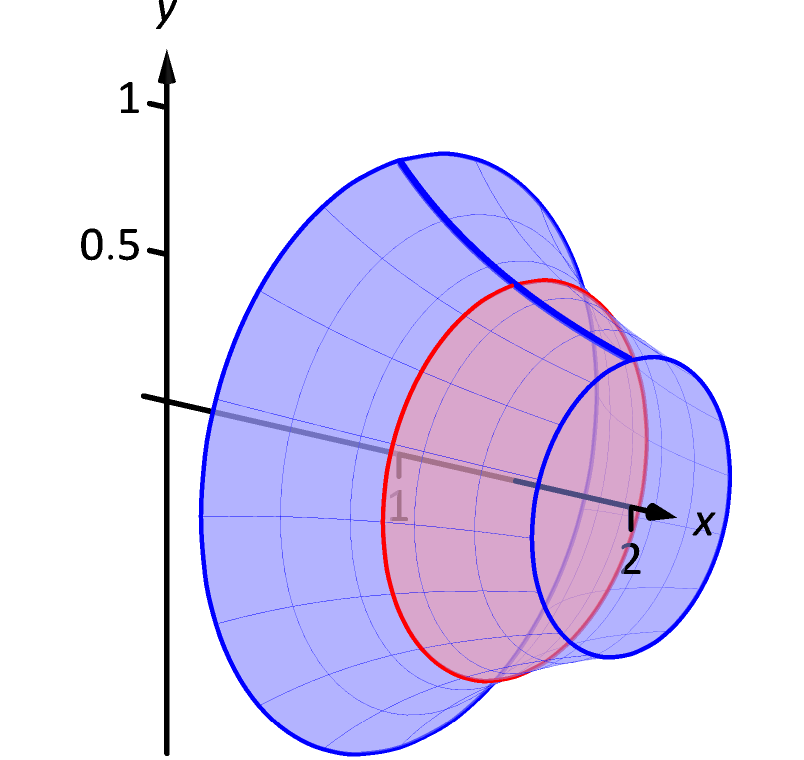

# 7-3 Volume as an Integral

## Learning Targets

You will be able to
- [ ] Apply the disc and washer methods
- [ ] Apply the shell method
- [ ] Find the volume of a solid of revolution

## Concepts / Definitions

### Solids of Revolution

A **solid of revolution** is a solid that is formed by revolving a bounded region around a particular line.
Similar to Riemann sums, the idea is to cut the solid into many pieces, then add them up.

### The Disc Method
The disc method is a summation of **the volume of all infinitely thin ($dx$) cylinders with radius $f(x)$ on an interval ($\int_a^b$)**.

$$Volume = \int_a^b\pi r^2 dx = \int_a^b\pi f(x)^2 dx$$

Note that you must account for different axes of rotation, whether it be $x = 3$ or $y = 0$, and calculate the radius (and width, as $dy$ could be used) appropriately.

### The Washer Method
The only difference between the washer and the disc method is that there is a **hole** to subtract. As such, the washer method is **the volume of the outside function subtracted by the inside function**.

$$Volume = \int_a^b\pi\ R(y)^2 dy - \int_a^b\pi\ r(y)^2 dy = \int_a^b \pi$$

### The Shell Method

In some situations, we cannot calculate the volume by slicing the object into discs. In many of these cases, we can slice the object into cylindrical shells instead.

The shell method is a summation of all infinitely thin shells (think tubes) of an object.

$$Volume = \int_a^b 2\pi (r*h*w) = \int_a^b 2\pi xy\ dy$$
