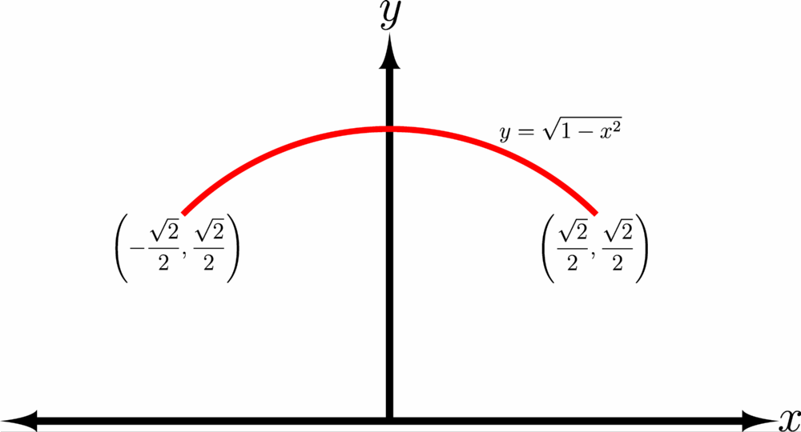
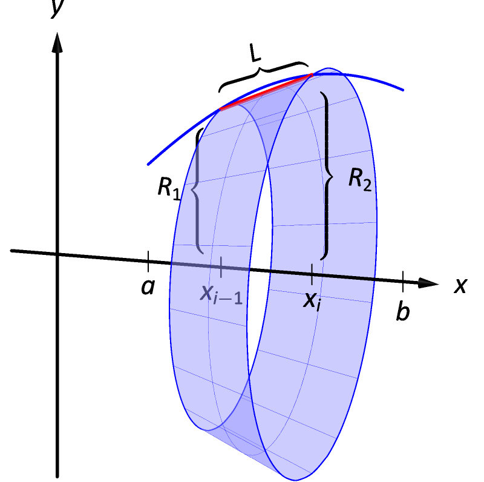

# 7-4 Finding the Length of a Curve

## Learning Targets

You will be able to
- [ ] Find the length of a smooth curve
- [ ] Find the length of a segment of a smooth curve

## Concepts / Definitions

### Deriving Arc Length

We want to determine the length of the continuous function $f(x)$ on the interval $[a, b]$.
This can be done by dividing the interval up into $n$ equal subintervals, each of width $\Delta x$.
Each point on the curve at each x-value can be denoted with $P_i$.
We can then approximate the curve by a series of straight lines connecting the points.

Here's a sketch of this situation.

The length of each segment is $\lvert P_{i-1} P_i \rvert$.

The length of the curve is approximately

$$L \approx \sum_{i=1}^9\ \lvert P_{i-1} P_i \rvert$$

Exact length would be

$$L = \lim_{n\to\infty} \sum_{i=1}^n \lvert P_{i-1} P_i \rvert$$

This exact length can be expressed as an integral.

### Definition of Arc Length

Given $f(x)$ is a _smooth curve_ (differentiable) on the interval $[a, b]$, the arc length of $f$ between $a$ and $b$ can be found by

$$Length = \int_a^b \sqrt{1+(f'(x))^2}\ dx$$

The curve's length can be integrated in terms of $x$ or $y$.

$$ds = \sqrt{1+(\frac{dy}{dx})^2}\ dx = \sqrt{1+(\frac{dx}{dy})^2}\ dy$$

### Surface Area of a Solid of Revolution

Building off the previous lesson, we can apply this concept of arc length to find the surface area of a solid of revolution.

$$Surface\ Area = \int_a^b 2\pi f(x) \sqrt{1+f'(x)^2}\ dx$$

Again, the surface area can be integrated in terms of $x$ or $y$, depending on the rotation axis.

$$dA = 2\pi\ f(x) \sqrt{1+(\frac{dy}{dx})^2} = 2\pi\ x\ \sqrt{1+(\frac{dx}{dy})^2}$$

When using the surface area formula, don't forget to add the area of the bottom and top bases, if necessary.
