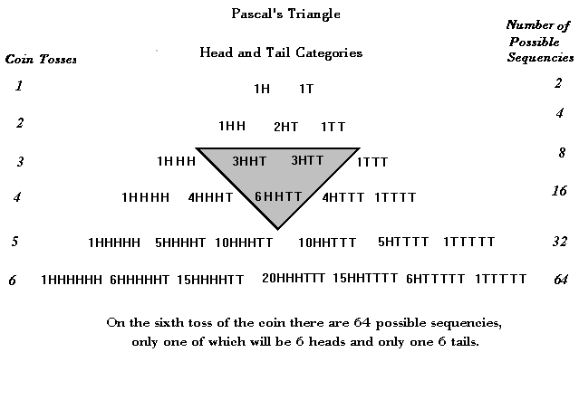
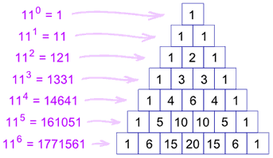
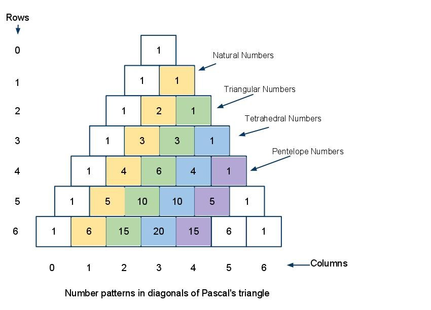
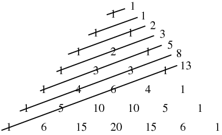

# Binomial Theorem

## Learning Targets

You should be able to
- [ ] Find Binomial Coefficients
- [ ] Expand binomial using Binomial Theorem

## Concepts / Definitions

### Expanding a Binomial

$(a + b)^0 = 1a^0$ 
$(a + b)^1 = 1a^1 + 1b^1$ 
$(a + b)^2 = 1a^2 + 2ab + 1b^2$ 
$(a + b)^3 = 1a^3 + 3a^2b + 3ab^2 + 1b^3$ 
$(a + b)^4 = 1a^4 + 4a^3b + 6a^2b^2 + 4ab^3 + 1b^4$ 
$(a + b)^5 = 1a^5 + 5a^4b + 10a^3b^2 + 10a^2b^3 + 5ab^4 + 1b^5$

Pascal's triangle corresponds to a value of $_nC_r$

$$_0C_0$$

$$_1C_0\ _1C_1$$

$$_2C_0\ _2C_1\ _2C_2$$

$$_3C_0\ _3C_1\ _3C_2\ _3C_3$$

$$_4C_0\ _4C_1\ _4C_2\ _4C_3\ _4C_4$$

$$_5C_0\ _5C_1\ _5C_2\ _5C_3\ _5C_4\ _5C_5$$

### Binomial Theorem

$$(a + b)^n = \sum_{k=0}^{n} \binom{n}{k} a^{n-k} b^k$$

$$(a + b)^n = nC_0 a^n b^0 + nC_1 a^{n-1} b^1 + nC_2 a^{n-2} b^2 + ... + nC_{n-1} a^1 b^{n-1} + nC_n a^0 b^n$$

### Binomial Theorem / Pascal's Triangle uses

## Exercises
  1. Evaluate $\binom 73$ without calculator
  2. Use the Binomial Theorem to expand $(2x + y)^4$ (no calculator)
  3. Use the Binomial Theorem to expand $(\sqrt x - \sqrt y)^6$ (calculator okay)
  4. Use the Binomial Theorem to expand $(x^{-2} + 3)^5$
  5. Find the coefficient of the $x^{11}y^3$ term for $(x+y)^{14}$
  6. Find the sixth term of $(x - 2)^6$
  7. If $n$ is a positive integer, show that $\binom n0 + \binom n1 + ... + \binom nn = 2^n$
