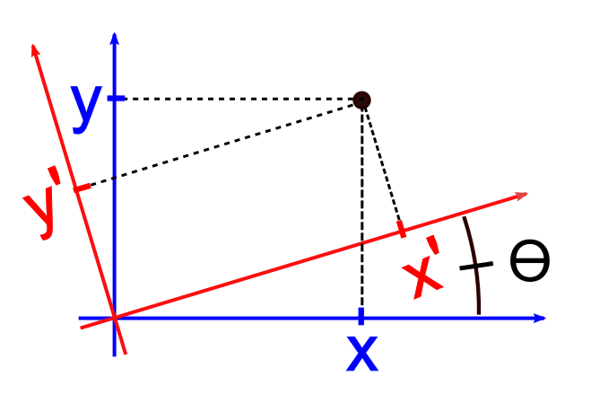

# Classification and Rotation of Conics

## Learning Targets

You should be able to
- [ ] Classify conics
- [ ] Find angle of rotation
- [ ] Write in its transformed form to eliminate the $xy$ term
- [ ] Graph the transformed conic

## Concepts / Definitions

### Classification of Conics

#### The graph of $Ax^2 + Cy^2 + Dx + Ey + F = 0$
If $A = C$ - circle 
If $AC = 0$ - parabola 
If $AC > 0$ - ellipse 
If $AC < 0$ - hyperbola

#### Using the discriminant = $B^2 - 4AC$ 
If $B^2 - 4AC < 0$ - ellipse or circle 
If $B^2 - 4AC = 0$ - parabola 
If $B^2 - 4AC > 0$ - hyperbola

### Rewriting Conics in transformed form

$Ax^2 + Bxy + Cy^2 + Dx + Ey + F = 0$ can be written as $A'x'^2 + C'y'^2 + D'x' + E'y' + F' = 0$ by rotating the axis through an angle $\theta$, where
$$\cot{2\theta} = (\frac{A-C}{B})$$

The coefficients of the new equation are obtained by making the following substitutions. 
$x = x' \cos{\theta} - y' \sin{\theta}$ and $y = x' \sin{\theta} + y' \cos{\theta}$

### Examples

#### Example 1
Classify $9x^2-6xy+y^2-7x+5y=0$, and state the angle of rotation.

#### Example 2
Rewrite the equation in standard form by rotating the axes to eliminate the $xy$ term for $5x^2-6xy+5y^2-12=0$. Then graph.

## Exercises
  1. Identify the conics and find the angle of rotation.
     1. $8x^2-4xy+2y^2+6=0$
     2. $x^2-3y^2-y-22=0$
     3. $3x^2-12xy+4y^2+x-5y=4$
  2. Rewrite the equation in standard for by rotating the axes to elimate the $xy$ term. Then graph.
     1. $xy=8$
     2. $x^2-4xy+y^2+1=0$
     3. $3x^2-2\sqrt 3 xy+y^2+2x+2\sqrt 3 y=0$
  3. Using the point $P(x,y)$ and the rotation information, find the coordinates of $P$ in the rotated $x'y'$ coordinate system.
     1. $P(x,y) = (-2,5),\theta =\frac \pi 4$
     2. $P(x,y) = (-5,-4),\cot 2\theta = 0$
  4. Using the point $P(x,y)$ and the _translation information_, find the coordinates of $P$ in the translated $x'y'$ coordinate system.
     1. $P(x,y) = (2,3),h=-2,k=4$
