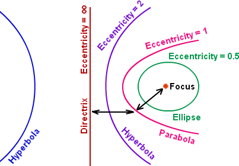

# Eccentricity and Orbits

## Learning Targets

You should be able to
- [ ] Find Eccentricity
- [ ] Find distances related to conics

## Concepts / Definitions

The **eccentricity**, denoted $e$ or $\epsilon$, is a parameter associated with every conic section that can be thought of as a measure of how much the conic section deviates from being circular.

### Formula to find eccentricity values

$$e = \frac{c}{a}$$

### Eccentricity values

Circle: $0$\
Ellipse: $0 < e < 1$\
Parabola: $1$\
Hyperbola: $e > 1$\
Line: $\infty$

### Solar System Data

The *closest point* to the Sun is the **Perihelion**. 
The *farthest point* to the Sun is the **Aphelion**.

*\*Mean distance from the Sun is also the semimajor axis length at the center of the Sun.*

Celestial Object | Mean Distance from Sun $_{(million\ km)}$ | Period of Revolution $_{(d=days)\ (y=years)}$ | Period of Rotation at Equator
:--|--:|--:|--:
THE SUN | --- | --- | 27 d
MERCURY | 57.9 | 88 d | 59 d
VENUS | 108.2 | 224.7 d | 243 d
EARTH | 149.6 | 365.26 d | 23 h 56 min 4 sec
MARS | 227.9 | 687 d | 24 h 37 min 23 sec
JUPITER | 778.4 | 11.9 y | 9 h 50 min 30 sec
SATURN | 1,426.7 | 29.5 y | 10 h 14 min
URANUS | 2,871.0 | 84.0 y | 17 h 14 min
NEPTUNE | 4,498.3 | 164.8 y | 16 h
THE MOON | 149.6 $_{(0.386\ from\ Earth)}$ | 27.3 d | 27.3 d

 

Celestial Object | Eccentricity of Orbit | Equatorial Diameter $_{(km)}$ | Mass $_{(Earth=1)}$ | Density $_{(g/cm^3)}$
:--|--:|--:|--:|--:
THE SUN | --- | 1,392,000 | 333,000.00 | 1.4
MERCURY | 0.206 | 4,879 | 0.06 | 5.4
VENUS | 0.007 | 12,104 | 0.82 | 5.2
EARTH | 0.017 | 12,756 | 1.00 | 5.5
MARS | 0.093 | 6,794 | 0.11 | 3.9
JUPITER | 0.048 | 142,984 | 317.83 | 1.3
SATURN | 0.054 | 120,536 | 95.16 | 0.7
URANUS | 0.047 | 51,118 | 14.54 | 1.3
NEPTUNE | 0.009 | 49,528 | 17.15 | 1.8
THE MOON | 0.055 | 3,476 | 0.01 | 3.3

The **astronomical unit** (AU) is a unit of length that is the average distance of the maximum distance (Aphelion) and the minimum distance (Perihelion).

Celestial Object | Astronomical Unit
:--|:--
MERCURY | 0.387 AU
VENUS | 0.723 AU
EARTH | 1.000 AU
MARS | 1.524 AU
JUPITER | 5.203 AU
SATURN | 9.529 AU
URANUS | 19.19 AU
NEPTUNE | 30.06 AU

Currently, 1 AU = 149,597,870,700 meters, or approximately 149.6 Gm (gigameters).

## Exercises
  1. What is the eccentricity of $\frac{(y-1)^2}{16} + \frac{(x+2)^2}{25} = 1$?
  2. Find the eccentricity of $5(x+3)^2 - 12(y-6)^2 = 60$
  3. Which planet has the most circular orbit?
  4. What is the perihelion and aphelion distances of Mercury?
  5. Given the diameter of the Sun is about 1.392 Gm (gigameters), how close does Earth get to the Sun's _surface_?
  6. The orbit of Haley's comet is 36.18 AU long and 9.12 AU wide. What is the eccentricity?
  7. The asymptotes of a hyperbola are $y-3 = \pm \frac 23 (x+1)$ and has a vertex at $(-1,4)$. What is the eccentricity?
  8. Name the type of conic and its eccentricity for $25y^2 - 9x^2 - 50y - 54x - 281 = 0$.

A Lithotripter is an elliptical machine that emits underwater ultrahigh-frequency (UHF) shock waves from one focus to the other. It is commonly used to break up kidney stones without surgery.

If the portion below its minor axis is rotated about its major axis, an ellipsoid is formed.

  9. For an ellipse that generates the ellipsoid of a lithotripter, the major axis has endpoints $(\pm8,0)$. One endpoint of the minor axis is $(0,3.5)$. Find the coordinates of the foci, and find its eccentricity.
