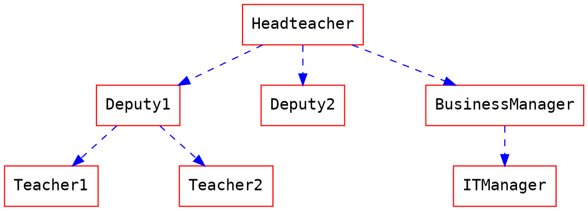
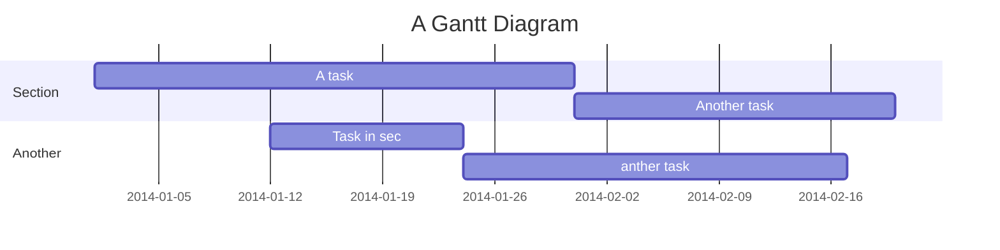




# How to use MathJax & UML

[**中文教學**](/c/tutorials-tw/%2Fs%2FMathJax-and-UML-tw)

**[:arrow_right: Check the source of this note :arrow_left:](/MathJax-and-UML?both)**

## MathJax

You can render *LaTeX* mathematical expressions using **MathJax**, as on [math.stackexchange.com](http://math.stackexchange.com/), except the space after the start `$` and the space before the end `$` are not allowed in the inline math:

The *Gamma function* satisfying $\Gamma(n) = (n-1)!\quad\forall n\in\mathbb N$ is via the Euler integral

$$
x = {-b \pm \sqrt{b^2-4ac} \over 2a}.
$$

$$
\Gamma(z) = \int_0^\infty t^{z-1}e^{-t}dt\,.
$$

> More information about **LaTeX** mathematical expressions [here](http://meta.math.stackexchange.com/questions/5020/mathjax-basic-tutorial-and-quick-reference).

## Mind map

```markmap
# markmap

## Links

- <https://markmap.js.org/>
- [GitHub](https://github.com/gera2ld/markmap)

## Related

- [coc-markmap](https://github.com/gera2ld/coc-markmap)
- [gatsby-remark-markmap](https://github.com/gera2ld/gatsby-remark-markmap)

## Features

- links
- **inline** ~~text~~ *styles*
- multiline
  text
- `inline code`
-
    ```js
    console.log('code block');
    ```
- Katex - $x = {-b \pm \sqrt{b^2-4ac} \over 2a}$
```

## UML Diagrams

### Sequence Diagrams

You can render sequence diagrams like this:

```sequence
Alice->Bob: Hello Bob, how are you?
Note right of Bob: Bob thinks
Bob-->Alice: I am good thanks!
Note left of Alice: Alice responds
Alice->Bob: Where have you been?
```

### Flow Charts

Flow charts can be specified like this:
```flow
st=>start: Start
e=>end: End
op=>operation: My Operation
op2=>operation: lalala
cond=>condition: Yes or No?

st->op->op2->cond
cond(yes)->e
cond(no)->op2
```

### Graphviz


### Mermaid


### Abc
```abc
X:1
T:Speed the Plough
M:4/4
C:Trad.
K:G
|:GABc dedB|dedB dedB|c2ec B2dB|c2A2 A2BA|
GABc dedB|dedB dedB|c2ec B2dB|A2F2 G4:|
|:g2gf gdBd|g2f2 e2d2|c2ec B2dB|c2A2 A2df|
g2gf g2Bd|g2f2 e2d2|c2ec B2dB|A2F2 G4:|
```

> More information about **sequence diagrams** syntax [here](http://bramp.github.io/js-sequence-diagrams/).
> More information about **flow charts** syntax [here](http://adrai.github.io/flowchart.js/).
> More information about **graphviz** syntax [here](http://www.tonyballantyne.com/graphs.html)
> More information about **mermaid** syntax [here](http://mermaid-js.github.io/mermaid)
> More information about **abc** syntax [here](http://abcnotation.com/learn)