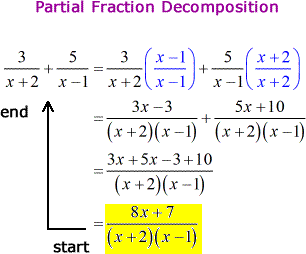

# Partial Fractions

## Learning Targets

You should be able to
- [ ] *Decompose* a fraction into a sum

## Concepts / Definitions

**Partial Fraction Decomposition** of fractions is the sum of partial fractions of a lesser degree.

### Process

#### Step 1
Divide rational if improper (An improper fraction is when the numerator is greater than or equal to the denominator)

#### Step 2
Factor denominator into linear factors and irreducible quadratics.

#### Step 3
Write the partial fraction decomposition based on the table below.

Factor in denominator | Term in partial fraction decomposition
---|---
$ax + b$ | $\frac{A}{ax + b}$
$(ax + b)^k$ | $\frac{A}{ax + b} + \frac{A_2}{(ax + b)^2} + ... + \frac{A_k}{(ax + b)^k}$
$ax^2 + bx + c$ | $\frac{Ax + B}{ax^2 + bx + c}$
$(ax^2 + bx + c)^k$ | $\frac{A_1x + b}{ax^2 + bx + c} + \frac{A_2x + B_2}{(ax^2 + bx + c)^2} + ... + \frac{A_kx + B_k}{(ax^2 + bx + c)^k}$

#### Step 4
Equate the original problem and partial fraction decomposition, and then multiply both sides of the equation by the LCD (least common denominator). In this case, it is the denominator of the original problem.

#### Step 5
Equate terms and solve for constants.

#### *Other trick to help solve for constants*
Let $x = \_$

### Examples of partial fraction decomposition

Type of proper rational function | Partial fraction
---|---
$\frac{px+q}{(x-a)(x-b)}, a \neq b$ | $\frac{A}{x-a} + \frac{B}{x-b}$
$\frac{px^2+qx+r}{(x-a)(x-b)(x-c)}, a \neq b \neq c$ | $\frac{A}{x-a} + \frac{B}{x-b} + \frac{C}{x-c}$
$\frac{px+q}{(x-a)^3}$ | $\frac{A}{x-a} + \frac{B}{(x-a)^2} + \frac{C}{(x-a)^3}$
$\frac{px^2+qx+r}{(x-a)^2(x-b)}$ | $\frac{A}{x-a} + \frac{B}{(x-a)^2} + \frac{C}{x-b}$
$\frac{px^2+qx+r}{(x-a)(x^2+bx+c)},\ _{where\ x^2 + bx + c\ cannot\ be\ factorized}$ | $\frac{A}{x-a} + \frac{Bx+C}{x^2+bx+c}$
$\frac{px^3+qx^2+rx+s}{(x^2+ax+b)(x^2+cx+d)},\ _{where\ (x^2+ax+b)\ and\ (x^2+cx+d)\ cannot\ be\ factorized}$ | $\frac{Ax+B}{x^2+ax+b} + \frac{Cx+D}{x^2+cx+d}$

#### Example 1
Find the partial fraction decomposition.
$$\frac{1}{x^2-5x+6}$$

#### Example 2
Find the partial fraction decomposition.
$$\frac{2x^3-4x-8}{x^4-16}$$

#### Example 3
Find the partial fraction decomposition.
$$\frac{5x^2+20x+6}{x^3+2x^2+x}$$

#### Example 4
Find the partial fraction decomposition.
$$\frac{x^4-2x^2+4x+1}{x^3-x^2-x+1}$$
