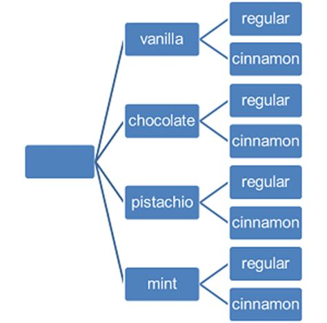
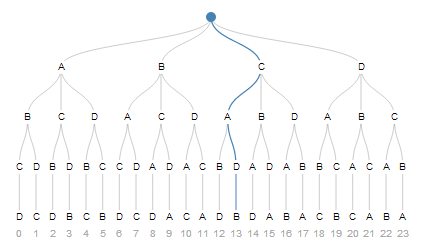
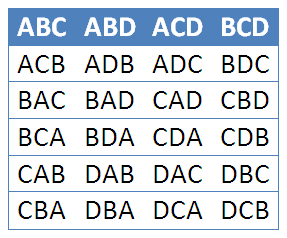

# Permutations and Combinations

## Learning Targets

You should be able to
- [ ] Apply Fundamental Counting Principle
- [ ] Apply Permutations
- [ ] Apply Combinations

## Concepts / Definitions

The **Fundamental Counting Principle** states that if one event has $m$ possible outcomes and a second independent event has $n$ possible outcomes, then there are **$m$ x $n$ total possible outcomes** for the two events together.

If you have four flavors of ice cream and two types of cones, then ther are $4 * 2 = 8$ possible combinations.

In mathematics, the **factorial** of a non-negative integer $n$, denoted by $n!$, is the product of all positive integers less than or equal to $n$.
$$n! = n(n-1)(n-2)(n-3)\ ...\ (2)(1)$$
By definition, $0! = 1$.

**Permutations** are the number of ways a set of $n$ distinguishable objects can be *arranged in order*. 
$4!$ = 24 ways to order four items

The number of permutations on $n$ objects taken $r$ at a time is given by
$$P\binom{n}{r} = P(n, r) = nPr = \frac{n!}{(n-r)!}$$

The number of ways $n$ items can be *ordered with replacement $r$* times is **$n^r$**

$\frac{4!}{(4-3)!}$ = 24 ways of selecting and ordering 3 or 4 letters, but only 4 ways if order does not matter.

**Combinations** are the number of ways selecting $r$ items from a group of $n$ items where *order does not matter*. 
**To take out all the ways $r$ can happen, we divide out all the ways $r!$ can happen.** 
The number of combinitions of $n$ objects taken $r$ at a time is given by
$$C\binom{n}{r} = C(n, r) = nCr = \frac{n!}{r!(n-r)!}$$
$\implies$ Also called $n$ choose $k$, noted \binom{n}{k} = \frac{n!}{k!(n-k)!}$

**Counting Subsets of an $n$-Set** 
Consider a binomial situation, where there is a yes or no, success or failure, possibility happening $n$ times. The number of ways this can happen is $2^n$. There are $2^n$ subsets of a set with $n$ objects.

## Exercises
  1. How many ways can 8 runners in a track race finish?
  2. Subway is running a special on 6" subs for $3.99 with 6 choices of bread, 3 choices of meat, and 2 choices of cheese. Not including toppings or sause, how many choices are available?
  3. How many ways can 2 students of a class of 25 be selected for room reps?
  4. How many distinguishable ways can the letters, TOPPINGS be written?
  5. A license plate has 3 letters followed by 3 digits. How many possible plates are there?
  6. From a group fo 10 people in theater, how many possible ways can a teacher select roles for a show on the 7 dwarfs?
  7. In the original version of poker, straight poker, a five-card hand is dealt from a standard deck of 52. How many different hands are possible?
  8. A coin is flipped 10 times, and the sequence is recorded.
     1. How many sequences are possible?
     2. How many sequences have exactly 7 heads?
  9. A particular subway advertises 256 ways for a sandwich to be fixed with veggies. How many veggie toppings does this subway offer?
  10. Calculate $_{10}C_3$ without a calculator.
