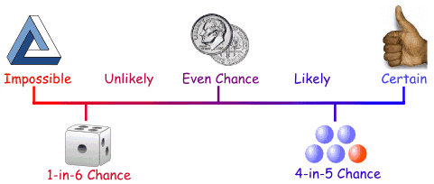
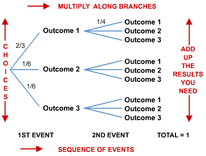
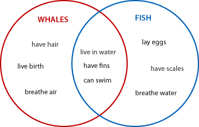
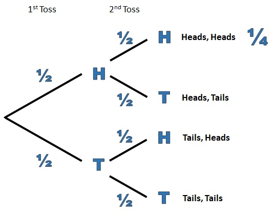
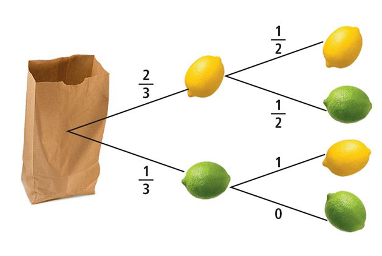

# Probability

## Learning Targets

You should be able to
- [ ] Apply probabilities

## Concepts / Definitions

If $E$ is an event in a finite, nonempty sample space $S$ of equally likely outcomes, then the probability of the event $E$ is
$$P(E) = \frac{the\ number\ of\ outcomes\ in\ E}{the\ number\ of\ outcomes\ in\ S}$$

(If not equally likely outcomes, add up all the probabilities of all outcomes)

A **probability function** is a function $P$ that assigns a real number to each outcome in a sample space $S$ subject to the following conditions:
1. $0 \leq P(O) \leq 1$ for every outcome O
2. The sum of the probabilities of all outcomes in $S$ is 1
3. $P(\varnothing) = 0$\
($\varnothing$ is the empty set; set with no elements / solutions)

The union symbol $\cup$ means "or" (add probabilities).\
The intersection symbol $\cap$ means "and" (multiply probabilities).

### Tree diagram for sequence of events

### Venn Diagram for inclusive events

Events are **independent events** if the occurrence of one event does not affect the probability of the other.

Events are **dependent events** if the occurrence of one event affects the probability of the other.

### Conditional Probability

If the event $B$ depnds on the event $A$, then
$$P(B|A) = \frac{P(A\ and\ B)}{P(A)}$$
and
$$P(A\ and\ B) = P(A) * P(B|A)$$

### Binomial Probability

If a binomial experiment has $n$ trials in which $p$ is the probability of success and $q = 1 - p$ is the probability of failure in any given trial, the **the binomial probability** that there will be exactly $r$ successes is
$$P(r) = _nC_r p^r q^{n-r}$$

## Exercises
   1. A red and green die are rolled.
      1. What is the probability that a sum of 5 is rolled?
      2. What is the probability that a 2 or 6 is rolled?
   2. Is it possible to weight a standard 6-sided die in such a way that the probability of rolling each number $n$ is exactly $\frac{1}{n^2+1}$?
   3. If it rains tomorrow, the probability is 0.8 that John will practice the piano lesson. If it does not rain tomorrow, there is only a 0.4 chance that John will practice. Suppose the chance of rain tomorrow is 60%. What is the probability that John will practice the piano?
   4. In two classes at a small school, there are 12 girls and 8 boy in Mr. Smith's class, and 10 girls and 15 boys in Ms. John's class. If a student is chosen at random, what is the probability that the student happens to be a girl from Mr. Smith's class?
   5. You have 8 songs on your iPod. If you set it to play at random, what is the probability that the songs will play in the order in which they are listed?
   6. You and two friends go to a restaurant and order a sandwich. The menu has 10 types of sandwiches and each of you is equally likely to order any type. What is the probability that each of you orders a different type?
   7. Jackson has a probability of 80% to make a free-throw. If he shoots 10 free-throws in a game,
      1. what is the probability that he makes exactly 8 free-throws?
      2. what is the probability that he makes at least 8 free-throws?
   8. Would you say for the following simulation that a fair die (not weighted) was thrown? Explain.

   9.  Five years after 650 high school seniors graduated, 400 had a college degree and 310 were married. Half of the students with a college degree were married.
      1.  What is the probability that a student has a college degree or is married?
      2.  What is the probability that a student has a college degree or is not married?
  10.   What is the probability of getting a straight flush (5 of one suit in chronological order, but not a royal, which is 10 through Ace) in a game of poker?
  11.   A group has 7 seniors and 5 juniors. What is the probability that a team of four if randomly selected consists of 2 seniors and 2 juniors?
  12.   What is the probability of getting a full house (3 of one kind and 2 of another kind) when dealt a five card hand in poker out of a deck of 52 cards?
  13.   Four houses in a neighborhood have the same model of garage door opener. Each opener has 4096 possible transmitter codes. What is the probability that at least two of the four openers have the same code?
